---
authors:
- max
blog: maxrohde.com
categories:
- java
date: "2010-05-23"
title: OSGi + Maven + Declarative Services + Apache Felix SCR + NetBeans
---

This post is part of a series of posts on [java modularity with OSGi and Declarative Services](http://maxrohde.com/2010/05/26/java-modularity-tutorials-osgi-declarative-services-and-maven/).

Please follow the previous parts first ([part 1](http://maxrohde.com/2010/05/23/osgi-maven-declarative-services-eclipse/), [part 2](http://maxrohde.com/2010/05/23/osgi-maven-pax-runner-apache-felix-equinox/), [part 3](http://maxrohde.com/2010/05/24/creating-runtime-environments-for-osgi-declarative-services-in-eclipse/))

**Summary:** This tutorial describes how the NetBeans IDE can be used to define OSGi bundles in Maven projects. These bundles again use declarative services. In this tutorial, the declarative services are implemented using the Apache Felix Maven SCR plugin.

**Create a Maven OSGi Bundle in NetBeans**

Create a new „Maven OSGi Bundle“ project.

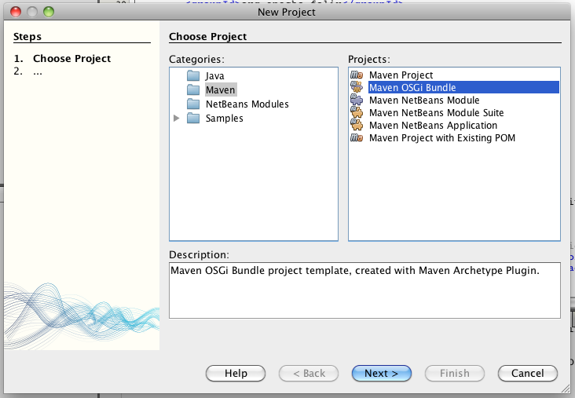

Name the project WisdomProvider2

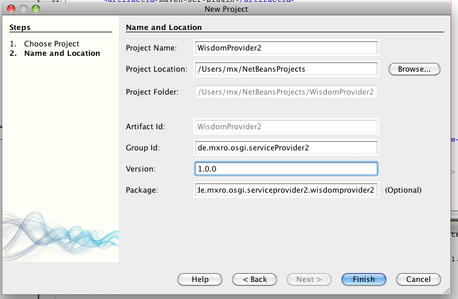

Right click the Libraries node below the project and select „Add Dependency“

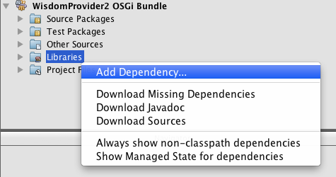

Add the bundle we created in eclipse earlier:

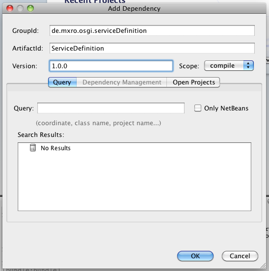

Expand the Libraries node:

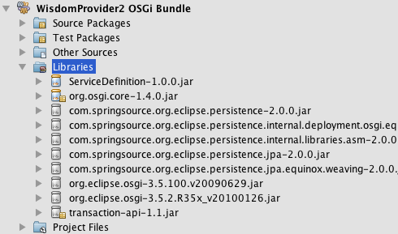

The ServiceDefinition bundle and its dependencies should be added to the classpath.

**Implement a Service for the Wisdom Interface**

Right click on the Source Packages and select New / Java Class

Create a class AncientWisdomProvider in the package de.mxro.osgu.serviceProvider2.

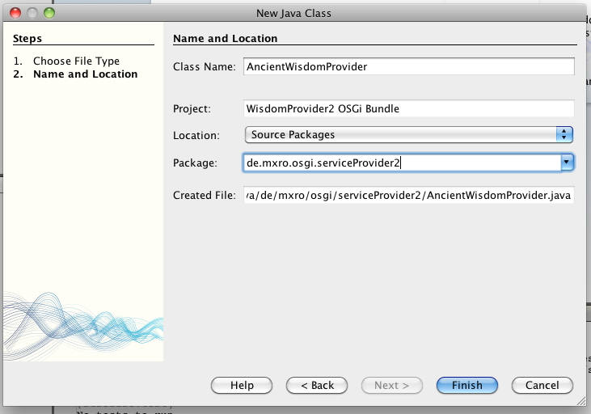

Implement the Interface Wisdom, add an import and implement the method defined by the interface.

```
package de.mxro.osgi.serviceProvider2;

import de.mxro.osgi.serviceDefintion.Wisdom;

/\*\* \* \* @author mx \*/ public class AncientWisdomProvider implements Wisdom {

public String getWisdom() { return "A good decision is based on knowledge and not on numbers."; // Plato }

}
```

**Add JavaDoc Meta Data to Define Declarative Service**

In eclipse, we defined the declarative service by manually editing the component definition XML files in the OSGI-INF folder. An alternative way is to use the [Maven Felix SCR Plugin](http://felix.apache.org/site/apache-felix-maven-scr-plugin.html) to generate the component definitions during the Maven build.

This plugin allows to add the component definition meta-data directly to the class, which implements the component. There are two ways to add this meta-data: (1) as JavaDoc annotation and (2) using Java annotations.

JavaDoc annotations have the advantage that the class can still remain a highly independent POJO.

To turn the AncientWisdomProvider class into a component offering a service, we simply have to add the following JavaDoc annotations.

```
package de.mxro.osgi.serviceProvider2;

import de.mxro.osgi.serviceDefintion.Wisdom;

/\*\* \* \* @author mx \* \* \* **@scr.component \* @scr.service** \* \*/ public class AncientWisdomProvider implements Wisdom {

public String getWisdom() { return “A good decision is based on knowledge and not on numbers.”; // Plato }

}
```

**Compile the Declarative Service using Maven Felix SCR Plugin**

We need to add a plugin to the Maven script in order for the Java Doc annotations to be processed.

Open the node Project Files under the WisdomProvider and open the file pom.xml.

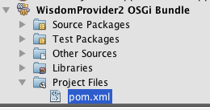

We need to add the maven-scr-plugin to the plugins node.

```
<plugin> <groupId>org.apache.felix</groupId> <artifactId>maven-scr-plugin</artifactId> <executions> <execution> <id>generate-scr-scrdescriptor</id> <goals> <goal>scr</goal> </goals> </execution> </executions> </plugin>
```

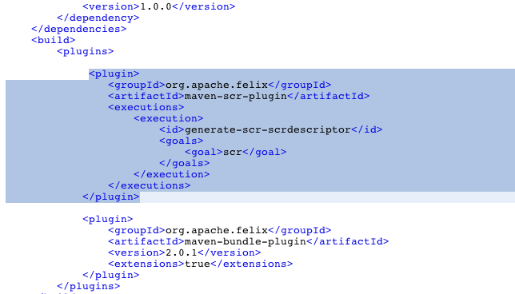

Also change the maven-bundle-plugin to add the import of the service definition:

```
<plugin> <groupId>org.apache.felix</groupId> <artifactId>maven-bundle-plugin</artifactId> <version>2.0.1</version> <extensions>true</extensions> **<configuration> <instructions> <Import-Package>de.mxro.osgi.serviceDefinition,org.osgi.framework</Import-Package> </instructions> </configuration>** </plugin>
```

Now we can right-click the WisomProvider2 project and select „Clean and Build“.

The log should contain the following lines:

```
\[scr:scr\] Generating 2 MetaType Descriptors to /Users/mx/NetBeansProjects/WisdomProvider2/target/scr-plugin-generated/OSGI-INF/metatype/metatype.xml Writing abstract service descriptor /Users/mx/NetBeansProjects/WisdomProvider2/target/scr-plugin-generated/OSGI-INF/scr-plugin/scrinfo.xml with 1 entries. Generating 1 Service Component Descriptors to /Users/mx/NetBeansProjects/WisdomProvider2/target/scr-plugin-generated/**OSGI-INF/serviceComponents.xml** ... \[install:install\] Installing /Users/mx/NetBeansProjects/WisdomProvider2/target/WisdomProvider2-1.0.0.jar to **/Users/mx/.m2/repository/de/mxro/osgi/serviceProvider2/WisdomProvider2/1.0.0/WisdomProvider2-1.0.0.jar**
```

This project has been added the the local Maven repository as well.

**Test the declarative service using Apache Felix**

We can now test this package in a similar manner as the packages created with eclipse. For this, first [download Pax Runner](http://paxrunner.ops4j.org/display/paxrunner/Download) if you have not done so already. Extract the archive on a local folder. I use Mac OS X terminal in the following but in principle it should work quite similar in Windows.

Start Pax Runner with the following parameters:

MacBookMX:bin mx$ ./pax-run.sh --clean --platform=felix --profiles=ds

Install the ServiceDefinition bundle, which was created in eclipse, where we can find the location in the local repository, which should look similar to:

```
/Users/mx/.m2/repository/de/mxro/osgi/serviceDefinition/ServiceDefinition/1.0.0/ServiceDefinition-1.0.0.jar
```

We can also install the WisomProvider2 bundle from the path we have seen above in the compiler log.

```
/Users/mx/.m2/repository/de/mxro/osgi/serviceProvider2/WisdomProvider2/1.0.0/WisdomProvider2-1.0.0.jar
```

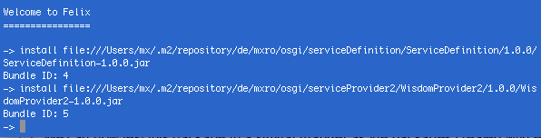

Now we need to start the bundle 5 and „scr list“ can list us the services again:


If we want, we can also install the service provider, we have implemented in eclipse.

\-> install file:///Users/mx/.m2/repository/de/mxro/osgi/serviceProvider/ServiceProvider/1.0.0/ServiceProvider-1.0.0.jar Bundle ID: 6 -> start 6 -> scr list Id State Name \[ 0\] \[registered \] de.mxro.osgi.serviceProvider2.AncientWisdomProvider \[ 1\] \[registered \] de.mxro.osgi.serviceProvider ->

Two services should be registered.

You can leave this instance of Felix open. We can reuse it later.

**Implement a Service Consumer using the Maven SCR Plugin**

The Maven SCR plugin also allows us to declare components, which consume services using annotations. To illustrate this, we create a new Maven OSGi project in NetBeans.

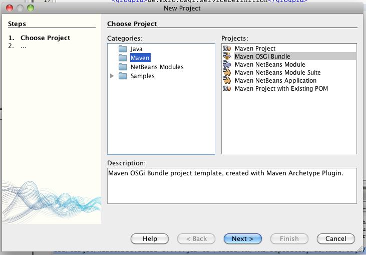

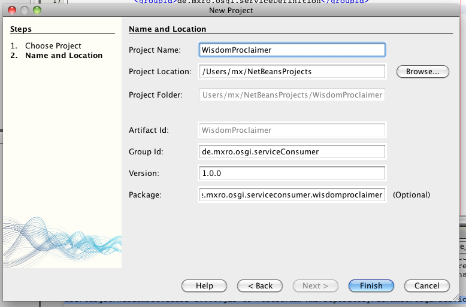

Add a Java Class Wisdom Proclaimer

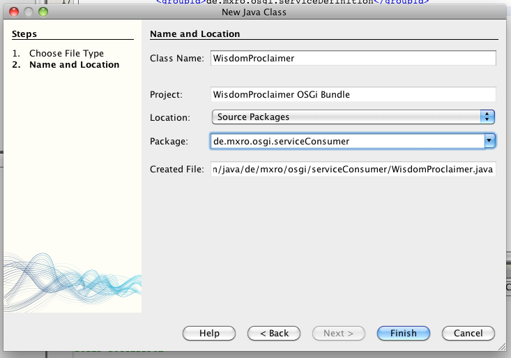

Again add a dependency to the ServiceDefinition package:

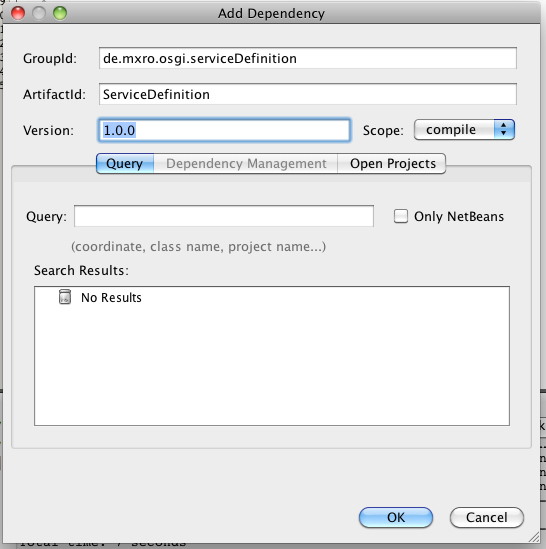

Again add the interface Wisdom, add the import and implement the abstract method.

```
package de.mxro.osgi.serviceConsumer;

import de.mxro.osgi.serviceDefintion.Wisdom;

/\*\* \* \* @author mx \*/ public class WisdomProclaimer implements Wisdom {

public String getWisdom() { throw new UnsupportedOperationException("Not supported yet."); }

}
```

Add a field of the type Wisdom and change the getWisdom method:

```
public class WisdomProclaimer implements Wisdom {

Wisdom wisdom;

public String getWisdom() { System.out.println(wisdom.getWisdom()); return wisdom.getWisdom(); }

}
```

(as you can see, we are implementing a Proxy Service)

Add the JavaDoc annotations:

```
/\*\* \* **@scr.component immediate=“true”** \* **@scr.service** \* \* @author mx \*/ public class WisdomProclaimer implements Wisdom {

/\*\* **@scr.reference cardinality=“1..1”, dynamic=“false”** \*/ Wisdom wisdom;

public String getWisdom() { System.out.println(wisdom.getWisdom()); return wisdom.getWisdom(); }

}
``

Other annotations can for instance be: **properties:** @scr.property name=“\[property name\]“ value=“\[property name\]“ **service with interface definition:** @scr.service interface=“de.yourclass“

You also need to add the Maven SCR Plugin to the maven pom.xml file of this project:

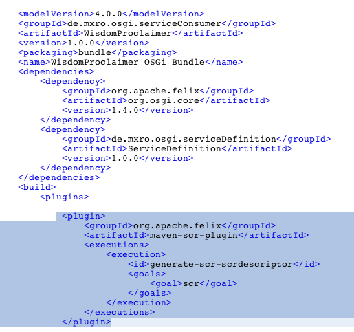

Also change the maven-bundle-plugin to add the import of the service definition:

```xml
<plugin> <groupId>org.apache.felix</groupId> <artifactId>maven-bundle-plugin</artifactId> <version>2.0.1</version> <extensions>true</extensions> **<configuration> <instructions> <Import-Package>de.mxro.osgi.serviceDefinition,org.osgi.framework</Import-Package> </instructions> </configuration>** </plugin>
```

You can right-click the project WisdomProclaimer and select „Clean and Build“.

This component is again installed to the local Maven repository in a path like:

/Users/mx/.m2/repository/de/mxro/osgi/serviceConsumer/WisdomProclaimer/1.0.0/WisdomProclaimer-1.0.0.jar

We can easily browse to this path using Mac OS X terminal (or Windows cmd.exe)

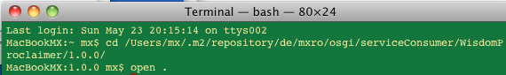

You can right-click the generated JAR file and extract it: (In Windows use 7zip or another ZIP utility)

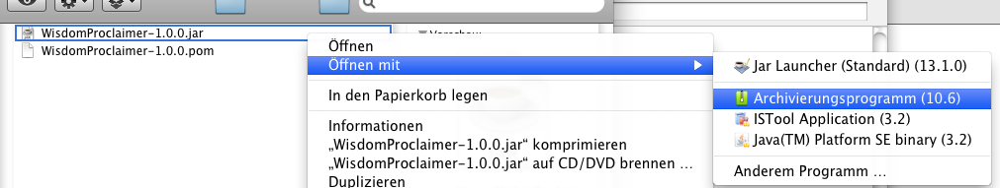

You can check in the generated OSGI-INF

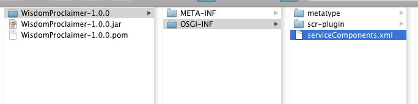

```
&gt;?xml version\=“1.0” encoding\=“UTF-8”?\&lt; &lt;components xmlns:scr=“[http://www.osgi.org/xmlns/scr/v1.0.0](http://www.osgi.org/xmlns/scr/v1.0.0)”\> <scr:component enabled=“true” immediate=“true” name=“de.mxro.osgi.serviceConsumer.WisdomProclaimer”\> <implementation class=“de.mxro.osgi.serviceConsumer.WisdomProclaimer”/> <service servicefactory=“false”\> <provide interface=“de.mxro.osgi.serviceDefintion.Wisdom”/> </service\> <property name=“service.pid” value=“de.mxro.osgi.serviceConsumer.WisdomProclaimer”/> <reference name=“wisdom” interface=“de.mxro.osgi.serviceDefintion.Wisdom” cardinality=“1..1” policy=“static” bind=“bindWisdom” unbind=“unbindWisdom”/> </scr:component\> </components\>
```

You can go back to the instance of Felix, which we have opened earlier.

```
\-> install file:///Users/mx/.m2/repository/de/mxro/osgi/serviceConsumer/WisdomProclaimer/1.0.0/WisdomProclaimer-1.0.0.jar Bundle ID: 13 -> start 13 -> ps START LEVEL 6 ID State Level Name ID State Level Name \[ 0\] \[Active \] \[ 0\] System Bundle (2.0.2) \[ 1\] \[Active \] \[ 5\] Apache Felix Declarative Services (1.0.8) \[ 2\] \[Active \] \[ 1\] Apache Felix Shell Service (1.4.1) \[ 3\] \[Active \] \[ 1\] Apache Felix Shell TUI (1.4.1) \[ 4\] \[Active \] \[ 5\] ServiceDefinition (1.0.0.qualifier) \[ 6\] \[Active \] \[ 5\] ServiceProvider (1.0.0.qualifier) \[ 13\] \[Active \] \[ 5\] WisdomProclaimer OSGi Bundle (1.0.0) \[ 18\] \[Active \] \[ 5\] WisdomProvider2 OSGi Bundle (1.0.0) -> scr list Id State Name \[ 1\] \[active \] de.mxro.osgi.serviceProvider \[ 8\] \[active \] de.mxro.osgi.serviceConsumer.WisdomProclaimer \[ 9\] \[registered \] de.mxro.osgi.serviceProvider2.AncientWisdomProvider ->
```
