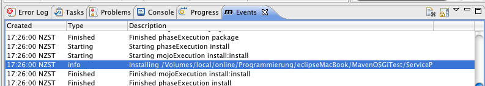
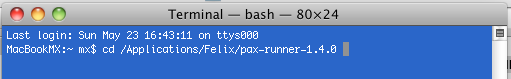
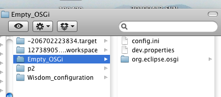
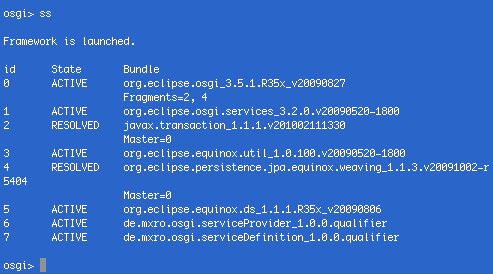
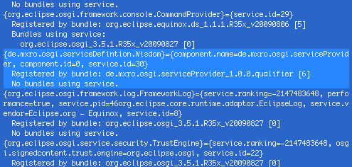
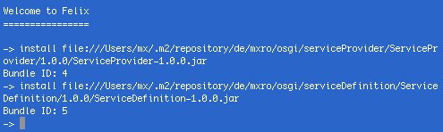
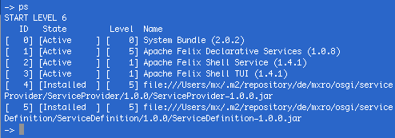
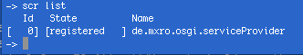

This post is part of a series on java modularity.

Please first follow the tutorial on [OSGi + Maven + Declarative Services in eclipse](http://nexnet.wordpress.com/2010/05/23/osgi-maven-declarative-services-eclipse/)

**Summary:** In this tutorial I show how the OSGi bundles with declarative services, which were created in the previous post can be tested using Pax Runner running Equinox and Apache Felix.

**Locate Maven Packages in Local Repository**

We will need the path names to where Maven has installed our bundles. These can be found in the Maven events (of Eclipse IAM) after installing the package to the local repository (Right click the bundle project and select Maven 2 / Locally Install Artifact).

The path can be quite long but it can easily be copied by double-clicking on the event, which will open an additional window.

The paths can for example look like:

/Users/mx/.m2/repository/de/mxro/osgi/serviceProvider/ServiceProvider/1.0.0/ServiceProvider-1.0.0.jar /Users/mx/.m2/repository/de/mxro/osgi/serviceDefinition/ServiceDefinition/1.0.0/ServiceDefinition-1.0.0.jar

**Test your Maven Packages using Pax Runner**

To test the Maven packages we need to run the jar files, which are created by Maven in a OSGi container. For this, we again can use equinox as it is delivered with eclipse. Another option is to use pax-provision.

We can test our bundles using pax-provision and test them using Apache Felix.

For this, first [download Pax Runner](http://paxrunner.ops4j.org/display/paxrunner/Download). Extract the archive on a local folder. I use Mac OS X terminal in the following but in principle it should work quite similar in Windows.

Open terminal and go to the folder where you extracted Pax Runner. 

Execute the following commands:

MacBookMX:pax-runner-1.4.0 mx$ cd bin MacBookMX:bin mx$ chmod +x pax-run.sh

**Test Maven Packages using Equinox**

An easy way yo test the packages generated by Maven using Pax Runner is to copy the configuration, which eclipse creates to run the container.

Eclipse saves the launch configuration in the workspace folder under the path: {your workspace dir}/.metadata./.plugins/org.eclipse.pde.core/

Here you can open the Empty\_OSGi folder configuration. 

The file config.ini should look something like:

#Configuration File #Sun May 23 18:56:27 NZST 2010 osgi.bundles=reference\\:file\\:/Applications/eclipse/plugins/org.eclipse.osgi.services\_3.2.0.v20090520-1800.jar@start,reference\\:file\\:/Applications/eclipse/plugins/javax.transaction\_1.1.1.v201002111330.jar,reference\\:file\\:/Applications/eclipse/plugins/org.eclipse.equinox.util\_1.0.100.v20090520-1800.jar@start,reference\\:file\\:/Applications/eclipse/plugins/org.eclipse.persistence.jpa.equinox.weaving\_1.1.3.v20091002-r5404.jar,reference\\:file\\:/Applications/eclipse/plugins/org.eclipse.equinox.ds\_1.1.1.R35x\_v20090806.jar@start osgi.bundles.defaultStartLevel=4 osgi.install.area=file\\:/Applications/eclipse osgi.framework=file\\:/Applications/eclipse/plugins/org.eclipse.osgi\_3.5.2.R35x\_v20100126.jar osgi.configuration.cascaded=false

When starting Pax Runner, we can provide all the bundles listed under osgi.bundles. These need to be reformatted a bit (remove the backslashes and @ flags). In addition, the paths to the jars deployed with Maven can be added. The result should be a list of packages, which looks similar to the following:

file:///Applications/eclipse/plugins/org.eclipse.osgi.services\_3.2.0.v20090520-1800.jar file:///Applications/eclipse/plugins/javax.transaction\_1.1.1.v201002111330.jar file:///Applications/eclipse/plugins/org.eclipse.equinox.util\_1.0.100.v20090520-1800.jar file:///Applications/eclipse/plugins/org.eclipse.persistence.jpa.equinox.weaving\_1.1.3.v20091002-r5404.jar file:///Applications/eclipse/plugins/org.eclipse.equinox.ds\_1.1.1.R35x\_v20090806.jar **/Users/mx/.m2/repository/de/mxro/osgi/serviceProvider/ServiceProvider/1.0.0/ServiceProvider-1.0.0.jar /Users/mx/.m2/repository/de/mxro/osgi/serviceDefinition/ServiceDefinition/1.0.0/ServiceDefinition-1.0.0.jar**

Using this lists of paths to OSGi bundles, we can start Pax Runner with the following command:

MacBookMX:bin mx$ ./pax-run.sh --clean --platform=equinox file:///Applications/eclipse/plugins/org.eclipse.osgi.services\_3.2.0.v20090520-1800.jar file:///Applications/eclipse/plugins/javax.transaction\_1.1.1.v201002111330.jar file:///Applications/eclipse/plugins/org.eclipse.equinox.util\_1.0.100.v20090520-1800.jar file:///Applications/eclipse/plugins/org.eclipse.persistence.jpa.equinox.weaving\_1.1.3.v20091002-r5404.jar file:///Applications/eclipse/plugins/org.eclipse.equinox.ds\_1.1.1.R35x\_v20090806.jar /Users/mx/.m2/repository/de/mxro/osgi/serviceProvider/ServiceProvider/1.0.0/ServiceProvider-1.0.0.jar /Users/mx/.m2/repository/de/mxro/osgi/serviceDefinition/ServiceDefinition/1.0.0/ServiceDefinition-1.0.0.jar **Attention:** Make sure to include the option **\--clean**. If you do not, Pax Runner will cache your bundles. So, if you change them in eclipse, the changes won‘t be visible when starting the bundles with Pax Runner.

Once equinox has started up, you can list the installed packages using the command „ss“. The packages should look like listed below.

You can check with the command „services“ whether the services has been loaded correctly.

Also the command „ls“ will list our component.

**Test Maven Packages using Felix**

We will need a special [Pax Runner profile](http://paxrunner.ops4j.org/display/paxrunner/Profiles) to be able to use declarative service. We need to use the profile [ds](http://paxrunner.ops4j.org/display/paxrunner/Pax+Runner+profiles+list).

./pax-run.sh --platform=felix --clean --profiles=ds

Here again, do not forget the **\--clean** option!

Install the ServiceProvider and ServiceDefinition bundles to your instance of Felix.

The command „ps“ will give you a list of installed bundles.

Start the service provider using the command „start \[the id that the bundle has\]“ in above example „start 4“.

Now you can list the active services using the command „scr list“.

You can close Felix using the command „shutdown“.

A quicker way to test your bundles, is to add them to the Pax Runner commands and let them automatically be loaded at startup. For this, use the following command:

./pax-run.sh --platform=felix --clean --profiles=ds /Users/mx/.m2/repository/de/mxro/osgi/serviceProvider/ServiceProvider/1.0.0/ServiceProvider-1.0.0.jar /Users/mx/.m2/repository/de/mxro/osgi/serviceDefinition/ServiceDefinition/1.0.0/ServiceDefinition-1.0.0.jar
