---
authors:
- max
blog: maxrohde.com
categories:
- java
date: "2010-05-24"
title: Implementing a Service Client for OSGi Declarative Services
---

This post is part of a series of posts on [java modularity](http://maxrohde.com/2010/05/26/java-modularity-tutorials-osgi-declarative-services-and-maven/).

**Summary:** I show in this tutorial how we can create a simple component using the eclipse IDE, which calls the services, we have created in the previous parts. Again, the component is deployed as Maven package and can be tested in an eclipse runtime environment and an Apache Felix instance.

**Create Plugin Project and link to Maven**

Create a new Plugin Project „ServiceClient“ in eclipse. Make sure to follow Maven conventions in the project settings.

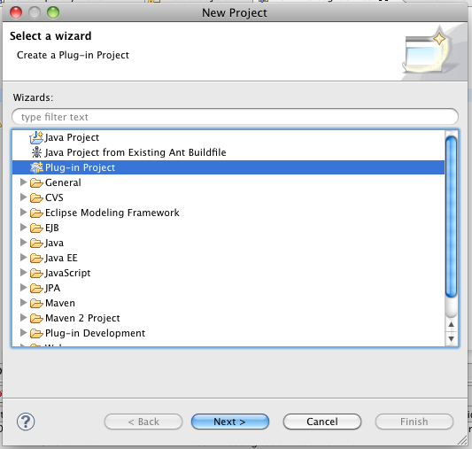

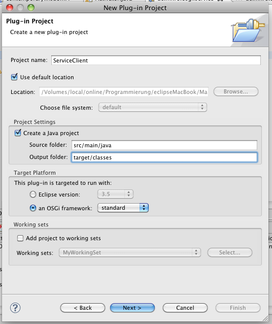

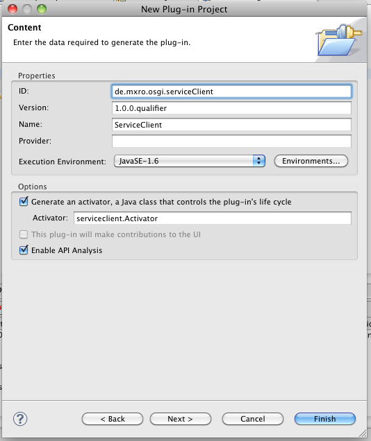

Right click your ServiceClient project and select Maven 2 / Convert to Maven Project

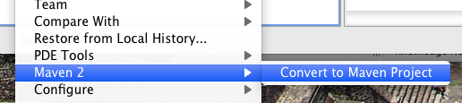

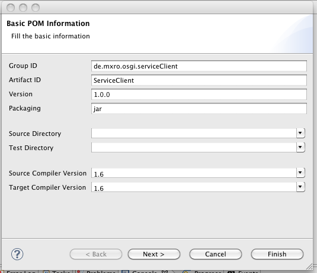

Add a dependency to the ServiceDefinition in the Maven pom.xml file.

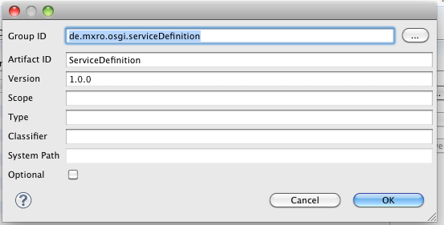

Also add the following dependencies (either using the dialog or directly in the source of the pom.xml file):

<dependency\> <groupId\>org.apache.felix</groupId\> <artifactId\>org.osgi.core</artifactId\> <version\>1.0.1</version\> </dependency\> <dependency\> <groupId\>org.apache.felix</groupId\> <artifactId\>org.osgi.compendium</artifactId\> <version\>1.0.1</version\> </dependency\>

Make sure to make your project compilable by Maven by adding the manifest plugin and the OSGI-INF resource to your pom.xml file:

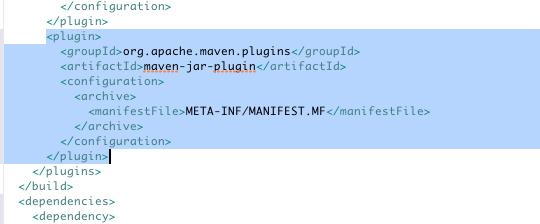

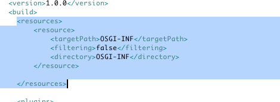

Add the package with the service definition to the MANIFEST.MF file:

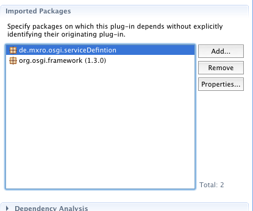

Also add org.osgi.service.component

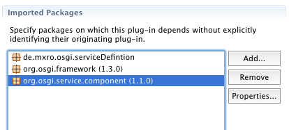

**Create Interface and Implementation**

Create an interface ServiceClient

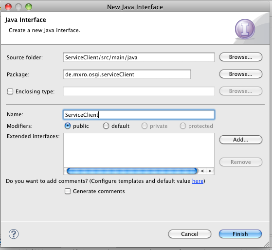

We will not add any methods to the interface.

Create a class ServiceClientImplementation:

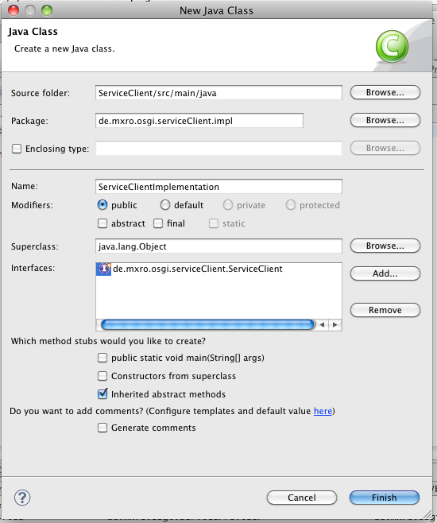

Add the following simple implementation (note that none of these methods are required for the interface).

import java.util.Vector;

import org.osgi.service.component.ComponentContext;

import de.mxro.osgi.serviceClient.ServiceClient; import de.mxro.osgi.serviceDefintion.Wisdom;

public class ServiceClientImplementation implements ServiceClient {                  public Vector<Wisdom> wisdom \= new Vector<Wisdom>();                  protected void activate(ComponentContext ctxt) {                 System.out.println("ServiceClientImplementation activated!");                 for (Wisdom w : wisdom)                  System.out.println("Connected to wisdom: "+w.getWisdom());                          } protected void deactivate(ComponentContext ctxt) {          }                           protected void bindWisdom(Wisdom wisdom) {          System.out.println("Wisdom was set: '"+wisdom.getWisdom()+"'");          this.wisdom.add(wisdom);          }                  protected void unbindWisdom(Wisdom wisdom) {                 System.out.println("Wisdom was unset: '"+wisdom.getWisdom()+"'"); this.wisdom.remove(wisdom);         }          }

IMPORTANT: Please note that the [activate and deactivate methods do not have to list the parameters ComponentContext](http://www.slideshare.net/njbartlett/component-oriented-development-in-osgi-with-declarative-services-spring-dynamic-modules-and-apache-ipojo). This is actually a bad practices as it ties this object to the osgi framework class ComponentContext. But here it helps to have a look at the variable. It can, for instance, be used to get a reference to the corresponding service for this component. Activate and deactivate could be implemented as follows:

protected void activate(Map<String, Object> config) {...} protected void deactivate() {...}

Bind and Unbind: When a service is dynamically replaced, first the bind method for the new service is called and then unbind method for the old service. This can be mitigated using AtomicReference ([Presentation: Bartlett, 2009](http://www.slideshare.net/njbartlett/component-oriented-development-in-osgi-with-declarative-services-spring-dynamic-modules-and-apache-ipojo)). For instance in the bind method: atomicReference.compareAndSet(newlyBindedValue);

**Define the Declarative Service**

Add the folder OSGI-INF to your project and add a component definition:

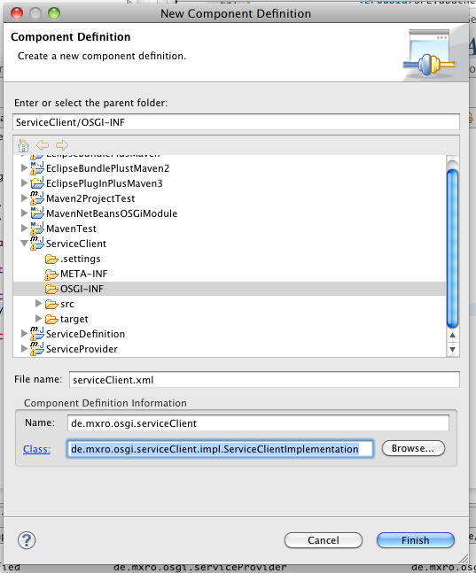

Add the ServiceClient as provided service: 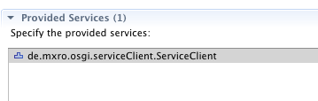

In the Services Tab, also add a referenced service by using the Wisdom interface.

Select the cardinality 1..n and the policy dynamic.

1..n means that the ServiceClient component will only be activated if there is at least one Wisdom service available. However, the component is also able to deal with more than one Wisdom service. Other options would be 1..1, which requires one service or 0..n, in which case the component would also be activated, even if there is no Wisdom service available.

The policy dynamic means that ServiceClient is able to deal with wisdom services appearing and disappearing during its runtime. If it was set to static, the component would have to be reinitialized every time a new Wisdom services appears or disappears. This behavior is not desirable, especially when creating the service is an expensive operation (for instance if the service is linked to many other services).

The methods bindWisdom and unbindWisdom, will be called if a Wisdom service becomes available or disappears.

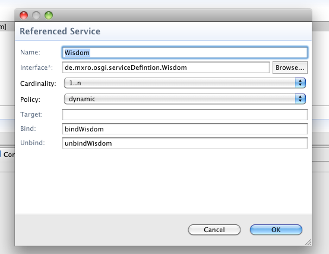

**Testing the Service Client**

You can test the service by running it in eclipse. Once the OSGi container is started up, you should see the following messages:

osgi> Wisdom was set: 'A wrong decision is better than indecision.' ServiceClientImplementation activated! Connected to wisdom: A wrong decision is better than indecision.

Note that first the bind method was called and then the activate method.

(If the OSGi container is not working as expected, it might help to reinitialize the container using the commands „shutdown“, „init“, „close“ and restarting it.)

We can manually load the bundle, [we have created in NetBeans](http://maxrohde.com/2010/05/24/osgi-maven-declarative-services-apache-felix-scr-netbeans/) from the local Maven repository.

osgi> install [file:///Users/mx/.m2/repository/de/mxro/osgi/serviceProvider2/WisdomProvider2/1.0.0/WisdomProvider2-1.0.0.jar](///Users/mx/.m2/repository/de/mxro/osgi/serviceProvider2/WisdomProvider2/1.0.0/WisdomProvider2-1.0.0.jar) Bundle id is 21

osgi> start 21 Wisdom was set: ‘A good decision is based on knowledge and not on numbers.’

osgi>

We can further test to deactivate and reactive our service client manually. osgi> ls All Components: ID        State                        Component Name                        Located in bundle 1        Satisfied                de.mxro.osgi.serviceProvider                        de.mxro.osgi.serviceProvider(bid=12) 2        Satisfied                ServiceClient                        de.mxro.osgi.serviceClient(bid=16) 3        Satisfied                de.mxro.osgi.serviceProvider2.AncientWisdomProvider                        de.mxro.osgi.serviceProvider2.WisdomProvider2(bid=21)

osgi> disable 2 Sent request for disabling component ServiceClient

osgi> Wisdom was unset: 'A good decision is based on knowledge and not on numbers.' Wisdom was unset: 'A wrong decision is better than indecision.'

osgi> enable 2 Sent request for enabling component ServiceClient

osgi> Wisdom was set: 'A wrong decision is better than indecision.' Wisdom was set: 'A good decision is based on knowledge and not on numbers.' ServiceClientImplementation activated! Connected to wisdom: A wrong decision is better than indecision. Connected to wisdom: A good decision is based on knowledge and not on numbers.

Note how the output from the activation method has changed due to the different services, which are available.

Now we can manually stop the bundles, which provide the services (note that it would be a cleaner approach to only work with the services.)

osgi> ss

Framework is launched.

id        State Bundle 0        ACTIVE org.eclipse.osgi_3.5.2.R35x_v20100126          Fragments=2, 3 2        RESOLVED javax.transaction_1.1.1.v201002111330          Master=0 3        RESOLVED org.eclipse.persistence.jpa.equinox.weaving_1.1.3.v20091002-r5404          Master=0 5        ACTIVE org.eclipse.equinox.util_1.0.100.v20090520-1800 6        ACTIVE org.eclipse.equinox.ds_1.1.1.R35x_v20090806 8        ACTIVE de.mxro.osgi.serviceDefinition_1.0.0.qualifier 9        ACTIVE org.eclipse.osgi.services_3.2.0.v20090520-1800 12        ACTIVE de.mxro.osgi.serviceProvider_1.0.0.qualifier 16        ACTIVE de.mxro.osgi.serviceClient_1.0.0.qualifier 21        ACTIVE de.mxro.osgi.serviceProvider2.WisdomProvider2_1.0.0

osgi> stop 12 Wisdom was unset: 'A wrong decision is better than indecision.'

osgi> stop 21 Wisdom was unset: 'A good decision is based on knowledge and not on numbers.'

osgi>

Note how the ServiceClient is notified by the changes through the unbind method. Now that no service is available any more, the ServiceClient‘s status changes to „unsatisfied“ as no service is available any more.

osgi> ls All Components: ID        State                        Component Name                        Located in bundle 2        Unsatisfied                ServiceClient                        de.mxro.osgi.serviceClient(bid=16)

osgi>

**Testing the Service in Apache Felix**

Using slightly different commands, we can test the same scenario in Apache Felix.

However, we can first remove the dependency on the package org.osgi.service.component. For this, we first remove the ComponentContext ctxt variable from the activate and deactivate methods and remove the import.

import java.util.Vector; import de.mxro.osgi.serviceClient.ServiceClient; import de.mxro.osgi.serviceDefintion.Wisdom;

public class ServiceClientImplementation implements ServiceClient {                  public Vector<Wisdom> wisdom \= new Vector<Wisdom>();                  protected void activate() {                 System.out.println("ServiceClientImplementation activated!");                 for (Wisdom w : wisdom)                  System.out.println("Connected to wisdom: "+w.getWisdom());                          } protected void deactivate() {          }                           protected void bindWisdom(Wisdom wisdom) {          System.out.println("Wisdom was set: '"+wisdom.getWisdom()+"'");          this.wisdom.add(wisdom);          }                  protected void unbindWisdom(Wisdom wisdom) {                 System.out.println("Wisdom was unset: '"+wisdom.getWisdom()+"'");                 this.wisdom.remove(wisdom);         }          }

Then we remove the package dependency in the MANIFEST.MF.

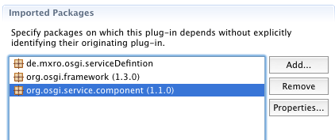

Make sure to upload the projects to the local Maven repository first (by right clicking / Maven 2 / Locally install artifact).

The project can be started in Maven using the following command (but again note that the path to your local Maven repository will most likely be different).

MacBookMX:bin mx$ ./pax-run.sh --clean --platform=felix --profiles=ds /Users/mx/.m2/repository/de/mxro/osgi/serviceProvider2/WisdomProvider2/1.0.0/WisdomProvider2-1.0.0.jar /Users/mx/.m2/repository/de/mxro/osgi/serviceDefinition/ServiceDefinition/1.0.0/ServiceDefinition-1.0.0.jar /Users/mx/.m2/repository/de/mxro/osgi/serviceProvider/ServiceProvider/1.0.0/ServiceProvider-1.0.0.jar /Volumes/local/online/Programmierung/eclipseMacBook/MavenOSGiTest/ServiceClient/target/ServiceClient-1.0.0.jar

...

Welcome to Felix ================

\-> Wisdom was set: 'A wrong decision is better than indecision.' Wisdom was set: 'A good decision is based on knowledge and not on numbers.'

The commands to work with the services can be listed using the command „scr help“.