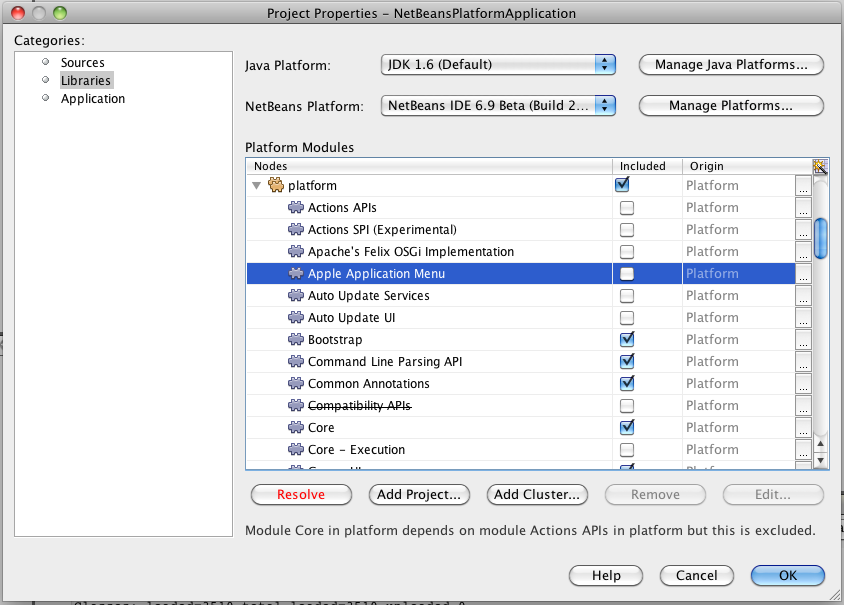

---
categories:
- java
date: "2010-05-24"
primaryBlog: maxrohde.com
title: NetBeans Application Platform Core Modules
---

There are many similarities between the NetBeans Application Platform/NetBeans Modules and OSGi container/OSGi bundles.

Whereas the standard NetBeans Application Platform project includes a great number of NetBeans modules, which significantly increases the startup time, the platform also runs on a small number of core modules.

These are: - Bootstrap - Startup - Module System API - File System API - Utilities API

After creating a NetBeans Application Platform project, a project consisting of these modules can easily be created. Just right click the NetBeans Application Platform project and select „Properties“. Go to the tab „Libraries“ and deselect all libraries but the ones listed above.

