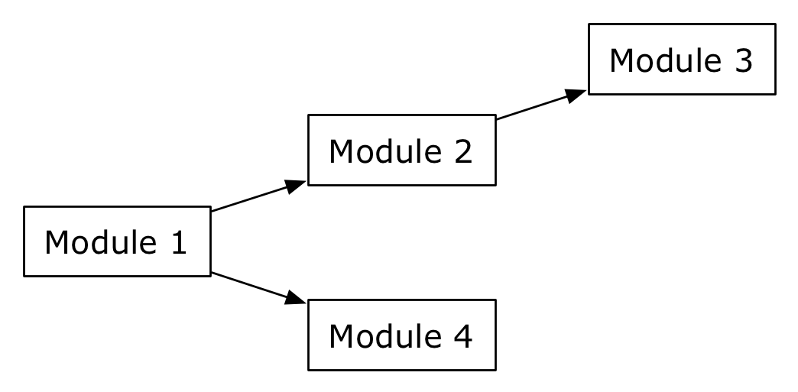

Modern applications depend on a great number of third party libraries, or libraries, which are developed as part of a project or in other places in the organization. Managing these dependencies is a daunting task. If, for instance, in the scenario depicted below, the module 1 must be added to a project, module 2 to 4 must be downloaded from respective locations and added to the project.

Tools, which support transitive dependencies between modules, simplify this task. All what needs to be done is to specify an identifier for module 1, and the dependency management system will take care of downloading the modules and adding them to the project, in which module 1 is required.

Two popular tools, which support the management of transitive dependencies are Maven 2 ([Porter and Ching, 2009](http://www.citeulike.org/user/mxro/article/7187717)) and Apache Ivy. Comparison between Apache Ivy and Maven 2 are available at the [Apache Ivy](http://ant.apache.org/ivy/m2comparison.html) and [Maven 2](http://docs.codehaus.org/display/MAVEN/Feature+Comparisons) project websites. Generally, it is often said that the documentation of Maven is rather weak. An impression I share from my work with Maven so far. Also, the integration with eclipse is also said to be weak. However, using the Eclipse IAM plugin, I did not have many problems. Maven‘s integration with the NetBeans environment is strong.

It is a quite popular approach to use Maven with OSGi ([Walls, 2009](http://www.citeulike.org/user/mxro/article/6106622)). Also, Maven is widely distributed and provides plugins for many technologies. However, I believe that Maven is great once you have figured out how to use it, but not so great if you still have to figure it out. I therefore follow an approach of Lean Maven. I create a simple template for a module and will reuse this template for all modules. This template tries to make as little use of Maven as possible.

The template consists of

- A src/test/java, src/main/java and target/classes folder following the standard Maven project structure.
- The pom.xml files declares dependencies to other modules.
- A META-INF/MANIFEST.MF file to define run time dependencies.
- A OSGI-INF folder containing XML files declaring the services the module offers.
- I use the bundle plugin to copy the MANIFEST.MF file, rather than using Maven 2 to generate the bundle definition file
- A build.properties file, allowing to run and debug the file using the eclipse Plugin Development Environment (PDE)

It is described as part of the java modularity tutorials, how to create these bundles in eclipse ([OSGi + Maven + Declarative Services + eclipse](http://maxrohde.com/2010/05/23/osgi-maven-declarative-services-eclipse/)).

This template offers the following **advantages**:

- It is easy to add new modules from third parties to the project, by, for instance, using the Maven repositories.
- Maven can be used to deploy JAR files of the project to the local and other repositories. From there, the project itself becomes a module, which is easily reusable (with all its dependencies) by other projects/modules
- The JAR files, which are deployed to the repository, can easily be installed into an OSGi container.
- Only minimal configuration is necessary for the individual modules.
- Configuring the OSGi bundles (import and export of packages) goes hand in hand with declaring dependencies via Maven. The whole process is supported by the eclipse IDE.
- It is very easy to synchronize the projects between the eclipse IDE and the NetBeans IDE. To open a project, which was created in eclipse, with NetBeans, one simply needs to Open the project using NetBeans standard open project dialog.

Using the template has the following **disadvantages**:

- Often, adding a dependency from a public repository leads to the addition of many dependencies from the referenced project, which are not necessary in the current project. This can be mitigated by maintaining a custom Maven repository.

This post is part of a series of posts on [java modular software development](http://maxrohde.com/2010/05/26/java-modularity-tutorials-osgi-declarative-services-and-maven/).
