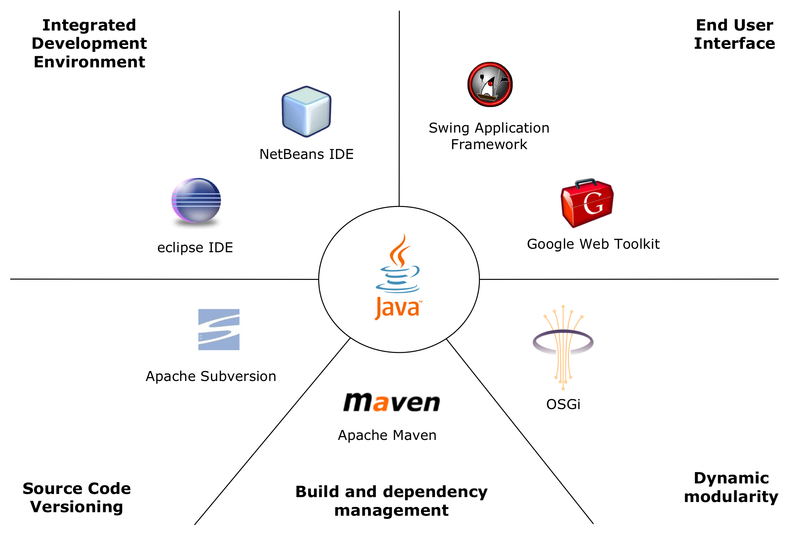

---
categories:
- java
date: "2010-05-25"
primaryBlog: maxrohde.com
title: Java Modularity Tutorials (OSGi, Declarative Services and Maven)
---

I provide here a number of tutorials to set up and work with a development environment as depicted below: 

Why I chose to use _OSGi with Declarative Services_ is discussed in the post [Modular Software Development OSGi, Spring DM, iPOJO and Declarative Services](http://maxrohde.com/2010/05/25/modular-software-development-with-osgi-spring-dm-ipojo-and-declarative-services/). Why I chose Apache Maven is described in the post [Build and Dependency Management: Lean Maven](http://maxrohde.com/2010/05/26/build-and-dependency-management-lean-maven/). After a long struggle of figuring out how to develop **OSGi** WITH **Declarative Services** with **Eclipse** AND **NetBeans** to run in Apache Felix AND Equinox, I have created a few tutorials including many screenshots showing possible ways to work with these technologies. Part 1: [OSGi + Maven + Declarative Services + eclipse](http://maxrohde.com/2010/05/23/osgi-maven-declarative-services-eclipse/) Part 2: [OSGi + Maven + Pax Runner + Apache Felix + Equinox](http://maxrohde.com/2010/05/23/osgi-maven-pax-runner-apache-felix-equinox/)

Part 3: [Creating Runtime Environments for OSGi Declarative Services in Eclipse](http://maxrohde.com/2010/05/24/creating-runtime-environments-for-osgi-declarative-services-in-eclipse/)

Part 4: [OSGi + Maven + Declarative Services + Apache Felix SCR + NetBeans](http://maxrohde.com/2010/05/24/osgi-maven-declarative-services-apache-felix-scr-netbeans/)

Part 5: [Implementing a Service Client for OSGi Declarative Services](http://maxrohde.com/2010/05/24/implementing-a-service-client-for-osgi-declarative-services/)

Part 6: [Migrate Projects to Maven/Subversion Development Environment](http://maxrohde.com/2010/05/31/migrate-projects-to-mavensubversion-development-environment/) (also see [Subversion and Maven](http://maxrohde.com/2010/06/01/subversion-and-maven/))

**Resources**

See also this [excellent tutorial on building OSGi bundles with Maven, including integration tests, etc](http://www.osgilab.org/2010/06/osgi-tutorial-from-project-structure-to.html) [Java Modularity: Jigsaw and OSGi](http://osgi.mjahn.net/2009/07/01/osgi-vs-jigsaw-why-cant-we-talk/) [Enterprise Maven Stack](http://www.slideshare.net/sonatypecm/next-generation-development-infrastructure-with-the-maven-enterprise-stack) (Commercial)