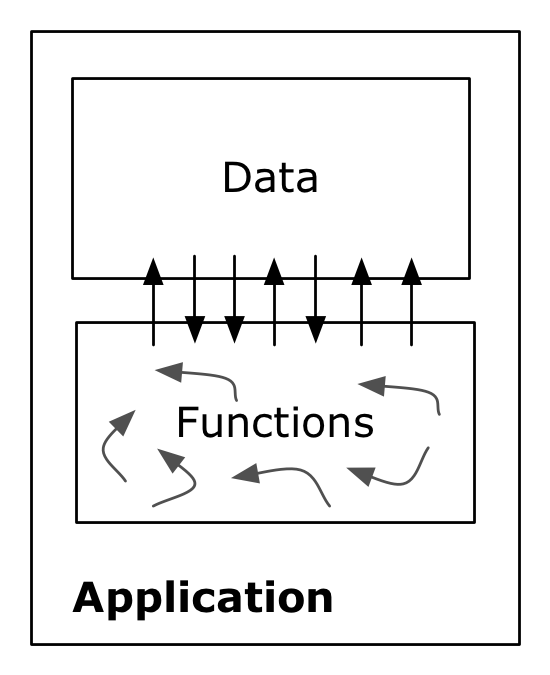
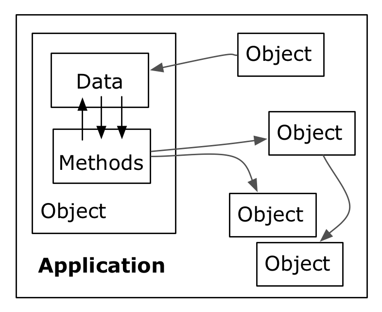
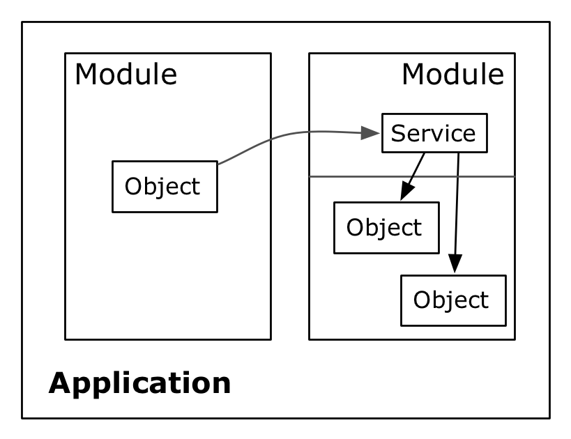
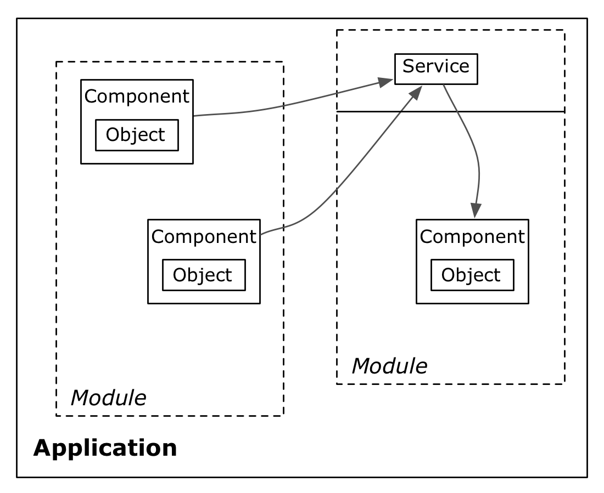
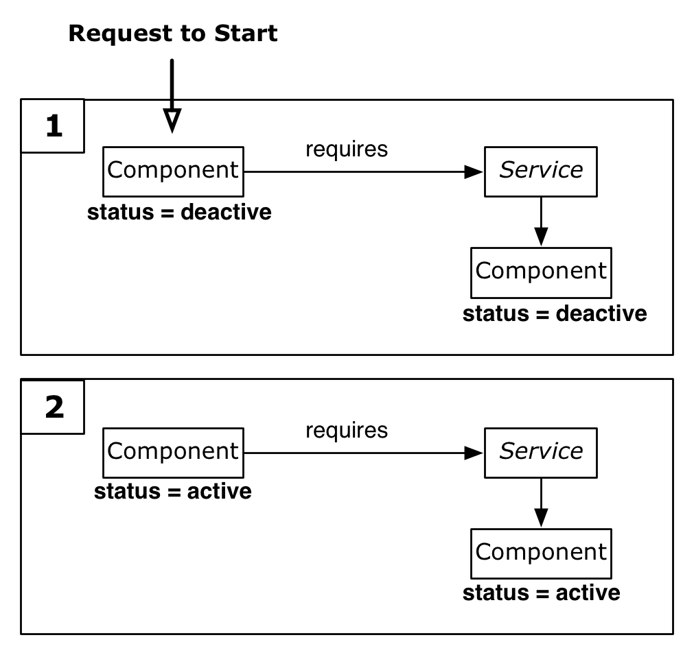

Software development is inherently different from other forms of creation. Traditional production requires a constant inflow of fresh resources, for instance energy and raw materials. Creating movies requires the combined effort of many skilled people and even writing a book cannot be accomplished without a significant investment of time and effort, as every page, every sentence has to be written anew.

To develop software is different in that re-usage, in theory, is a simple recomposition of bit and bytes. If there is one open source software, which is able to calculate differential equations, and another, which is a powerful word processor, creating a software, which can accomplish both, should be fairly easy.

However, generations of developers have experienced that the theoretical reusability of software is subject to many practical barriers: among these are different operating systems (not every software written to work on MS Windows can be used on Linux), different programming languages (a program written in Java can only with great difficulty be integrated with a software written in C), or poor design (also known as „spaghetti code“).

A first natural approach to create reusability was the idea of the function. A program was seen as a number of functions, which interact with each other by calling each other to delegate tasks. Even parts of programs can be reused by other programs by using their functions. However, even if programs organized by functions are more manageable than code structured by Go-Tos, functions leave developers of software with many problems. These are, for instance, related to extensibility: how is it possible to extend the functionality of a function without changing it or copying the code. Further, programs organized by functions face difficulties in dealing with persistent data, which is kept in arrays and other data structures. An approach often seen in functional programs (take Pascal for instance), is that data is kept in „global variables“ which keep all the data, which is accessible by all the functions of the program. Soon one looses the overview of which function access which part of the data in which way.

As one way to deal with this problem, the concept of object oriented programming was proposed. Objects are instances of classes which specify a given set of functions as well as data, which is accessible by these functions. Ideally, the outside world of the object should only access the data of the object by its functions or so called methods. Furthermore, one class can inherit another class, which means inheriting all its methods and data definition, this makes it easier to extend objects. Other applications, which want to reuse parts of other application, can reuse their objects.

However, this re-usage of objects stills bears a number of problems, which become apparent in the context of large applications:

- Extending classes, which define data, makes it still difficult to track, which method changes which data. And often, in OO, class and implementation inheritance was emphasized instead of interfaces ([D'Souza and Wills, 1998](http://www.citeulike.org/user/mxro/article/7223964))
- Complex application usually depend on extensive libraries (many of which are open source). These libraries consist of hundreds of objects. The application usually has to load and manage all these objects, which raises issues of performance.
- Furthermore, dependencies between objects can be manifold and it is difficult to manage and govern all interactions between the objects.
- OO is also said to provide a too small granularity for effective management of the code ([D'Souza and Wills, 1998](http://www.citeulike.org/user/mxro/article/7223964))
- The usual approach is to register and load all objects of all attached libraries at the start of the application. It is difficult to add and remove objects from the application during the application is running.
- Furthermore, the classes which are available to the application during runtime must be specified when the application is started. Although classes like ServiceLoader ([ServiceLoader](http://java.sun.com/javase/6/docs/api/java/util/ServiceLoader.html)) allow to create instances of objects from service interfaces, they do not support dynamic loading and unloading of services. That is, all the services which are going to be used by the application must be loaded when the application starts (be part of the classpath).

We will look at two complex and popular application, which have attempted to deal with these challenges. The integrated development environments (IDE) eclipse and NetBeans. Eclipse is a software widely known for its extensibility. The attentive user will notice that the eclipse IDE does not have to be restarted after a new extension has been installed. To accomplish this, eclipse uses the OSGi framework, which relies on a standard established by the OSGi Alliance. Among the member of this not-for-profit organization are leading IT companies like SAP AG, IBM Corporation, and Oracle Corporation (as of Mai 2010). The OSGi framework enables „the creation of highly cohesive, loosely coupled modules that can be composed into larger applications“ where „each module can be individually developed, tested, deployed, updated, and managed with minimal or no impact to the other modules.“ ([Walls, 2009](http://www.citeulike.org/user/mxro/article/6106622), p. 15). This is usually not possible in most object-oriented environments, where, possibly, every object can relate to any other object. In OSGi, an object can only rely on objects within a particular modules or a strictly limited set of classes from other modules. Furthermore, objects can be exposed as services, which can used by objects in other modules.

A very similar approach has been pursued by the NetBeans IDE. Instead of the OSGi framework, NetBeans uses so called NetBeans Modules. These modules can be dynamically loaded and unloaded during the runtime of the application and also allow to restrict access to the classes, which they contain ([Boeck, 2009](http://www.citeulike.org/user/mxro/article/7210866)). A major difference is that NetBeans modules implement a special from of file system, where file resources can be shared between modules. We see this feature as introducing a lot of complexity, which can complicate the development of large applications of many modules. Furthermore, whereas the OSGi initiatives is driven by many of the major players in IT today and used in many software products, NetBeans modules are not widely distributed outside the NetBeans community.

Both OSGi and NetBeans Modules do not solve the problem that it is actually the objects, which are required by other objects and not the modules. These leads to code as the following, sometimes referred to as „check-then-act“ pattern:

If Object is Available then let the object do something.

This is not very safe code in a multithread environment (which most applications nowadays are), as while the first line is executed, the object might be available, but it might be unavailable at the second line due to changes made in a second thread. Furthermore, usually more code needs to be added

Dynamically loading and unloading objects still raises a number of challenges. There are a number of related approaches to deal with these:

- OSGi Services
- Spring Dynamic Modules/ OSGi Blueprint services
- Apache iPOJO
- Declarative Services

Many contemporary attempts to improve the modularity of Java applications aim at turning as many objects as possible into POJOs (Plain Old Java Objects). The basic idea behind POJOs is to assure that the classes are _reusable_ in another context. For instance, if the same class is used in an application, which uses neither OSGi nor services. For instance, these classes can be reused by NetBeans modules, which were mentioned earlier.

POJOs also help to achieve class normalization in order to increase the cohesion between classes and minimize the coupling ([Ambler and Constantine, 2000](http://www.citeulike.org/user/mxro/article/7224080)).

OSGi Services rely on objects from the OSGi environment. Thereby, using these services in objects of the application, makes these objects depend on the OSGi environment (They cannot be reused apart from it). Using these services usually requires to write lots of code ([Presentation: Bartlett, 2009](http://www.slideshare.net/njbartlett/component-oriented-development-in-osgi-with-declarative-services-spring-dynamic-modules-and-apache-ipojo)).

Apache iPOJO is a framework which allows to specify reusable services. It uses reengineering of compiled byte code of Java classes to assure that references to other objects are always satisfied. The necessity of an additional build step and the change of the bytecode leads to that these objects are, despite the name of the project, not always reusable in the same way as classes supported by declarative services and Spring DM.

Spring is a very popular dependency injection framework. Such frameworks allow to declaratively set the properties of objects, for instance by specifying the value for properties in an XML file. A major advantage of such an approach is that many objects can be preserved as POJOs. However, it leads to many objects (or beans in Spring terms) are placed in a single namespace ([Presentation: Bartlett, 2009](http://www.slideshare.net/njbartlett/component-oriented-development-in-osgi-with-declarative-services-spring-dynamic-modules-and-apache-ipojo)), which is not desirable for modular applications. Spring Dynamic Modules (Spring DM) allows to break up this single namespace into smaller-grained „Application Contexts“, which can specify, which particular objects they share (import and export) ([Walls, 2009](http://www.citeulike.org/user/mxro/article/6106622)). Spring DM is part of the OSGi compendium R4.2 as Blueprint Service). However, although it is part of the standard, there is only one framework (the Spring Framework), which implements this standard). However, Spring DM requires to add a large number of modules to the application, which can take as much space as 2 MB (it is also possible to use a light version, which only takes around 600 kb). Furthermore, Spring DM only allows to create one Application Context per OSGi module. Also, in Spring DM the objects which use services by injecting references to them to their fields cannot be aware whether these services are available or not as Spring DM connects the fields with a Proxy, which is always available (But it is possible to implement Service Listeners). Spring DM has the most advanced dependency injection features such as constructor injection ([Presentation: Bartlett, 2009](http://www.slideshare.net/njbartlett/component-oriented-development-in-osgi-with-declarative-services-spring-dynamic-modules-and-apache-ipojo)). However, Spring DM does not load the beans lazily.

Declarative services (DS) are part of the OSGi standard specification (Version 4.0, OSGi Compendium specification, section 112). A framework, which supports this specification is called a „Service Component Runtime“ (SCR). This SCR creates objects and exposes them as services, manages the life-cycle of these objects, and manages the dependencies between these objects. This SCR is an independent module, which supports other modules. Every DS is also a normal OSGi service registered with the component. But these services are only registered with the bundle but not actually loaded. The services are only loaded if some component tries to consume the services. This behavior is called „lazy“ loading. This behavior can save significant startup time for applications, especially by saving time need for loading classes by the class loader ([Presentation: Bartlett, 2009](http://www.slideshare.net/njbartlett/component-oriented-development-in-osgi-with-declarative-services-spring-dynamic-modules-and-apache-ipojo)). DS only requires around 200 kb of additional space.

It must be noted here that the use of the term component is different in the context of above technologies than traditionally. Components or component frameworks ([Ambler and Constantine, 2000a](http://www.citeulike.org/user/mxro/article/2678908); [Ambler and Constantine, 2000b](http://www.citeulike.org/user/mxro/article/7224080); [D'Souza and Wills, 1998](http://www.citeulike.org/user/mxro/article/7223964); [Malveua and Mowbray, 2001](http://www.citeulike.org/user/mxro/article/7224123)) understand components as entities with greater granularity. As such, they are closer to the concept of modules described above.

All these frameworks have in common that they decouple the object from the service. The object is not responsible anymore for managing the services. This is done by a surrounding component (or bean ...) as it has been found that code to manage services can be quite repetitive (and error prone). 

The following scenario shows a component, which requires a certain service, in order to function. This service is offered by another component. If the first component must be activated, the service management framework will arrange for both components to be activated. If there was no component being capable of providing the service, the first component would not be activated. This scenario could, for instance, be implemented with Declarative Services in OSGi.

As all the frameworks work with OSGi services, they work together flawlessly. So, for instance, one module can use Declarative Services while another uses Spring DM; they will still be able to communicate with each other.

Further frameworks to decouple services are, for instance, Peaberry for Google Guice ([http://code.google.com/p/peaberry/](http://code.google.com/p/peaberry/)) or the NetBeans Lookup API.

With ubiquity of the Internet in many areas of our every day life, applications are faced with the requirement of reacting to a dynamic environment. Technologies such as OSGi and NetBeans Modules allow to design applications, which can be dynamically changed during run time. Management of such dynamic environments is a challenging tasks from an implementation point of view. Spring DM, Declarative Services and iPOJO are powerful frameworks, which allow to reduce the required work and involved risks in dealing with appearing and disappearing services.
