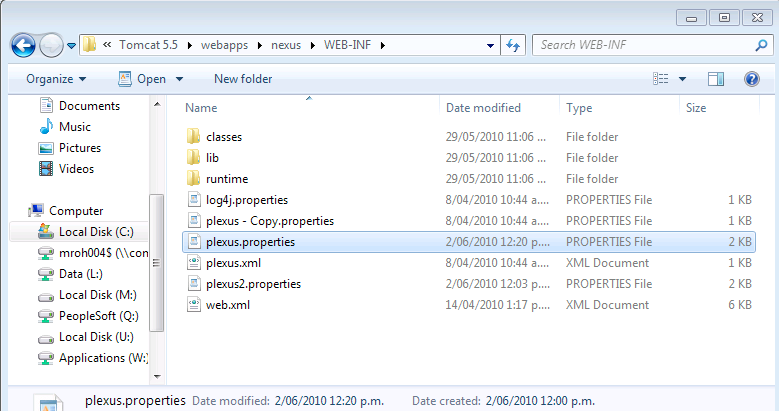
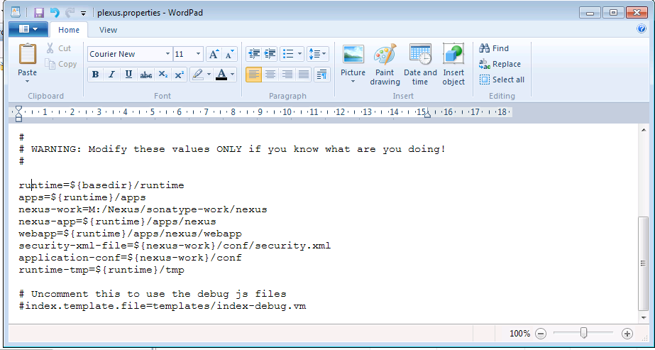
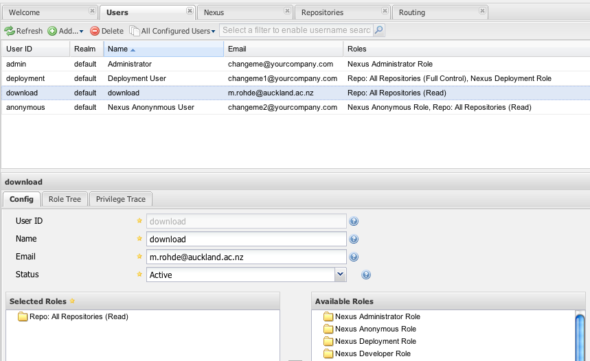
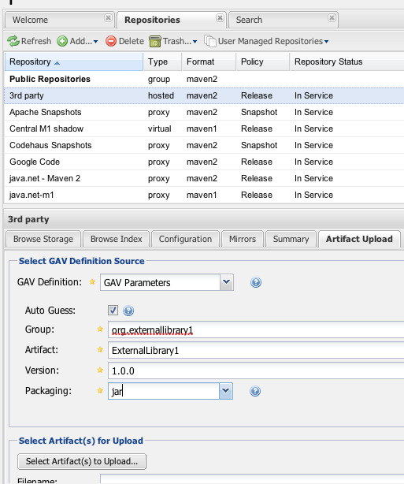
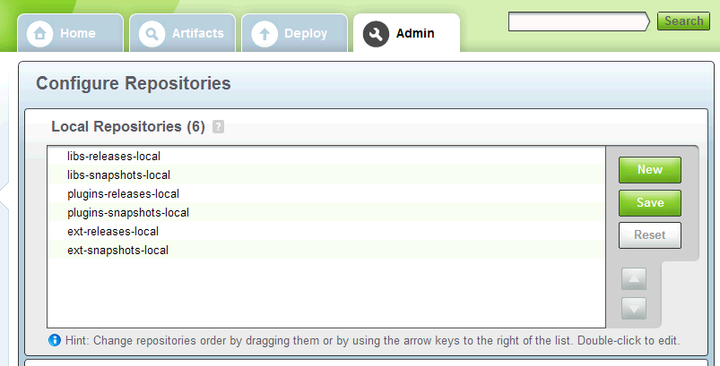
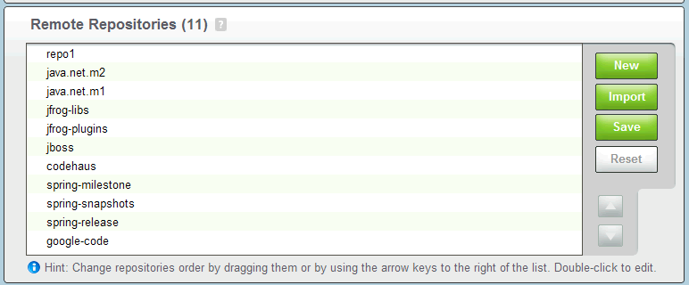
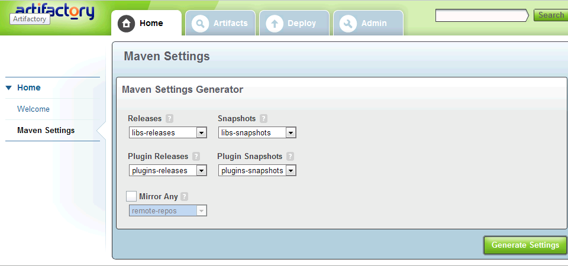

---
authors:
- max
blog: maxrohde.com
categories:
- java
date: "2010-05-29"
title: Setting up a Maven Repository using Nexus and Artifactory
---

Two popular alternatives are Nexus and Artifactory and it is highly debated, which is the [best option to use](http://weblogs.java.net/blog/johnsmart/archive/2010/01/03/tale-two-repository-managers-nexus-and-artifactory-compared-and-co). Nexus seems to have the smaller footprint on the server‘s memory.

**Installing Nexus**

Download and Install Apache Tomcat (as Windows Service)

You can [deploy Nexus as a War file](http://www.sonatype.com/books/nexus-book/reference/install-sect-as-a-war.html).

The war file is at the bottom of the downloads page [http://nexus.sonatype.org/downloads/](http://nexus.sonatype.org/downloads/).

**Configuring Nexus**

Follow some of the [post install steps](http://www.sonatype.com/books/nexus-book/reference/install-sect-repoman-post-install.html). Eg change the passwords (also for deployment user etc) and reindex the repositories.

I would also suggest to change the default location, in which repositories are kept. On my Windows 7, Nexus used a very strange folder in systems32/systemprofiles or so. The default location can be changed by changing the file „plexus.properties“. It can be found in the Apache Tomcat folder, under webapps/ nexus / WEB-INF.

The parameter, which needs to be changed is nexus-work:

I would disable anonymous access.

Set up a user „download“ and assign the role „Repo: All Repositories (Read)“. Set a password for the user. eg „example1“.

**Configuration of Maven Client to Download Repositories**

You will need to change the [settings.xml file](http://maven.apache.org/settings.html) for your Maven clients.

(1) You need to specify the address of your repository:

<?xml version=“1.0” encoding=“UTF-8”?>

<settings xmlns=“[http://maven.apache.org/SETTINGS/1.0.0](http://maven.apache.org/SETTINGS/1.0.0)”         xmlns:xsi=“[http://www.w3.org/2001/XMLSchema-instance](http://www.w3.org/2001/XMLSchema-instance)”         xsi:schemaLocation=“[http://maven.apache.org/SETTINGS/1.0.0](http://maven.apache.org/SETTINGS/1.0.0)

[http://maven.apache.org/xsd/settings-1.0.0.xsd](http://maven.apache.org/xsd/settings-1.0.0.xsd)”>

<profiles>

<profile> <repositories>          <id>localRepositories</id> <repository> <id>mxsnapshots</id> <name>mxsnapshots</name> <url>http://mylocalserver.com:8080/nexus/content/repositories/snapshots</url> </repository> <repository> <id>mxreleases</id> <name>mxreleases</name> <url>http://mylocalserver.com:8080/nexus/content/repositories/releases</url> </repository> </repositories>

</profile> </profiles> **<activeProfiles><activeProfile>localRepositories</activeProfile></activeProfiles>** </settings>

HINT: Do not forget the activeProfiles element!

(2) Since we have disabled anonymous access, we will need to specify the authentication information for the servers. Nexus allows you to store the password in an encrypted form. However, here we just specify the passwords in plain text. The servers element can be inserted below or above the profiles element:

<servers> <server> <id>mxsnapshots</id> <username>download</username> <password>...</password> </server> <server> <id>mxreleases</id> <username>download</username> <password>...</password> </server> </servers>

NOTE: In NetBeans the user settings file can be easily edited by right-clicking the „Project Files“ node in a Maven project and selecting „create settings.xml“.

You now should be able to use repositories from your repository in your local projects.

**Configure Repository for Third Party Jars**

Often, a project depends on a jar, which is not available on the public Maven repositories. In that case, it is the most robust approach to define this library in our Nexus Maven repository.

Nexus creates a special repository „thirdparty“.

We need to add this repository to our local settings.xml as well:

<repositories> <repository> <id>mxthirdparty</id> <name>mxthirdparty</name> <url>http://mylocalserver.com:8080/nexus/content/repositories/thirdparty</url> <releases> <enabled>true</enabled> </releases> <snapshots> <enabled>true</enabled> </snapshots> </repository> ...

And add another entry to the servers element:

<servers> <server> <id>mxthirdparty</id> <username>download</username> <password>...</password> </server> ...

Now we can log in to the Nexus web interface. Under repositories, we find the 3rd party repository. We can go to the tab „Artifact Upload“ 

You need to select the „GAV Definition“ GAV Parameter if you do not have a POM for the jar. You must come up with your own group etc meta data. Then you can select the jar file that you want to upload.

**Configuration of Maven Client to Upload Projects**

To upload to your repository, you have to specify an additional element in your projects pom.xml: the elements <distributionManagement> can be inserted directly under the project element (and NOT in the build element):

<distributionManagement> <repository> <id>releases</id> <name>Internal Releases</name> <url>http://mylocalserver.com:8080/nexus/content/repositories/releases</url> </repository> <snapshotRepository> <id>snapshots</id> <name>Internal Snapshots</name> <url>http://mylocalserver.com:8080/nexus/content/repositories/snapshots</url> </snapshotRepository> </distributionManagement>

You will further need to specify the authentication, as only the deployment user is allowed to deploy artifacts to the repository. For this, you will need to add new server elements to the settings.xml file:

<server> <id>snapshots</id> <username>deployment</username> <password>...</password> </server> <server> <id>releases</id> <username>deployment</username> <password>...</password> </server> <server> <id>thirdparty</id> <username>deployment</username> <password>...</password> </server>

Now you can deploy the project by using the command „mvn deploy“.

See also this blogpost regarding [distributing projects to a local repository](http://numberformat.wordpress.com/2009/05/18/nexus-repository/).

**Installing Artifactory (Incomplete)**

You can also check out [this screencast](http://www.jfrog.org/screencast.php?id=2FGHwZSAqog).

Download and Install Apache Tomcat (as Windows Service)

[Download Artifactory](http://www.jfrog.org/products.php) Open Source Maven repository manager

Deploy the artifactory.war to the Tomcat Application using the Tomcat manager.

Click on /artifactory and wait for the application to load

login with admin / password

Go to admin and specify the server name (eg „mymavenreps“)

Go to security and require authentication.

Create a user „maven“ with a password of your choice.

Go to repositories.

Local and remote repositories should already been set up.

You can go back to the home tab and automatically generate settings for Maven there:

Go to your local maven repository:

MacBookMX:workflows mx$ cd ~/.m2/

Create a new file settings.xml there and paste the generate Maven settings.

For me, the generated settings file still defined the server as „localhost“ - I changed it to the actual server where I installed Maven.

Further, you need to specify the user login information of the user you have created before.

How your local jar files can be uploaded to the server is described in [this screencast](http://wiki.jfrog.org/confluence/display/RTF/Configuring+Deployment).

**Further Resources**

[Blog post on why to use dependency management](http://blogs.jfrog.org/2010/03/building-enterprise-repository-with.html). And another blog post on the [same topic](http://blogs.reucon.com/srt/2009/06/16/nexus_vs_artifactory.html).

[Tutorial Setting Up Maven Repository under Windows using Artifactory](http://www.theserverside.com/news/1364121/Setting-Up-a-Maven-Repository)

[Good overview of how to configure repositories on the client side (Codehaus)](http://docs.codehaus.org/display/MAVENUSER/Creating+the+repositories)
