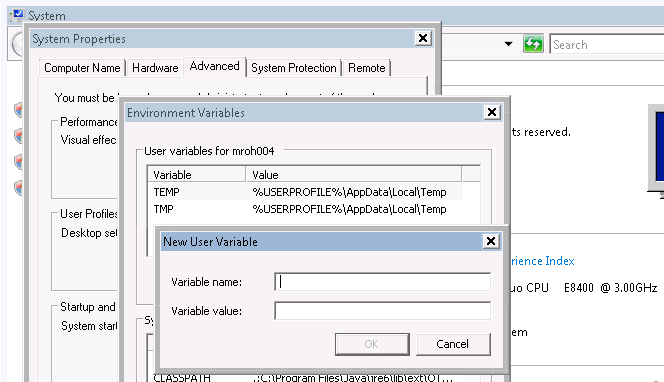

It is fairly easy to set up Maven under Windows Vista, following this [Excellent tutorial](http://www.avajava.com/tutorials/lessons/what-is-maven-and-how-do-i-install-it.html).

However, I had a few difficulties figuring out some steps, which are described in the following:

How to set your environment variables under Windows Vista? Right click your „Computer“ and select „Properties“ - here click on „Advanced Settings“.

The Systems Properties Dialog should open. Go to the tab Advanced and you can click environment variables at the bottom.

On my system, the variables where: JAVA\_HOME --> C:\\Program Files\\Java\\jdk1.6.0\_20 M2\_HOME --> C:\\Users\\mroh004.COM\\Documents\\Applications\\apache-maven-2.2.1
