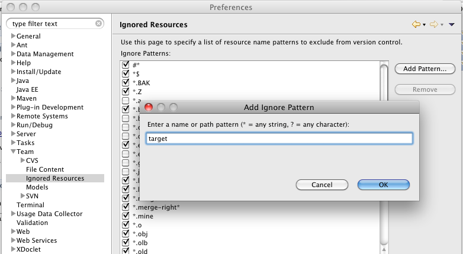
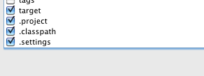
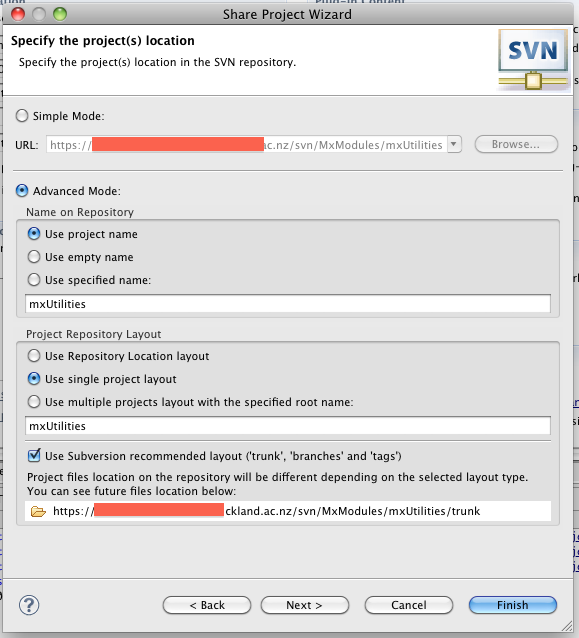
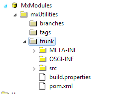
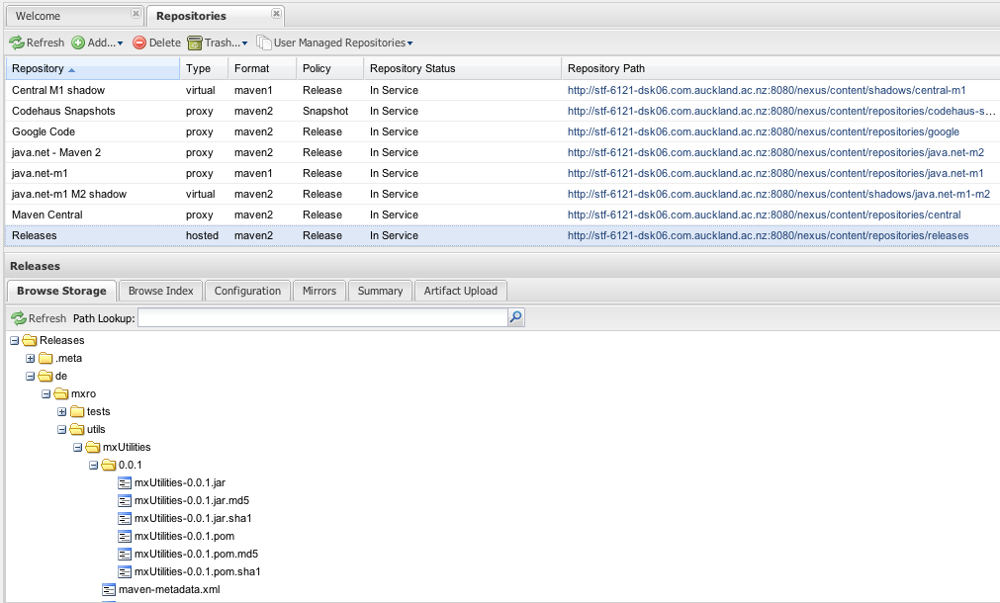
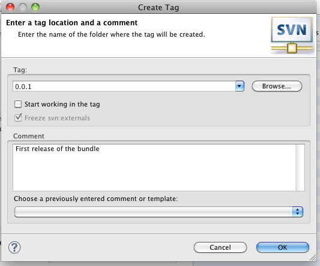
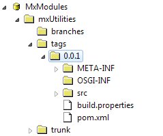
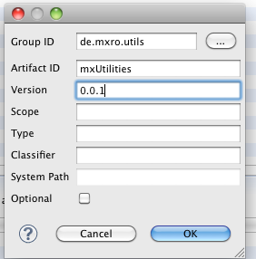
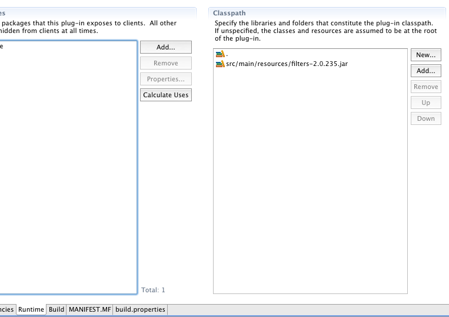
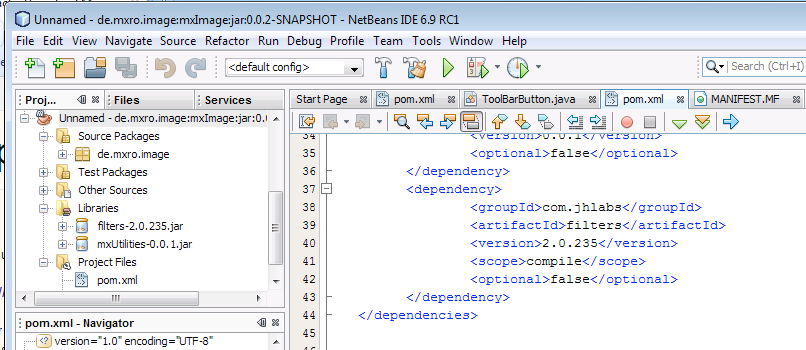

This post contains a number of experiences made while making a Swing desktop application modular using Maven and Subversion.

**Environment** Install a subversion server (for instance on [ubuntu server](http://maxrohde.com/2010/05/13/setting-up-a-subversion-server-on-ubuntu-9-10/) or on windows using VisualSVN) Set up [one subversion repository for all your projects](http://www.visualsvn.com/support/topic/00017/). (Read more [on setting up SVN repository structure](http://www.visualsvn.com/support/svnbook/reposadmin/planning/)) Install a [subversion plugin when using eclipse](http://www.eclipse.org/subversive/downloads.php).

The steps described here should allow a synchronized development on multiple systems and multiple IDEs. I have tested with Mac OS X (10.6.3), Microsoft Windows 7 and Microsoft Windows Vista. I used the IDEs Eclipse (Ganymede) and NetBeans (6.9 RC1).

I found eclipse more reliable when it comes to refactoring than NetBeans IDE.

**Link all your source folders to one project in eclipse**

Create a new project in eclipse named ‚AllSource‘. Do right click and Link Source Folders for all your projects.

Important: for this, the source folders in all your projects have to have different names (I guess eclipse by default creates them as ‚src‘ or something; I always rename the source folder to the name of the project, that it becomes easier to link the source folders of different projects).

**Organizes Classes in Packages**

Try to normalize the classes in distinct packages. Do not have the same package name in two source folders. Try to use as few as possible different root folders per source folder. Make the root folders distinct.

Eg. de.mxro de.mxro.package1 de.mxro.package2 is not desirable. Change to: de.mxro.domainpackage de.mxro.package1 de.mxro.package2

Furthermore, try to aggregate classes, which have similar dependencies in distinct packages.

eg de.mxro.notDependent de.mxro.dependsOnLib1 de.mxro.dependsOnLib2 **Create PlugIn Projects for the OSGi Bundles**

Create Plugin Projects in eclipse and link them to Maven (see [OSGi + Maven + Declarative Services + eclipse](http://maxrohde.com/2010/05/23/osgi-maven-declarative-services-eclipse/)).

Do not forget to change the pom.xml file: let the OSGI-INF and META-INF folders be copied and NOT generated by Maven (makes life easier in the long run)

<build\>         <resources\>                 <resource\>                         <targetPath\>OSGI-INF</targetPath\>                         <filtering\>false</filtering\>                         <directory\>OSGI-INF</directory\>                 </resource\>         </resources\>         <plugins\> <plugin\>         <groupId\>org.apache.maven.plugins</groupId\>         <artifactId\>maven\-jar-plugin</artifactId\>         <configuration\>                 <archive\>                         <manifestFile\>META-INF/MANIFEST.MF</manifestFile\>                 </archive\> </configuration\> </plugin\> <plugin\>

If you use a Maven repository, you can also specify the distribution location in the pom.xml file (can be directly inserted under the project element - don‘t insert under build):

<distributionManagement> <repository> <id>releases</id> <name>Internal Releases</name> <url>[http://mylocalserver.com:8080/nexus/content/repositories/releases](http://mylocalserver.com:8080/nexus/content/repositories/releases)</url> </repository> <snapshotRepository> <id>snapshots</id> <name>Internal Snapshots</name> <url>[http://mylocalserver.com:8080/nexus/content/repositories/snapshots](http://mylocalserver.com:8080/nexus/content/repositories/snapshots)</url> </snapshotRepository> </distributionManagement>

Open Mac OS X Finder or Windows Explorer and Copy and Paste the source files form the old source folders to the bundle source files (src/main/java)

Right click project in eclipse and select refresh. It might be also be a good idea to [change the encoding of the project](http://www.ibm.com/developerworks/opensource/library/os-eclipse-osxjava/index.html#N10290) to [UTF-8](http://ekkescorner.wordpress.com/2009/07/28/howto-change-fileencoding-of-eclipse-projects-osx/).

You should now be able to deploy the artifact to the Maven repository.

**Source Code Versioning**

Before adding the sources to version control, it is advisable to delete all old version control meta-data in the source directories. If you are using unix or Mac OS X, you can check, if there is any meta-data using the command:

MacBookMX:de mx$ find . -type d -name .svn

If you want to delete the meta data, use the command:

MacBookMX:de mx$ rm -rf \`find . -type d -name .svn\`

(more info [here](http://www.anyexample.com/linux_bsd/bash/recursively_delete__svn_directories.xml))

In eclipse, you can also add the project to version control, and then disconnect the project and choose to delete all .svn meta-data to achieve the same end.

Also, make sure the „target“ folder of maven is not uploaded ([Ignore eclipse project resources for subversion](http://www.waltercedric.com/java-j2ee-mainmenu-53/361-maven-build-system/1528-subversion-and-the-importance-of-svnignore-for-maven-multi-modules.html)):

You can also create global ignore pattern for the following files ([Setting up global ignore for eclipse](http://confluence.sakaiproject.org/display/BOOT/Add+bin+and+target+to+global+svn+ignore+in+Eclipse)). However, although this makes your modules more independent from the eclipse ID, it also complicates importing your projects to eclipse (you will need to configure all the project settings every time). I therefore **do not exclude these files**.

.project .classpath .settings 

(This must be done for all involved IDEs on all involved systems)

You can connect the project by right clicking the project and selecting Team / Share Project.

Make sure to use the layout using trunk/branches/tags.

The source files should be in the folder „trunk“ (and there should be no .project/.settings/... folders)

**Deploy Initial Release**

There are some ways to automate the release process ([Tutorial showing how to setup subversion to use with Maven](http://wiki.gxdeveloperweb.com/confluence/display/GXDEV/Maven+and+Source+Control+Management+in+Subversion)). However, I chose to do it manually, as I did not find yet integration for the release plugin for eclipse IAM.

Fist, change the version numbers of your OSGi bundle and the Maven project. I first use the version „0.0.1“ for new bundles.

You can right-click the project, select Maven 2 / Deploy Artifact.

This should upload your project to the local Maven repository: 

Now you should also create a tag in subversion. Just right click the project and select Team / Tag ...

Use the version number as the tag. And leave „start working in the tag“ UNselected.

Now you have a snapshot of your sourcecode at the time of the release:

Now do not forget to change the version to a new snapshot release:

Name your OSGi bundle: 0.0.2.SNAPSHOT Name your Maven project: 0.0.2-SNAPSHOT

You can deploy the snapshot version to the Maven repository as well.

However, when specifying dependencies between projects, I would always recommend to use release versions of the plugin (this allows to trace back various builds and reduces the workload to prepare a release as releases should not contain any -SNAPSHOT) references.

So it is good to have a release version available from the very beginning.

**Import to other IDEs**

Import into eclipse can be accomplished by File / Import and „Project from SVN“. Use the HEAD revision and let eclipse search for project settings in the directories.

The import in eclipse is so effortless that I would suggest to initially download the projects using an eclipse IDE. Then, the projects can be very easily opened in NetBeans IDE (just use open project).

**Setting up Dependencies between Modules**

When setting up dependencies, always try to use non-snapshot version:

**Linking to Third Party Libraries**

Many third party libraries do not provide Maven metadata. You can upload these libraries as JARs to your own repository (eg Nexus, Artifactory).

These libraries then still need to be installed into the OSGi runtime. There is a Maven plugin, which is able to [automatically package the Maven dependencies into OSGi bundles](http://www.lucamasini.net/Home/osgi-with-felix/creating-osgi-bundles-of-your-maven-dependencies). However, the generated MANIFEST.MF would only be available AFTER the Maven build. So the bundle might not run in eclipses runtime environment (which is desirable for debugging purposes).

Another option is to include the libraries directly in the bundle you are working with. I copy the jars in the src/main/resources folder. From there, I edit the MANIFEST.MF and add the libraries in the scr/main/resources folder to the Classpath of the plugin. Make sure that also the „.“ is added to the classpath)

These will make the bundles available at runtime for the bundle (as the JARs from the resources folder are copied to the root of the bundle, and by „.“ the root is added to the classpath of the bundle).

This works fine in eclipse but if you want to use the projects effortlessly in NetBeans, the pom.xml must still define the dependency to the library. For this, the library must of course be available as Maven project (either from a public repository or uploaded to your own repository as shown above). It might make sense to change the scope to „provided“ (see [Maven Doc Dependency Scope](http://maven.apache.org/guides/introduction/introduction-to-dependency-mechanism.html))

**Resources**

Eclipse/PDE integration of the [Maven Bundle Plugin](http://felix.apache.org/site/apache-felix-maven-bundle-plugin-bnd.html) [Maven Eclipse Plugin](http://maven.apache.org/plugins/maven-eclipse-plugin/): Allows to generate eclipse project files and convert eclipse projects to maven [Extensive tutorial on how to develop plugins for eclipse using maven and eclipse PDE](http://www.eclipse.org/articles/article.php?file=Article-Eclipse-and-Maven2/index.html)
