**The Problem**

Maven has a slightly different approach to handling resources in Java packages than Eclipse PDE. For Maven, usually only \*.java files are compiled and the rest of the files in java packages are ignored. For Eclipse PDE, these files are included in the classpath.

This works fine as long as resources and \*.java files are mixed in the same package as shown below:

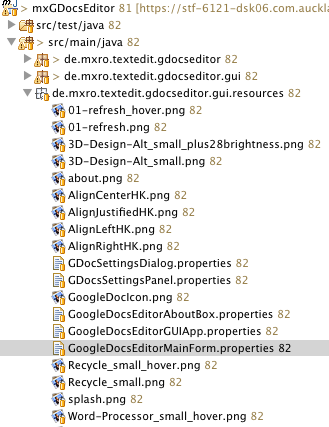

When this project is compiled using Maven, the folder with the resources remains empty:

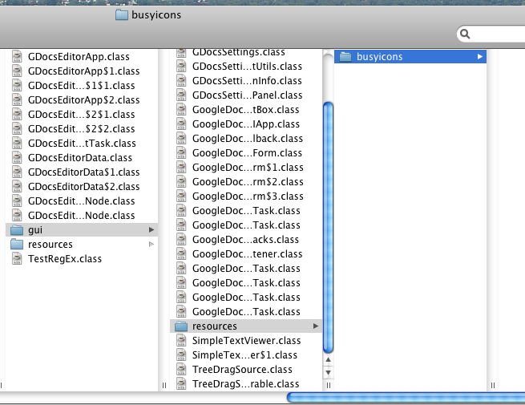

Using eclipses plugin export, all the resources are copied:

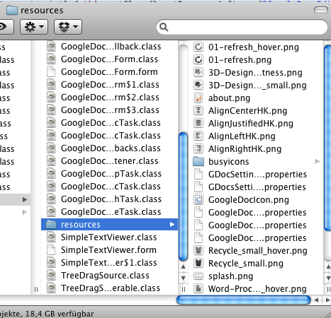

**Causes of the Problem**

The cause of the problem is a different handling of classpaths: when an eclipse project is converted to a Maven project, the classpath is changed:

Create a new Plug in project

Commit the project to a SVN server

Rigth click and select Maven 2 / Enable dependency management

Right click and select Team / Synchronize

The Maven 2 Plugin changes the following files:

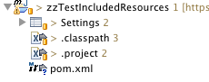

Changes in the settings

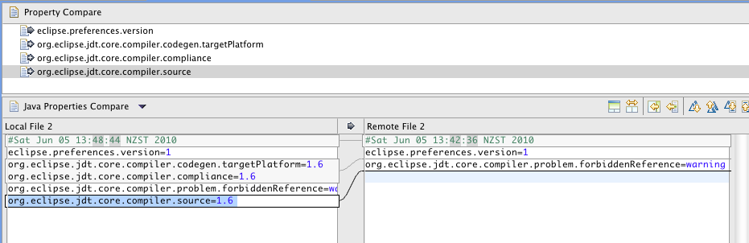

Changes in .project

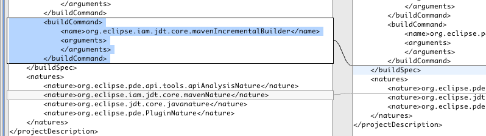

And the changes in .classpath show what causes the problems:

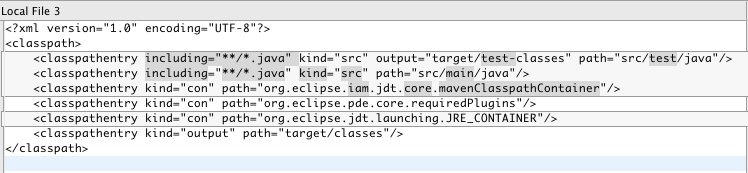

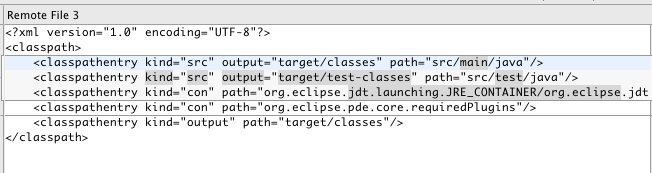

In specific the filter „including="\*\*/\*.java"“ causes the problems, the resources will have other extensions such as .png.

**Solving the Problem for eclipse PDE**

The following solves the problem for PDE Development:

Remove the including attribute in .classpath:

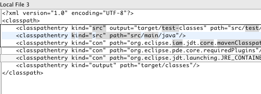

My projects are all in one eclipse workspace, and I would suggest to change all the .classpath files in a batch. For that one way to do this so to go to Search / File in eclipse.

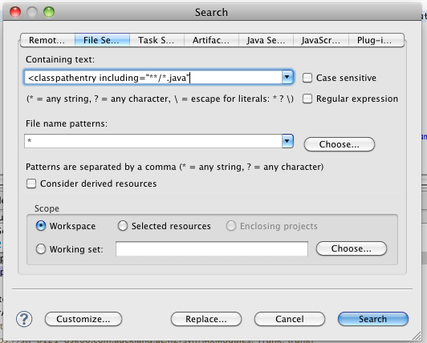

After specifying the settings above, hit Replace

Each project should have two matches in the projects .classpath file.

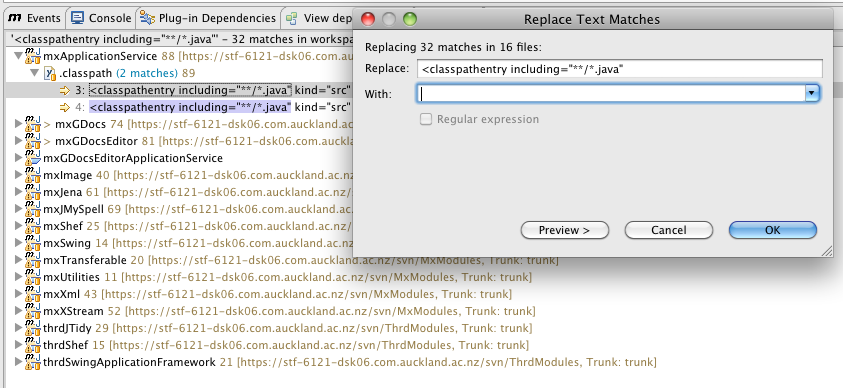

Just replace „<classpathentry including=“\*\*/\*.java”“ with „<classpathentry “ (make sure to leave one space at the end of the replacement string).

You can preview all the changes by hitting preview:

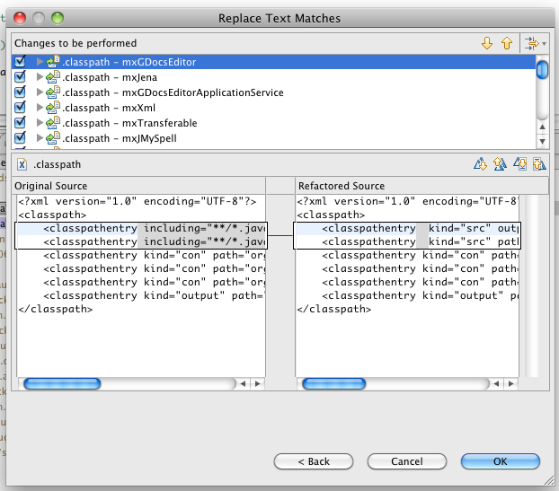

**Solving the Problem for Maven**

Resources in the same packages as classes also require of bit of tweaking in the Maven project file (pom.xml).

I needed the following additional entries in the pom.xml so that the jar is created by Maven in the right way:

<resources>                         <resource>                                 <filtering>false</filtering>                                 <directory>src/main/java</directory>                                 <includes>                                         <include>\*\*</include>                                 </includes>                                 <excludes>                                         <exclude>\*\*/\*.java</exclude>                                 </excludes>                         </resource>                         <resource>                                 <targetPath>OSGI-INF</targetPath>                                 <filtering>false</filtering>                                 <directory>OSGI-INF</directory>                          <includes>                                         <include>\*\*</include>                                 </includes>                         </resource>                         <resource>                                                 <filtering>false</filtering>                                 <directory>src/main/resources</directory>                          <includes>                                         <include>\*\*</include>                                 </includes>                         </resource> </resources>

The OSGI-INF folder is, of course, only needed when declarative services etc is used. I really do not know why know a manual entry for src/main/resources is necessary? It should be included following the Maven convention.

Also, as described before, an additional plugin needs to be loaded in order to use the MANIFEST.MF file from eclipse rather than the one generated by Maven:

<plugin>         <groupId>org.apache.maven.plugins</groupId>         <artifactId>maven\-jar-plugin</artifactId>         <configuration>                 <archive>                         <manifestFile>META-INF/MANIFEST.MF</manifestFile>                 </archive> </configuration> </plugin>

**Resources**

[Blog post on the difference between getResourceAsStream and Bundle getEntry](http://www.eclipsezone.com/eclipse/forums/t101557.html) [Discussion about getResourceAsStream in OSGi](http://www.eclipsezone.com/eclipse/forums/t63159.html)
