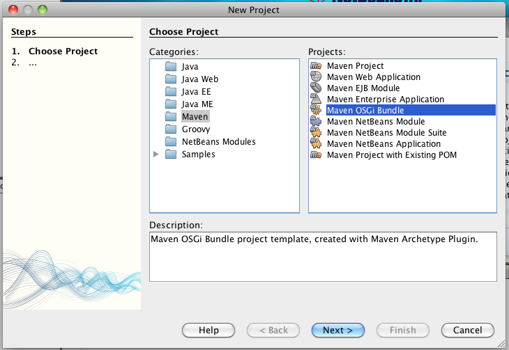
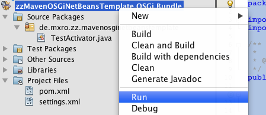
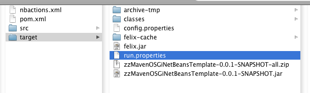

Just a number of pointers on the debugging, testing and deployment of OSGi applications ...

**Debugging**

Debugging is often an essential activity if the application just does not want to work as it is supposed to. Eclipse offers strong support for debugging of OSGi applications through the Plug-In Development Environment (PDE). I have written a number of posts describing how [eclipse PDE can be set up to work together with Maven](http://nexnet.wordpress.com/2010/05/26/java-modularity-tutorials-osgi-declarative-services-and-maven/). There are a few tricky issues such as [Loading Resources in Class Package for PDE using Eclipse IAM](http://nexnet.wordpress.com/2010/06/05/loading-resources-in-class-package-for-pde-using-eclipse-iam/).

**Testing**

See [OSGi Bundle Buddy](http://romanroe.blogspot.com/2010/03/osgi-bundle-buddy.html)

**Deploying**

A good template to start is the OSGi template Maven project in the NetBeans IDE (I guess included since version 6.9).



This archetype creates a Maven pom.xml such as the following:

```“xml”

&lt;project xmlns=“<a href="http://maven.apache.org/POM/4.0.0">http://maven.apache.org/POM/4.0.0</a>” xmlns:xsi=“<a href="http://www.w3.org/2001/XMLSchema-instance">http://www.w3.org/2001/XMLSchema-instance</a>”
         xsi:schemaLocation=“<a href="http://maven.apache.org/POM/4.0.0">http://maven.apache.org/POM/4.0.0</a> <a href="http://maven.apache.org/maven-v4_0_0.xsd">http://maven.apache.org/maven-v4_0_0.xsd</a>”&gt;

    &lt;modelVersion&gt;4.0.0&lt;/modelVersion&gt;
    &lt;groupId&gt;de.mxro.zz.mavenosginetbeanstemplate&lt;/groupId&gt;
    &lt;artifactId&gt;zzMavenOSGiNetBeansTemplate&lt;/artifactId&gt;
    &lt;version&gt;0.0.1-SNAPSHOT&lt;/version&gt;
    &lt;packaging&gt;bundle&lt;/packaging&gt;
    &lt;name&gt;zzMavenOSGiNetBeansTemplate OSGi Bundle&lt;/name&gt;
    &lt;dependencies&gt;
        &lt;dependency&gt;
            &lt;groupId&gt;org.apache.felix&lt;/groupId&gt;
            &lt;artifactId&gt;org.osgi.core&lt;/artifactId&gt;
            &lt;version&gt;1.4.0&lt;/version&gt;
        &lt;/dependency&gt;
    &lt;/dependencies&gt;
    &lt;build&gt;
        &lt;plugins&gt;
            &lt;plugin&gt;
                &lt;groupId&gt;org.apache.felix&lt;/groupId&gt;
                &lt;artifactId&gt;maven-bundle-plugin&lt;/artifactId&gt;
                &lt;version&gt;2.0.1&lt;/version&gt;
                &lt;extensions&gt;true&lt;/extensions&gt;
            &lt;/plugin&gt;
        &lt;/plugins&gt;
    &lt;/build&gt;

    &lt;profiles&gt;
        &lt;profile&gt;
            &lt;!-- this profile executes the bundle on apache felix--&gt;
            &lt;id&gt;run-on-felix&lt;/id&gt;
            &lt;dependencies&gt;
                &lt;dependency&gt;
                    &lt;groupId&gt;org.apache.felix&lt;/groupId&gt;
                    &lt;artifactId&gt;org.apache.felix.main&lt;/artifactId&gt;
                    &lt;version&gt;2.0.2&lt;/version&gt;
                    &lt;scope&gt;provided&lt;/scope&gt;
                &lt;/dependency&gt;
                &lt;dependency&gt;
                    &lt;groupId&gt;org.apache.felix.gogo&lt;/groupId&gt;
                    &lt;artifactId&gt;org.apache.felix.gogo.commands&lt;/artifactId&gt;
                    &lt;version&gt;0.2.2&lt;/version&gt;
                &lt;/dependency&gt;
            &lt;/dependencies&gt;

            &lt;build&gt;
                &lt;plugins&gt;
                    &lt;plugin&gt;
                        &lt;groupId&gt;org.apache.maven.plugins&lt;/groupId&gt;
                        &lt;artifactId&gt;maven-antrun-plugin&lt;/artifactId&gt;
                        &lt;version&gt;1.3&lt;/version&gt;
                        &lt;executions&gt;
                            &lt;execution&gt;
                                &lt;id&gt;compile&lt;/id&gt;
                                &lt;phase&gt;compile&lt;/phase&gt;
                                &lt;goals&gt;
                                    &lt;goal&gt;run&lt;/goal&gt;
                                &lt;/goals&gt;
                                &lt;configuration&gt;
                                    &lt;tasks&gt;
                                        &lt;property name=“plugins” refid=“maven.runtime.classpath”/&gt;
                                        &lt;pathconvert pathsep=“ “ dirsep=“/“ property=“project.build.url”&gt;
                                            &lt;path path=“${project.build.directory}”/&gt;
                                        &lt;/pathconvert&gt;
                                        &lt;pathconvert property=“plugins.jars” pathsep=“:”&gt;
                                            &lt;path path=“${plugins}”/&gt;
                                            &lt;map from=“${project.build.directory}/classes” to=“”/&gt;
                                        &lt;/pathconvert&gt;
                                        &lt;makeurl property=“urls” separator=“ “ validate=“false”&gt;
                                            &lt;path path=“${plugins.jars}”/&gt;
                                        &lt;/makeurl&gt;
                                        &lt;pathconvert pathsep=“ “ property=“bundles”&gt;
                                            &lt;path path=“${plugins}”/&gt;
                                            &lt;mapper&gt;
                                                &lt;chainedmapper&gt;
                                                    &lt;flattenmapper/&gt;
                                                    &lt;globmapper from=“*” to=“file:modules/*” casesensitive=“no”/&gt;
                                                &lt;/chainedmapper&gt;
                                            &lt;/mapper&gt;
                                        &lt;/pathconvert&gt;
                                        &lt;makeurl property=“main.bundle.url” file=“${project.build.directory}/${project.artifactId}-${project.version}.jar”/&gt;
                                        &lt;echo file=“${project.build.directory}/run.properties”&gt;
                                            felix.auto.install=${urls}
                                            felix.auto.start=${main.bundle.url}
                                            org.osgi.framework.storage=${project.build.url}/felix-cache
                                            org.osgi.framework.bootdelegation=*
                                        &lt;/echo&gt;
                                        &lt;replace file=“${project.build.directory}/run.properties” token=“\” value=“\\”/&gt;
                                        &lt;echo file=“${project.build.directory}/config.properties”&gt;
                                            felix.auto.install=“${bundles}”
                                            felix.auto.start=file:modules/${project.artifactId}-${project.version}.jar
                                        &lt;/echo&gt;
                                        &lt;copy file=“${maven.dependency.org.apache.felix.org.apache.felix.main.jar.path}” tofile=“${project.build.directory}/felix.jar”/&gt;
                                    &lt;/tasks&gt;
                                &lt;/configuration&gt;
                            &lt;/execution&gt;
                        &lt;/executions&gt;
                    &lt;/plugin&gt;
                    &lt;plugin&gt;
                        &lt;groupId&gt;org.apache.maven.plugins&lt;/groupId&gt;
                        &lt;artifactId&gt;maven-assembly-plugin&lt;/artifactId&gt;
                        &lt;version&gt;2.2-beta-5&lt;/version&gt;
                        &lt;executions&gt;
                            &lt;execution&gt;
                                &lt;id&gt;create-executable-jar&lt;/id&gt;
                                &lt;phase&gt;package&lt;/phase&gt;
                                &lt;goals&gt;
                                    &lt;goal&gt;single&lt;/goal&gt;
                                &lt;/goals&gt;
                                &lt;configuration&gt;
                                    &lt;descriptors&gt;
                                        &lt;descriptor&gt;${basedir}/src/main/assembly/felix.xml&lt;/descriptor&gt;
                                    &lt;/descriptors&gt;
                                    &lt;finalName&gt;${project.artifactId}-${project.version}&lt;/finalName&gt;
                                &lt;/configuration&gt;
                            &lt;/execution&gt;
                        &lt;/executions&gt;
                    &lt;/plugin&gt;
                &lt;/plugins&gt;
            &lt;/build&gt;
        &lt;/profile&gt;
    &lt;/profiles&gt;
&lt;/project&gt;
```

Just for the sake of testing, we can add the following simple bundle activator (by right click on the NetBeans project)

```“java”

package de.mxro.zz.mavenosginetbeanstemplate;

import org.osgi.framework.BundleActivator;
import org.osgi.framework.BundleContext;

/**
 *
 * @author mx
 */
public class TestActivator implements BundleActivator {

    public void start(BundleContext context) throws Exception {
        System.out.println("OSGi bundle started.");
    }

    public void stop(BundleContext context) throws Exception {
        System.out.println("OSGi bundle stopped.");
    }

}
```

First, we right-click the project and select „clean and build“.

By right-clicking on the project and selecting „Run“, the OSGi bundle will be launched in an Apache Felix container.



This action should result in the following files being written in the target directory of the project:



These are all files necessary to start your application with one command. Navigate to the target directory on the command line and type in the following command.

```“bash”

MacBookMX:target mx$ java -jar felix.jar
No config.properties found.

Welcome to Felix
================

<strong>OSGi bundle started.</strong>
```

This is enabled by the files „config.properties“.

config.properties:

```

felix.auto.install="file:modules/classes file:modules/org.osgi.core-1.4.0.jar file:modules/org.apache.felix.gogo.commands-0.2.2.jar file:modules/org.apache.felix.gogo.runtime-0.2.2.jar"
felix.auto.start=file:modules/zzMavenOSGiNetBeansTemplate-0.0.1-SNAPSHOT.jar
```

I am not too sure, why a file run.properties is created. The bundle starts well, even if this file is not existent.

run.properties:

```

felix.auto.install=file:/Users/mx/.m2/repository/org/apache/felix/org.osgi.core/1.4.0/org.osgi.core-1.4.0.jar file:/Users/mx/.m2/repository/org/apache/felix/gogo/org.apache.felix.gogo.commands/0.2.2/org.apache.felix.gogo.commands-0.2.2.jar file:/Users/mx/.m2/repository/org/apache/felix/gogo/org.apache.felix.gogo.runtime/0.2.2/org.apache.felix.gogo.runtime-0.2.2.jar
                                            felix.auto.start=file:/Volumes/local/online/Programmierung/Modules/zzMavenOSGiNetBeansTemplate/target/zzMavenOSGiNetBeansTemplate-0.0.1-SNAPSHOT.jar
                                            org.osgi.framework.storage=/Volumes/local/online/Programmierung/Modules/zzMavenOSGiNetBeansTemplate/target/felix-cache
                                            org.osgi.framework.bootdelegation=*
```

[Find here more information on the startup of the Felix framework](http://felix.apache.org/site/apache-felix-framework-usage-documentation.html).

**Resources**

[OSGi Bundle Buddy](http://romanroe.blogspot.com/2010/03/osgi-bundle-buddy.html) (Allows to quickly update bundles loaded in a OSGi runtime) [Equinox Framework](http://www.eclipse.org/equinox/framework/) (Includes the Java Launcher and the Native Launcher used by the eclipse binary) [Discussion of best choice for OSGi container](http://stackoverflow.com/questions/560794/what-osgi-container-do-you-recommend) [Apache Felix Framework Launching and Embedding](https://cwiki.apache.org/confluence/display/FELIX/Apache+Felix+Framework+Launching+and+Embedding)
