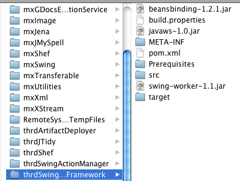

---
authors:
- max
blog: maxrohde.com
categories:
- java
date: "2010-06-18"
title: Eclipse PDE and Maven Bundle Plugin
---

To get eclipse PDE working hand in hand with Maven is a rather tricky task. I have already written about some necessary [tweaks to get it working](http://maxrohde.com/2010/06/05/loading-resources-in-class-package-for-pde-using-eclipse-iam/).

Another way is to use the [Apache Felix Maven bundle plugin](http://felix.apache.org/site/apache-felix-maven-bundle-plugin-bnd.html). This Maven plugin is able to generate the necessary files for the eclipse PDE to work with the Maven files. It does so by copying the JARs that the Maven project depends on and by altering the .classpath and .project files of the project.

I found that this procedure works fine with eclipse projects, which are already linked to eclipse IAM and have been created as eclipse plugin projects.

**Copying Maven Dependencies**

The Maven dependencies are directly copied to the project‘s main folder. The dependencies are the jars in the following screenshot.



This must be configured in the project‘s pom.xml file. (1) <packaging>bundle</packaging> must be added (2) A plugin to copy the dependencies must be added (I added a further execution to unpack the dependencies for reasons described in [OSGi: Libraries Requiring Access to Bundle ClassLoader](http://maxrohde.com/2010/06/06/osgi-libraries-requiring-access-to-bundle-classloader/))

```
<plugin> <artifactId>maven-dependency-plugin</artifactId> <executions> <execution> <id>unpack-dependencies</id> <phase>generate-resources</phase> <goals> <goal>unpack-dependencies</goal> </goals> <configuration> <includeGroupIds>org.swinglabs,org.jdesktop,com.sun</includeGroupIds> </configuration> </execution> <execution> <id>copy-dependencies</id> <phase>process-sources</phase> <goals> <goal>copy-dependencies</goal> </goals> <configuration> <outputDirectory>${basedir}</outputDirectory> <overWriteReleases>false</overWriteReleases> <overWriteSnapshots>false</overWriteSnapshots> <overWriteIfNewer>true</overWriteIfNewer> </configuration> </execution> </executions> </plugin>
```

(3) Add a Maven clean plugin to remove those copied dependencies

```
<plugin> <artifactId>maven-clean-plugin</artifactId> <version>2.3</version> <configuration> <filesets> <fileset> <directory>${basedir}</directory> <includes> <include>\*.jar</include> </includes> <followSymlinks>false</followSymlinks> </fileset> </filesets> </configuration> </plugin>
```

(4) Add a plugin to configure the bundles manifest file. I think the syntax to create these files using the plugin is quite verbose and rather use the PDE tools for generating a bundle. Therefore, the plugin basically just copies the MANIFEST.MF edited with eclipse.

```
<plugin> <groupId>org.apache.felix</groupId> <artifactId>maven-bundle-plugin</artifactId> <extensions>true</extensions> <configuration> <instructions> <Bundle-ClassPath>.</Bundle-ClassPath> <\_include>META-INF/MANIFEST.MF</\_include> </instructions> </configuration> </plugin>
```

**.classpath**

Classpath entries such as the following are created to link to the Maven dependencies:

```
<classpathentry kind="lib" path="beansbinding-1.2.1.jar"/> <classpathentry kind="lib" path="javaws-1.0.jar"/> <classpathentry kind="lib" path="swing-worker-1.1.jar" sourcepath="/Users/mx/.m2/repository/org/swinglabs/swing-worker/1.1/swing-worker-1.1-sources.jar"> <attributes> <attribute value="jar:file:/Users/mx/.m2/repository/org/swinglabs/swing-worker/1.1/swing-worker-1.1-javadoc.jar!/" name="javadoc\_location"/> </attributes> </classpathentry>
```

**.project**

A comment is added to the project description

```
<comment>NO_M2ECLIPSE_SUPPORT: Project files created with the maven-eclipse-plugin are not supported in M2Eclipse.</comment>
```

(for me it seemed to work fine with eclipse iam.

and a number of linked resources

```
<linkedResources> <link> <name>javaws-1.0.jar</name> <type>1</type> <location>/Users/mx/.m2/repository/com/sun/javaws/1.0/javaws-1.0.jar</location> </link> <link> <name>beansbinding-1.2.1.jar</name> <type>1</type> <location>/Users/mx/.m2/repository/org/jdesktop/beansbinding/1.2.1/beansbinding-1.2.1.jar</location> </link> <link> <name>swing-worker-1.1.jar</name> <type>1</type> <location>/Users/mx/.m2/repository/org/swinglabs/swing-worker/1.1/swing-worker-1.1.jar</location> </link> </linkedResources>
```

I am not too happy about the absolute paths used here. These require a different .project file on each workstation. However, the .project file can be fairly easy created with the Maven Bundle Plugin.

```
mvn clean package eclipse:eclipse -Declipse.pde install
```

Sometimes it is better to call mvn eclipse:clean clean package eclipse:eclipse -Declipse.pde install as otherwise the classpath is not created correctly.
