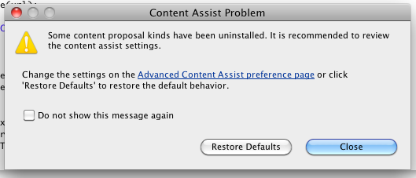
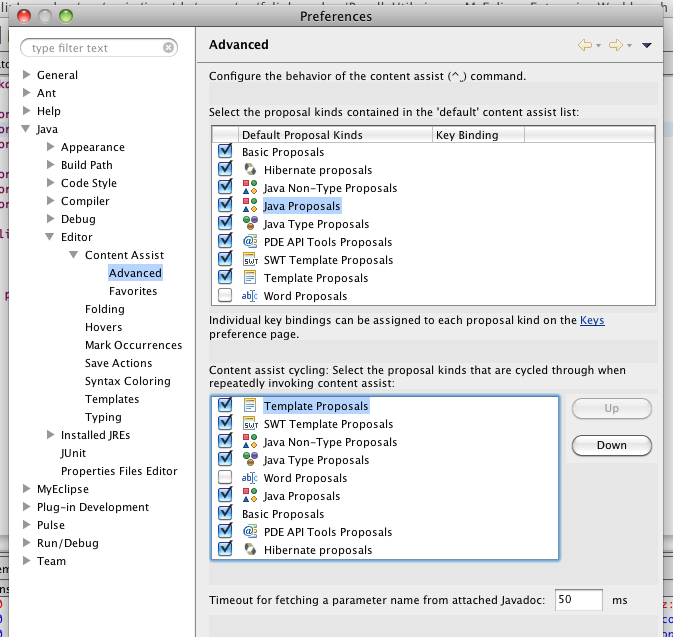

---
authors:
- max
blog: maxrohde.com
categories:
- java
date: "2010-06-19"
title: Java Code Completion does not work in MyEclipse 8.5 in OS X
---

**Problem**

Java code completion does not work in MyEclipse after installation on Mac OS X.

The first time, Java code completion is used, the following message is displayed:

**Solution**

Change the settings in the Content Assist as shown below:

**Resources**

[Java Code Completion does not work in MyEclipse 7.1, OS X](http://www.myeclipseide.com/index.php?name=PNphpBB2&file=viewtopic&t=23170&start=0&postdays=0&postorder=asc&highlight=&sid=cd380ff1d187836e9860f3612cb08c49)
