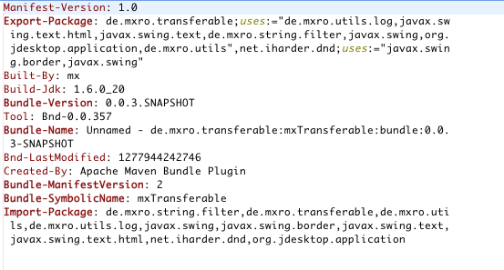
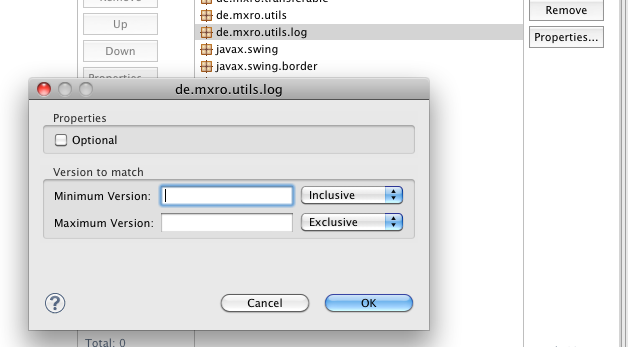
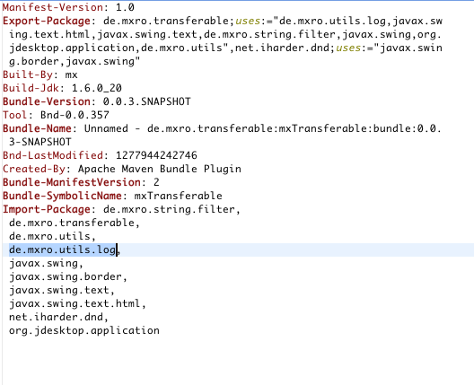
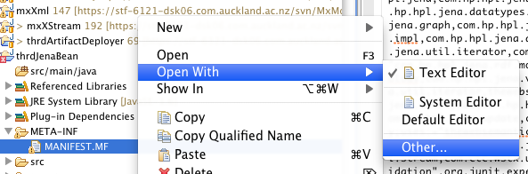
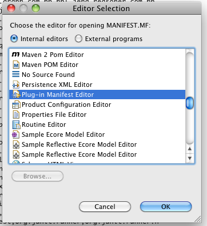

**Problem**

As I have written earlier, [I copy the MANIFEST.MF, which is generated by the Maven Bundle Plugin into my eclipse PDE projects](http://nexnet.wordpress.com/2010/06/29/maven-eclipse-plugin-and-eclipse-pde-the-right-configuration/).

The problem is that eclipse PDE has problems with picking up the contents of the newly created MANIFEST.MF.

 **Solution**

One solution I have found is to simply open the MANIFEST.MF in eclipse and click on one of the import‘s properties.

Afterwards, the MANIFEST.MF can be saved and the PDE will pick up the contents of the MANIFEST.MF and do a syntax check, etc.

Sometimes eclipse does not recognize that the MANIFEST.MF is to be opened with the Plugin in Manifest Editor. In that case, right clicking and selecting open with / other is helpful. 

