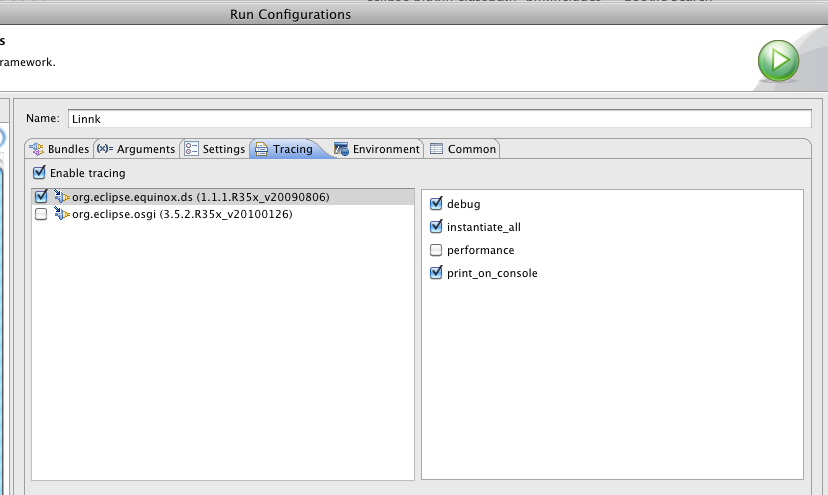

---
authors:
- max
blog: maxrohde.com
categories:
- java
date: "2010-08-20"
title: Declarative Services, Exceptions and Eclipse PDE
---

**Problem**

When using declarative services in a bundle, which is started in eclipse PDE, usually exceptions occurring ‚inside‘ the services are not traced in the the usual output window. This can be especially daunting for frequent ClassNotFound exceptions.

**Solution**

In the run configuration window in eclipse is a tab „tracing“. This can be enabled for the „equinox.ds“ package and exceptions will be shown in the eclipse output window.

