**Purpose**

Getting started with a GWT project, which utilizes Maven build management and is still compatible with the eclipse Google Plugin, can be quite complex. Especially if one is not familiar with Java web applications and/or Maven. This post starts with the simplest possible GWT project, created by the Google Plugin for eclipse. Then we manually add a pom to the project and compile the project with Maven.

**Instructions**

As of now only works for 2.0.4 (see problems with 2.1 below)

1. Download and Install the Google Plugin for Eclipse
2. Create a new Web application project

You can name the project „zzSampleGWT204Project“ and use the package „de.mxro.zz.zzsamplegwt204project“ to make following the succeeding steps easier.

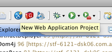

1. You should be able to Compile this project (using GWT compile) and run it (will require you to open the provided URL in Safari)

1. Create a new XML file „pom.xml“ on the root of the project

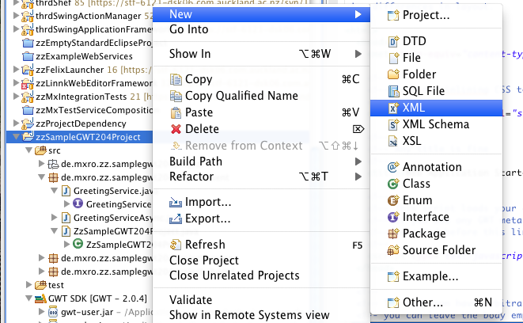

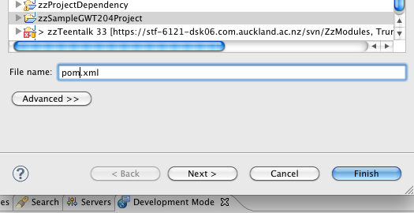

1. Use the following pom.xml as starting point (you might want to change artifact id etc).

[View and download pom.xml](http://gist.github.com/585468)

1. You will need to change the project structure a little bit to conform with the maven convention.

\- Right click the folder src and select „remove from build path“ - Create a new source folder at src/main/java

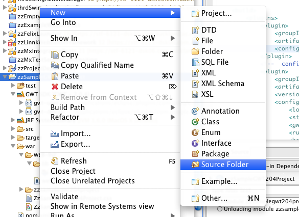

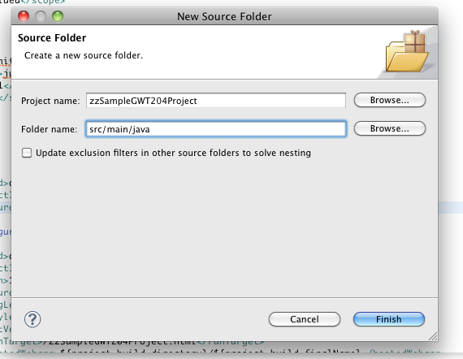

\- right click the source folder inside the src folder and select „move“ - move the source folder the the src/main/java

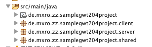

\- Move the war folder into the folder scr/ 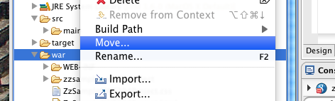

\- rename the war folder to „webapp“

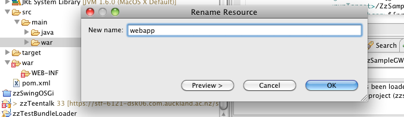

\- change the WAR directory path in the project settings (right click the project and select properties)

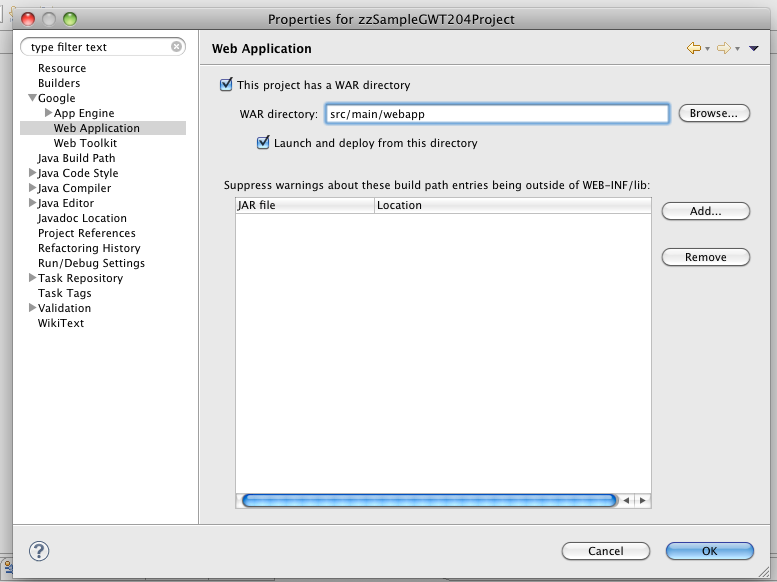

1. Go the project folder on the command line and type „mvn verfiy“

1. Maven should download the necessary libraries (what might take a while), compile Java and GWT classes and create a war package in the folder target

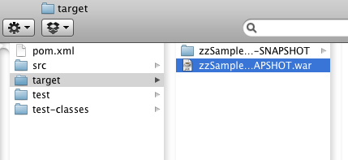

1. You can deploy this war file to a servlet container (eg tomcat) - the sample application should run there as in the hosted mode

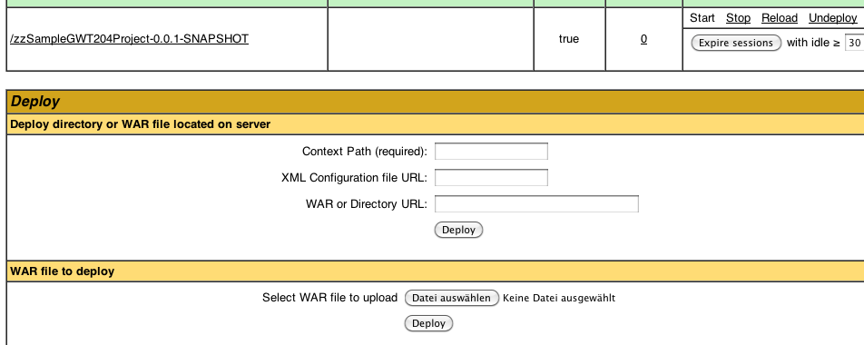 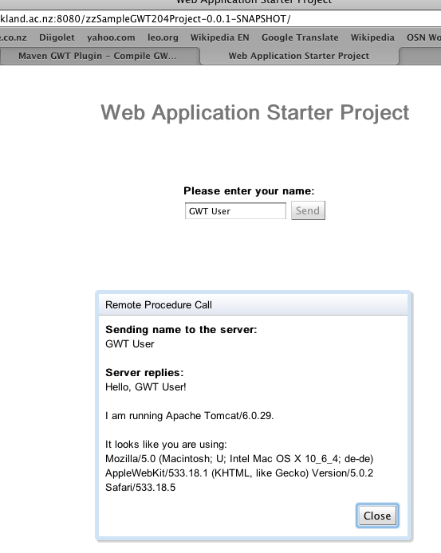

**Closing Remarks**

\- You can also test your server right from the command line by typing „mvn gwt:run“

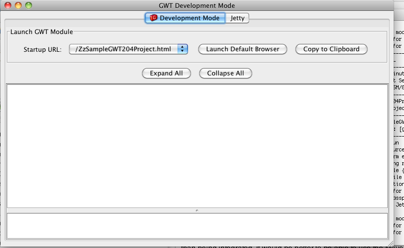

\- It should still be possible to run the project from eclipse. This is only a simple introductory example: Maven and eclipse work beside each other rather than being integrated. It would be better to be able to use the Maven eclipse plugin to handle the dependencies in eclipse.

You can create the eclipse project files using the command „mvn gwt:eclipse“. However, you might have to [change the export order of the associated libraries to make eclipse recognize the gwt skds](http://blog.inventivesoftware.com.au/2010/03/project-xxx-does-not-have-any-gwt-sdks.html).

**\=== Does not work ===**

... because there are no „Mac“ artefacts for 2.1.0.M3 or 2.1-SNAPSHOT ...

1. **[Create a new project using the GWT archetype](http://gwt-maven.googlecode.com/svn/docs/maven-googlewebtoolkit2-plugin/archetype.html)**

mvn archetype:create -DarchetypeGroupId=com.totsp.gwt -DarchetypeArtifactId=maven-googlewebtoolkit2-archetype -DarchetypeVersion=1.0.4 -DremoteRepositories=http://gwt-maven.googlecode.com/svn/trunk/mavenrepo -DgroupId=myGroupId -DartifactId=myArtifactId

1. **[Add the codehaus maven repository](http://www.sencha.com/learn/Tutorial:GWT_GXT_and_Maven_howto) and the Google Web Toolkit Repository**

<repository\> <id\>codehaus-maven-repo</id\> <name\>Codehaus repo</name\> <url\>[http://repository.codehaus.org/org/codehaus/mojo/](http://repository.codehaus.org/org/codehaus/mojo/)</url\> </repository\> <repository\> <id\>gwt-repo</id\> <url\>[http://google-web-toolkit.googlecode.com/svn/2.1.0.M3/gwt/maven](http://google-web-toolkit.googlecode.com/svn/2.1.0.M3/gwt/maven)</url\> <name\>Google Web Toolkit Repository</name\> </repository\>

1. **Update GWT Version**

<properties\>                 <gwtVersion\>2.1-SNAPSHOT</gwtVersion\>         </properties\>

1. **Download the libraries using „mvn verify“**

**Resources:**

[There is a post on the Google Web Toolkit Blog discussing how to use GWT with Maven and the eclipse plugins](http://googlewebtoolkit.blogspot.com/2010/08/how-to-use-google-plugin-for-eclipse.html)

[Step by step of creating a GWT project with Maven](http://www.bitsbythepound.com/gwt-module-using-maven-128.html)
