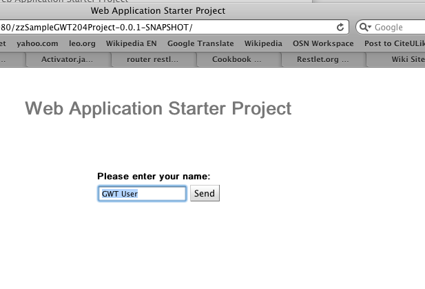
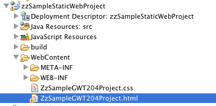
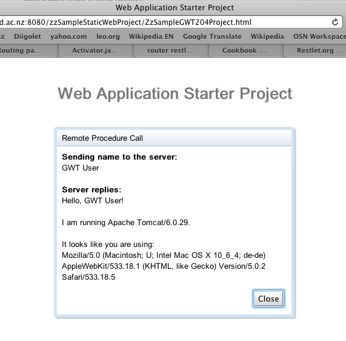
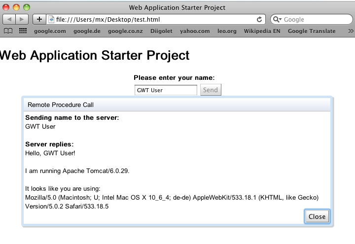

---
categories:
- java
date: "2010-09-19"
primaryBlog: maxrohde.com
title: Deployment of GWT Applications (Part 2)
---

**Purpose**

Show using the [example project created in part 1](http://maxrohde.com/2010/09/17/maven-gwt-and-eclipse-quick-start-part-1/) different ways in which a GWT application can be deployed. In a nutshell, the html file of your application can be deployed to any place you desire - another server or even a local machine. However, the generated JavaScript needs to remain on the same server, which hosts the RPC services your application uses.

**Overview**

I think the GWT technology presents itself as less versatile as it actually is. This might be due to Google‘s desire to integrate GWT application with Google Apps Engine (GAE). However, although this might make your life easier in many cases, I think GAE binds you to Google‘s platform, which might not always be desirable. Google Web Toolkit, in contrast, however is highly vendor independent. It build on top of powerful technologies like Java and JavaScript and can be deployed to any server environment.

In part 1, I have already illustrated that the application can run in hosted mode on your local development machine but can also be deployed to a servlet container such as tomcat. This makes the project available under the URL for the servlet package. In below picture, the name of the package is zzSampleGWT204Project-0.0.1-SNAPSHOT and the project can be accessed by opening this URL under the servlet container.

However, the application can basically be deployed by using just two files from the generated WAR file. To illustrate this, we can create a new **Dynamic Web Project** in eclipse. Copy the html and css files from your GWET projects webapp folder into the „WebContent“ folder of this application.

Now we only need to change the link to the generated JavaScript in the .html file. Add ../\[Name of the deployed project to the server

Now you can open the html file on your local desktop and the application should work from this html file as well.

But remember that this application not just downloads the JavaScript from the server but also access the GWT RPC from the same server. You cannot download the JavaScript file to your local machine. Then you would not be able to call the GWT RPC service anymore as you would violate the Same Origin Policy (SOP).