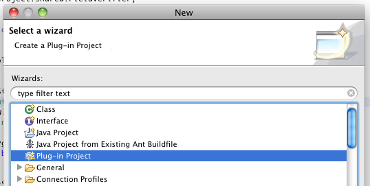
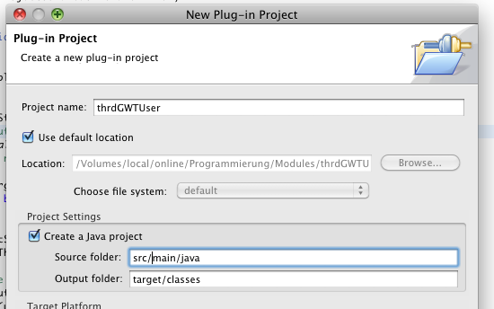
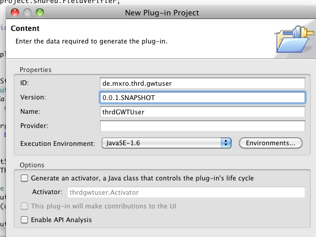

**Summary:**

Some steps and resources to set up a GWT project, which uses OSGi and Maven. However, these steps do not lead to a fully working GWT application. The main difficulty lies in the Server side, where the GWT servlets do not start up properly in the OSGi environment. I plan to implement the server using the Restlet framework, what should mitigate this problem.

**Steps:**

Create a new GWT project in eclipse

Add a new XML file pom.xml to the project

[pom.xml in github](http://gist.github.com/603774)

Now you should be able to create eclipse metadata using the eclipse:eclipse goal as well as compile and start the GWT project using gwt:compile, gwt:...

**Alternative:**

Set up a new plugin project in eclipse for the gwt.user package.

... and add the GWT user package to this package to keep it seperate from the bundle with your application.

Now you can remove the dependency to the GWT user package from the pom above.

**Resources**

Run GWT hosted mode in OSGi: [http://efreedom.com/Question/1-3060682/Debug-GWT-Application-Running-OSGi](http://efreedom.com/Question/1-3060682/Debug-GWT-Application-Running-OSGi)

Google Web Toolkit and Equinox (from eclipse wiki): [http://wiki.eclipse.org/Google_Web_Toolkit_and_Equinox](http://wiki.eclipse.org/Google_Web_Toolkit_and_Equinox) (One project with an example GWT/OSGi project [http://sourceforge.net/projects/sse-examples/develop](http://sourceforge.net/projects/sse-examples/develop))

Example project attempting to route GWT RPC calls to OSGi services: [http://code.google.com/p/gwt-in-osgi/source/checkout](http://code.google.com/p/gwt-in-osgi/source/checkout)

Tutorial using the Servlet Bridge: [http://angelozerr.wordpress.com/2010/09/02/osgi-equinox-in-a-servlet-container-step2/](http://angelozerr.wordpress.com/2010/09/02/osgi-equinox-in-a-servlet-container-step2/)

Overview developing web applications with OSGi (German) [http://www.wuetherich.com/public/ruhrjug-2009-05/mit-osgi-webanwendungen-entwickeln.pdf](http://www.wuetherich.com/public/ruhrjug-2009-05/mit-osgi-webanwendungen-entwickeln.pdf)

Tutorial HttpService by example: [http://www.dynamicjava.org/articles/osgi-compendium/http-service](http://www.dynamicjava.org/articles/osgi-compendium/http-service)

OSGi and GWT integration report: [http://www.morelab.deusto.es/morelab/media/OSGiGWT.pdf](http://www.morelab.deusto.es/morelab/media/OSGiGWT.pdf)

Issue discussing calling GWT servlets hosted in a OSGi environment: [http://code.google.com/p/google-web-toolkit/issues/detail?id=1888](http://code.google.com/p/google-web-toolkit/issues/detail?id=1888)
