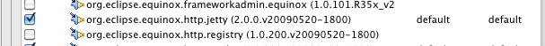
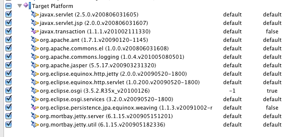
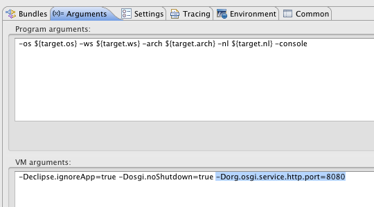
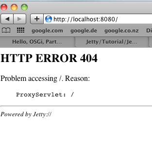

---
categories:
- java
date: "2010-09-25"
blog: maxrohde.com
title: Setting up and starting a web server in eclipse PDE (Quickstart)
---

The following describes a number of simple steps to set up and start up a web server in the eclipse PDE environment.

**Steps**

1. Create a new OSGi run configuration

1. Add the package org.eclipse.equinox.http.jetty

1. Click on „Add Required Bundles“

A number of bundles should have been added to your run configuration.

1. Go to the tab arguments and add the VM argument: „ -Dorg.osgi.service.http.port=8080“

**Result**

Now you should be able to start up the server by starting the run configuration. You can check if the server is running by opening the URL [http://localhost:8080/](http://localhost:8080/). It should show an error message as the following:

**Resources**

Building a server based Application with Equinox (on [eclipse.org](http://eclipse.org)): [http://www.eclipse.org/equinox-portal/tutorials/server-side/](http://www.eclipse.org/equinox-portal/tutorials/server-side/)

Building a web server in Felix by using wars: [http://heapdump.wordpress.com/2010/03/25/osgi-enabled-war/](http://heapdump.wordpress.com/2010/03/25/osgi-enabled-war/)

Alternative way: starting Equinox as deployed application on a web server and let this bundle load osgi modules: [http://angelozerr.wordpress.com/2010/09/01/osgi-equinox-in-a-servlet-container-step1/](http://angelozerr.wordpress.com/2010/09/01/osgi-equinox-in-a-servlet-container-step1/)

Scroll down to Server-Side [http://wiki.eclipse.org/Equinox_Eclipse_to_RT_Migration](http://wiki.eclipse.org/Equinox_Eclipse_to_RT_Migration)

The core bundle to start server [http://www.eclipse.org/equinox/server/http_in_equinox.php](http://www.eclipse.org/equinox/server/http_in_equinox.php) org.eclipse.equinox.http.jetty

Equinox Server Side info: [http://www.eclipse.org/equinox/server/http_quickstart.php](http://www.eclipse.org/equinox/server/http_quickstart.php)

Slides giving a good overview: \[slideshare id=3516425&doc=eclipsecon-2010-server-side-eclipse-tutorial-100322190055-phpapp01\]