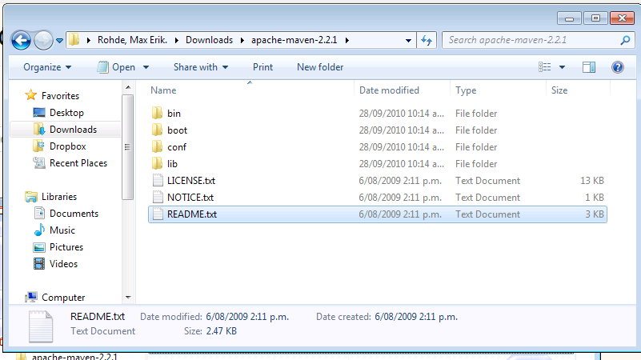

---
categories:
- java
date: "2010-09-27"
blog: maxrohde.com
title: Install Maven on Windows 7
---

**Steps**

1\. Download the latest Maven distribution zip from [http://maven.apache.org/download.html](http://maven.apache.org/download.html)

2\. Extract the Zip

3\. Consult the README.txt. Here you will a description of the following steps.

4\. Add Maven to your path. The procedure is similar as described here for Windows Vista: [http://www.java.com/en/download/help/path.xml](http://www.java.com/en/download/help/path.xml)

5.You might also have to add the JAVA_HOME environment variable: [http://stackoverflow.com/questions/2619584/how-to-set-java-home-on-windows-7](http://stackoverflow.com/questions/2619584/how-to-set-java-home-on-windows-7)

6.Don‘t forget to restart your command line window (cmd.exe)

7.You can test maven by starting the command line cmd.exe and type „mvn“