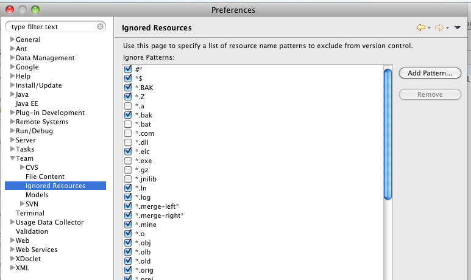

**Problem**

How to stop svn from synchronizing eclipse meta data in a project (eg .project files)

**Solution**

Add a number of project specific or global svn ignore directives. In the latter case, eclipse meta data will be ignored in all of your projects.

You can add the following pattern for exclusion

.eclipse .settings .project .classpath

Below the eclipse settings to add global ignore pattern:

