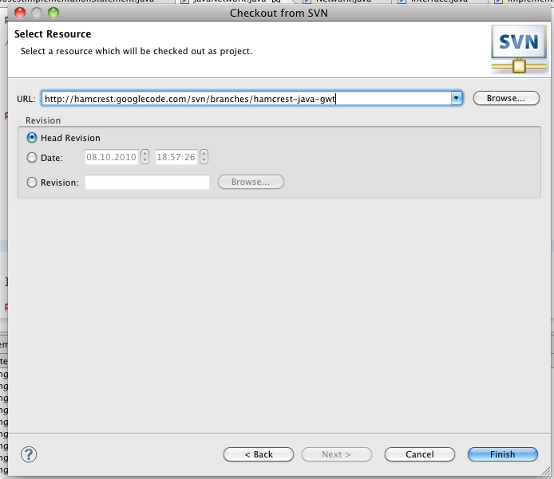

---
categories:
- java
date: "2010-10-08"
blog: maxrohde.com
title: Hamcrest GWT
---

**Abstract:** The largest parts of the Hamcrest library can be compiled in GWT. Just the IsInstanceOf class needs a bit of tweaking (as well as some other classes depending on reflection). The following provides a brief overview of _some_ of the steps required to compile Hamcrest with GWT.

1. 1\. Download the Hamcrest GWT SVN Branch ([Hamcrest GWT subversion branch](http://hamcrest.googlecode.com/svn/branches/hamcrest-java-gwt/)) and import to eclipse

1. 2\. Clean up the build path (remove the generated folders and remove all other source folders but core, library and gwt)
2. 3\. Copy the classes from the gwt folder into the respective packages in the core folder

4\. Import a generated CoreMatchers.java from some distribution (eg from hamcrest-all.jar)

**Resources**

[Issue 50: Hamcrest GWT support](http://code.google.com/p/hamcrest/issues/detail?id=50) [Hamcrest GWT subversion branch](http://hamcrest.googlecode.com/svn/branches/hamcrest-java-gwt/) [Google Group Discussion on Hamcrest GWT version](http://groups.google.com/group/hamcrest-dev/browse_thread/thread/e68d0e228e9a3bd2/d331763300f1e040)