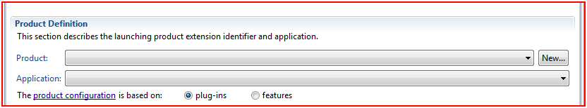
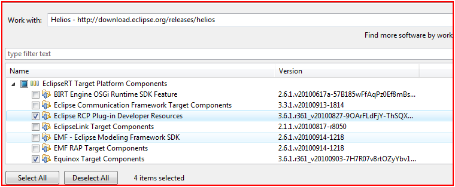
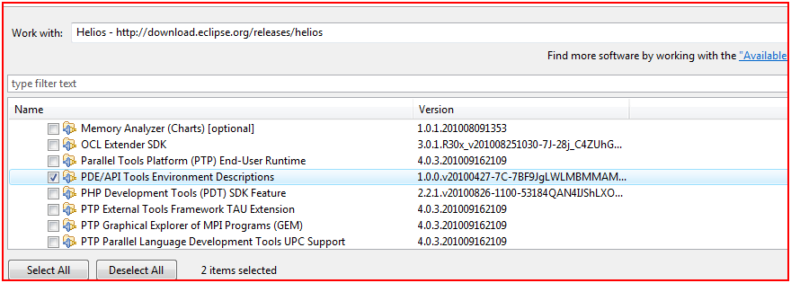
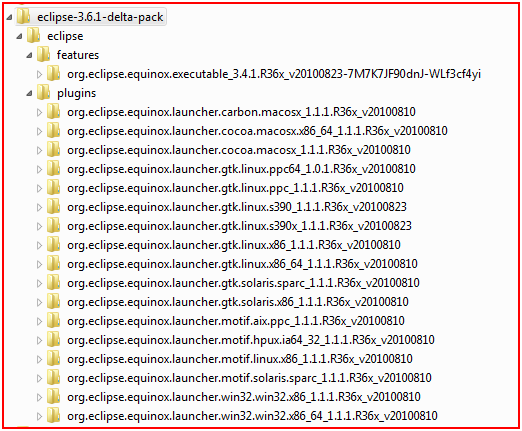

---
authors:
- max
blog: maxrohde.com
date: "2010-12-03"
title: Leverage Eclipse to Create Executable OSGi based Applications
---

Both eclipse and the Netbeans IDE provide strong tool support for deploying applications based on their respective platforms. This includes supports for branding for instance with custom splash screens as well as creating executables for various platforms (Windows, Mac OS X, Linux).

Eclipse allows to define Product configurations, which can be used to export eclipse RCP applications. However, the same mechanism can be used to deploy generic applications composed of OSGi bundles; including, for instance, OSGi applications based on Swing.

The following gives a number of pointers how the eclipse export function can be used to generate an executable of an application consistent of OSGi bundles organized as Maven artifacts.

- Right click on the module, which manages your application life cycle and add a new Eclipse Product configuration.
- Define ID, Version and Navme of the product.
- Under Product Definition, empty Product and Application

- In order to export the application, you might need to download the Eclipse Delta Pack. However, in my case the delta pack for Helios (3.6.1) did not seem to work very well and I had to [download launchers individually](http://ftp.heanet.ie/disk1/eclipse/equinox/drops/R-3.6.1-201009090800/).
- Add the following dependency to your project:

<table style="border-collapse:collapse;" border="0"><colgroup><col style="width:838px;"></colgroup><tbody valign="top"><tr><td style="padding-left:7px;padding-right:7px;border-top:solid black .5pt;border-left:solid black .5pt;border-bottom:solid black .5pt;border-right:solid black .5pt;">
&lt;dependency&gt;

&lt;groupId&gt;org.eclipse.equinox&lt;/groupId&gt;

&lt;artifactId&gt;app&lt;/artifactId&gt;

&lt;version&gt;1.0.0-v20070606&lt;/version&gt;

&lt;/dependency&gt;
</td></tr></tbody></table>

- Implement a class as the following:

<table style="border-collapse:collapse;" border="0"><colgroup><col style="width:838px;"></colgroup><tbody valign="top"><tr><td style="padding-left:7px;padding-right:7px;border-top:solid black .5pt;border-left:solid black .5pt;border-bottom:solid black .5pt;border-right:solid black .5pt;">
import org.eclipse.equinox.app.IApplicationContext;

&nbsp;

public class LinnkEclipseApplication implements org.eclipse.equinox.app.IApplication {

&nbsp;

&nbsp;&nbsp;&nbsp;&nbsp;@Override

&nbsp;&nbsp;&nbsp;&nbsp;public Object start(IApplicationContext context) throws Exception {

&nbsp;&nbsp;&nbsp;&nbsp;&nbsp;&nbsp;&nbsp;&nbsp;return null;

&nbsp;&nbsp;&nbsp;&nbsp;}

&nbsp;

&nbsp;&nbsp;&nbsp;&nbsp;@Override

&nbsp;&nbsp;&nbsp;&nbsp;public void stop() {

&nbsp;&nbsp;&nbsp;&nbsp;&nbsp;&nbsp;&nbsp;&nbsp;

&nbsp;&nbsp;&nbsp;&nbsp;}

&nbsp;

}
</td></tr></tbody></table>

(I used this class as ID for the application in the configuration but not sure if that has any implications)

- Under Dependencies, add the bundle, which manages your application lifecycle. Then, click Add Required Plug-Ins. (Do not add other bundles of the platform)
- Under Configuration, make sure that your main bundle is on auto start. If you use Declarative Services, also the \*.equinox.ds bundle should be on auto-start.
- From the Overview page you can export your project. The export will generate executables for the platforms you have selected (eg eclipse.exe) with a preconfigured eclipse.ini and a plugins directory with the dependencies of your project.
- With module dependencies declared in Maven, I found that these are often not assembled correctly into osgi bundles from the eclipse product export function. Therefore, I took the 'raw' Maven artifacts and replaced the bundles created by eclipse with them. As the naming conventions of Maven and OSGi are slightly different, I wrote the following crude routine to rename the Macen artifacts.

<table style="border-collapse:collapse;" border="0"><colgroup><col style="width:838px;"></colgroup><tbody valign="top"><tr><td style="padding-left:7px;padding-right:7px;border-top:solid black .5pt;border-left:solid black .5pt;border-bottom:solid black .5pt;border-right:solid black .5pt;">
package de.mxro.zz.mavenosgibundlerenamer;

&nbsp;

import java.io.File;

&nbsp;

public class BundleRenamer {

&nbsp;

&nbsp;&nbsp;&nbsp;&nbsp;public static void main(String[] args) {

&nbsp;&nbsp;&nbsp;&nbsp;&nbsp;&nbsp;&nbsp;&nbsp;

&nbsp;&nbsp;&nbsp;&nbsp;&nbsp;&nbsp;&nbsp;&nbsp;File file= new java.io.File("C:/Data/Jars");

&nbsp;&nbsp;&nbsp;&nbsp;&nbsp;&nbsp;&nbsp;&nbsp;

&nbsp;&nbsp;&nbsp;&nbsp;&nbsp;&nbsp;&nbsp;&nbsp;for (File f : file.listFiles()) {

&nbsp;&nbsp;&nbsp;&nbsp;&nbsp;&nbsp;&nbsp;&nbsp;&nbsp;&nbsp;&nbsp;&nbsp;

&nbsp;&nbsp;&nbsp;&nbsp;&nbsp;&nbsp;&nbsp;&nbsp;&nbsp;&nbsp;&nbsp;&nbsp;String jarName = f.getName();

&nbsp;&nbsp;&nbsp;&nbsp;&nbsp;&nbsp;&nbsp;&nbsp;&nbsp;&nbsp;&nbsp;&nbsp;String bundleName = jarName.replaceFirst("-", "_").replaceFirst("-", ".");

&nbsp;&nbsp;&nbsp;&nbsp;&nbsp;&nbsp;&nbsp;&nbsp;&nbsp;&nbsp;&nbsp;&nbsp;

&nbsp;&nbsp;&nbsp;&nbsp;&nbsp;&nbsp;&nbsp;&nbsp;&nbsp;&nbsp;&nbsp;&nbsp;f.renameTo(new File(bundleName));

&nbsp;&nbsp;&nbsp;&nbsp;&nbsp;&nbsp;&nbsp;&nbsp;&nbsp;&nbsp;&nbsp;&nbsp;

&nbsp;&nbsp;&nbsp;&nbsp;&nbsp;&nbsp;&nbsp;&nbsp;&nbsp;&nbsp;&nbsp;&nbsp;System.out.println("Jar : "+f);

&nbsp;&nbsp;&nbsp;&nbsp;&nbsp;&nbsp;&nbsp;&nbsp;&nbsp;&nbsp;&nbsp;&nbsp;System.out.println("Renamed to: "+bundleName);

&nbsp;&nbsp;&nbsp;&nbsp;&nbsp;&nbsp;&nbsp;&nbsp;&nbsp;&nbsp;&nbsp;&nbsp;

&nbsp;&nbsp;&nbsp;&nbsp;&nbsp;&nbsp;&nbsp;&nbsp;}

&nbsp;&nbsp;&nbsp;&nbsp;&nbsp;&nbsp;&nbsp;&nbsp;

&nbsp;&nbsp;&nbsp;&nbsp;}

&nbsp;

}
</td></tr></tbody></table>

- If you want to get rid of the console window started by eclipse, just remove the Program Arguments from the tab 'Launching'.

**Screenshots**

**Resources**

[Info on Interfaces to create custom Eclipse application (Eclipse documentation)](http://help.eclipse.org/help33/index.jsp?topic=/org.eclipse.platform.doc.isv/reference/extension-points/org_eclipse_core_runtime_applications.html)

[Eclipse PDE Tutorial from vogolla.de](http://www.vogella.de/articles/EclipsePDEBuild/article.html)

[Eclipse help pages for product export](http://help.eclipse.org/help33/index.jsp?topic=/org.eclipse.pde.doc.user/guide/tools/export_wizards/export_product.htm)

[How to create an Eclipse product (on eclipse wiki)](http://wiki.eclipse.org/FAQ_How_do_I_create_an_Eclipse_product%3F)

[Eclipse Downloads – download the delta pack from here](http://download.eclipse.org/eclipse/downloads/)

[Download the individual launchers from this location](http://ftp.heanet.ie/disk1/eclipse/equinox/drops/R-3.6.1-201009090800/) (only for Helios 3.6.1)
