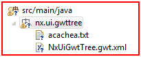
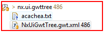

---
authors:
- max
blog: maxrohde.com
categories:
- java
date: "2010-12-11"
title: Cannot add files to svn ignore in eclipse
---

**The Problem**

You want to exclude certain files and folders from being uploaded to the SVN repository in eclipse.

However, some files in the project allow you to right-click them and select Team / Add to svn:ignore and for other files this action is 'greyed out'.

**The Solution**

- Often you might have already checked out the file you want to 'ignore'. In that case, there is no other option (to my knowledge) other than manually deleting the file, committing the delete, recreating the file and then adding it to svn:ignore.
- Sometimes this problem occurs for projects, which have not been uploaded at all. In that case the following solution might work:

In the following example, the option "Add to svn:ignore" in the team context menu will be 'greyed out' for the file 'acachea.txt':

We need to commit the other file 'NxUiGwtTree.gwt.xml' individually to the repository (right click on this file). Afterwards, we are able to select "Add to svn:ignore" for the file 'acachea.txt'.

