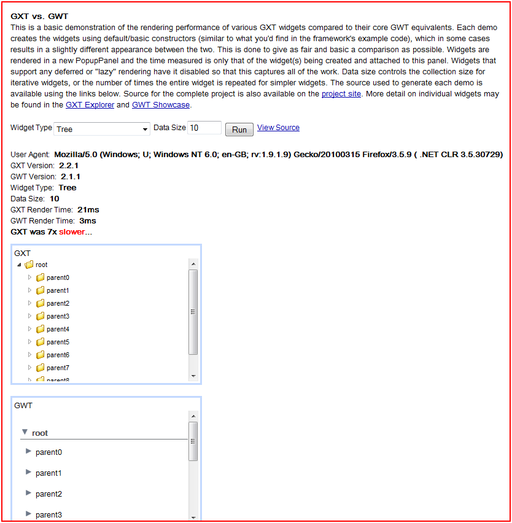

---
categories:
- java
date: "2011-02-12"
blog: maxrohde.com
title: GXT vs vanilla GWT Performance
---

The performance of a user interface based framework can often be a subjective matter. For me, for instance, the responsiveness of [SmartGWT](http://www.smartclient.com/smartgwt/showcase/) is slower than those of [Ext Gwt (GXT)](http://www.sencha.com/products/extgwt/), plain GWT 'feels' faster than GXT. However, such subjective measures are often quite unsatisfactory and might be wrong. It is great news that [Dustin Mallory](http://lifeandcode.net/2011/01/gxt-vs-gwt-performance/) has attempted to measure the difference in performance of these UI frameworks with greater accuracy.

The following GAE project provides and interactive demo comparing the performance between GXT and vanilla GWT:

[http://gxtvsgwt.appspot.com/](http://gxtvsgwt.appspot.com/)

All the demos show that **vanilla GWT has significantly better performance than GXT**. This performance gap becomes even larger when the scale of the examples increases (both more complex combination of widgets as well as simply more data (200 instead of 10 items)).

This reassures me in my position to use [GXT only and only if vanilla GWT is missing an essential feature](http://maxrohde.com/2010/12/12/smartgwt-and-ext-gwtgxt-or-the-question-of-the-gwt-ui-framework/). For instance, the built in support for drag and drop in GXT is light-years ahead of what vanilla GWT widgets offer and is extremely difficult to replicate. However, the claim that GXT 'looks better' out of the box than GWT should not justify the adoption of this framework, as the visual representation of GWT is relatively simple to enhance to one's own expectations.

Below an example output generated from the tool:

**Resources**

[Discussion about the GAE project on the Sencha Forum](http://www.sencha.com/forum/showthread.php?122461-GXT-vs.-GWT)

[Gxtvsgwt Google code project page](http://code.google.com/p/gxtvsgwt/)