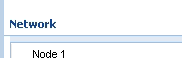
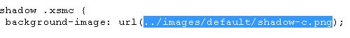
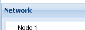

**The Problem**

When developing an GWT application using [Ext Gwt (GXT)](http://www.sencha.com/products/extgwt/), various images are not displayed when opening the deployed .html file of your GWT project.

These images may include:

- borders of panels
- backgrounds of panels
- icons displayed when dragging and dropping components

A panel, for instance, might look as follows:

(for me, when running the application in GWT hosted mode – using the [Maven GWT plugin](http://mojo.codehaus.org/gwt-maven-plugin/user-guide/compile.html) mvn:run the images are displayed. They are only missing in the compiled deployment version)

**The Solution**

In my case, the problem was caused by wrong paths for images in the Gxt css file (gxt-all.css). These were expecting the images in a folder relative to the .css files parent folder (../):

Therefore, the css file had to be moved to a child folder of the generated .html file (or the webapp directory):

/webapp/\[your gwt module\].html

/webapp/css/gxt-all.css

/webapp/images (à the images required for GXT)

Also, the path to the css file in your .html template needs to be changed to something like: css/gxt-all.css instrad of gxt-all.css.

After reloading the html file, the components should be displayed correctly:

