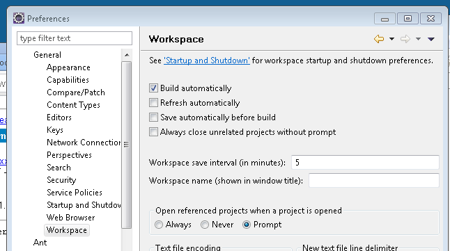

---
categories:
- java
date: "2011-02-25"
primaryBlog: maxrohde.com
title: Automatic Refresh of Projects in Eclipse
---

I am working with the Maven Eclipse Plugin, the [Maven Bundle Plugin](http://felix.apache.org/site/apache-felix-maven-bundle-plugin-bnd.html) and the eclipse PDE.

A common activity in this setup is to refresh projects in the workspace, since the Maven bundle plugin generates new MANIFEST.MF files (which I copy via Maven Ant Task), which become "out of sync" for eclipse.

Today I found that it is easy to set up eclipse to automatically refresh the projects in the workspace. The setting is in the Preferences under General / Workspace / "Refresh automatically".

However, another problem remains for me: the classpath of the projects seems to be corrupted by rebuilding projects with Maven. Therefore, I constantly need to perform "Update Classpath" form the PDE project context menu. It would be great if this could be configured to update automatically as well.

**Resources**

[Eclipse Newslist: Automatic Refresh](http://dev.eclipse.org/newslists/news.eclipse.newcomer/msg10273.html)