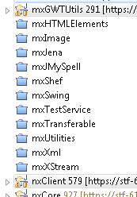
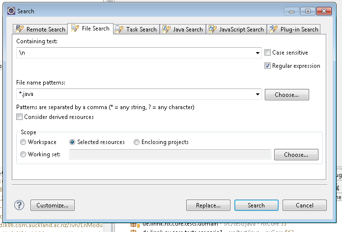
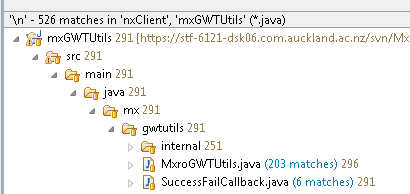
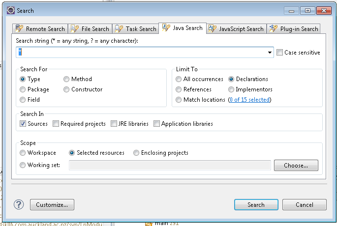
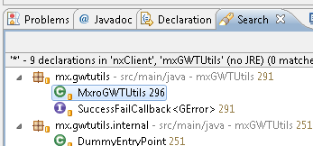

---
categories:
- java
date: "2011-03-29"
primaryBlog: maxrohde.com
title: Count lines of code and number of classes in eclipse projects
---

There are a number of plugins for eclipse, Maven and/or subversion, which allow the convenient and automatic determination of important project statistics such as the total lines of code in a project or the number of Java classes. However, sometimes one just needs these statistics **quick and dirty** and setting up sophisticated tools represents an unjustifiable overhead.

In this case, the eclipse search function is a useful tool to determine these statistics. Below are simple workflows of attaining the statistics for one or more projects.

## Lines Of Code

The lines of code can be determined by searching all the Java source files in the selected resource for line breaks. The number of line breaks should approximate the lines of code.

1\. Select the projects for which you want to count the lines of code in the Package Explorer.

2\. Open through Menu Search / File

3\. Search for the regular expression '\\n' in all '\*.java' files of the selected resources (these are the projects you selected in step 1 – be aware that the Package Explore must hold the current focus in order for this to work. If 'selected resources' is greyed out, reselect the projects in the package explorer in reopen the search dialog)

**Note:** If you would like to count only non-empty lines, you can use the expression: '\\s+\\n' instead of '\\n' (Thanks, [Anshul](http://maxrohde.com/2011/03/30/count-lines-of-code-and-number-of-classes-in-eclipse-projects/#comment-1145)!)

4\. Perform the search. The total matches reported in the Search tab at the bottom of your screen should approximate the lines of code in your Java sources. The matches reported for individual Java files, should represent the lines of codes for these files (actually the lines in the file -1 as pointed out by [shahnaz below](http://maxrohde.com/2011/03/30/count-lines-of-code-and-number-of-classes-in-eclipse-projects/#comment-288) :) ).

## Number of Classes

The number of classes can be determined using the eclipse Java search for all declared types.

1\. Select the projects for which you want determine the number of classes as shown above.

2\. Select Menu / Search

3\. Select the tab Java Search and search for all declared types as depicted below

4\. Perform the search. The total number of declarations reported should represent the total number of classes and interface in the projects you have selected.

**shahnaz**