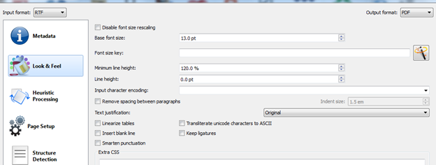
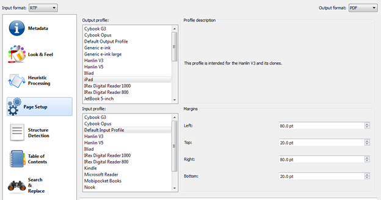
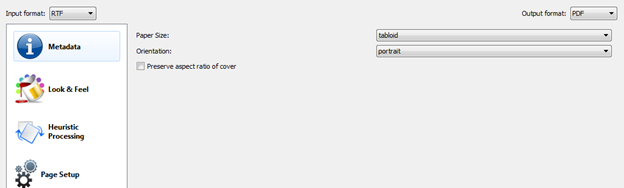

Ubiquitous devices of all sizes have radically changed our reading experiences in the last couple of years. I have no problem in reading entire books using iBooks on the iPhone. Reading on the [iPad](http://www.apple.com/ipad/) has often been criticized for the potential strenuous effects of screen brightness. However, I most struggle with the format of the screen – it is actually wider than the normal page in a book we are used to. iBooks on the iPad mitigates this problem by including relatively wide margins on both sides of the displayed pages (iBooks on the iPhone does not have these margins).

However, when reading PDFs, for instance using GoodReader or another PDF reader application on the iPad, the result is often a too small font due, as a DINA4 page (a common format for PDF ebooks) is significantly larger than the iPad screen. One possible way to solve this problem is using [calibre](http://calibre-ebook.com/) to reformat the ebook into a readable PDF. For this, it is best if the ebook is available in a text-based format such as RTF, MOBI or EPUB.

By right clicking onto an imported book in calibre, one can select to "Convert individually". Firstly, the font size can be adjusted to a convenient scale. I have chosen 13 pt.

On the page "Page Setup", the iPad profile can be chosen. To prevent the text in the PDF from becoming too 'broad', margins should be set. I used 80pt both for the left and right margins.

Finally, on the page "PDF Output", the page size 'tabloid' can be selected.

