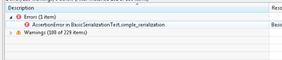

If there are multiple dependent projects in an eclipse workspace, it can be tedious to run the unit test of all these projects manually. Often, a failed unit test caused by a change in a different project than where the unit test is located is only discovered with a significant time gap. From there, it becomes difficult to trace back to the initial change causing the unit test to fail.

The [Infinitest eclipse plug in](http://improvingworks.com/products/infinitest/) constantly executes all relevant unit test defined in the workspace in the background. If a source file is saved, Inifitest will search for affected unit tests and execute these. If they fail, a Java problem is reported.

Below some simple steps to install and configure Inifitest:

## Download

Infinitest can be downloaded using their update site: [http://update.improvingworks.com](http://update.improvingworks.com)

Just follow [the instructions](http://improvingworks.com/products/infinitest/eclipse/) on their site to install the plugin.

## Activate

Once the Infinitest plug in is installed and the eclipse IDE restated, it should start searching for test cases.

If code is changed (and saved), it should start reporting any failed test cases as Java problem.

## Possible Problems

Infinitest can be disabled in the eclipse preference window. It adds a top level item "Infinitest" to the eclipse preference tree.

I encountered some problems with [GWTTestCases](http://google-web-toolkit.googlecode.com/svn/javadoc/2.2/com/google/gwt/junit/client/GWTTestCase.html). For every GWTTestCase in my projects, Infinitest reported:

Description    Resource    Path    Location    Type

NoClassDefFoundError (com/google/gwt/dev/cfg/Condition) in GwtTestGwtCollaborationScenario.    GwtTestGwtCollaborationScenario.java    /nxServerGwt/src/test/java/nx/servergwt/tests/hosted    line 0    Infinitest Test Failure

The only solution I found was to remove these test cases from the eclipse projects build path (right click the .java file and select Build Path / Exclude).
