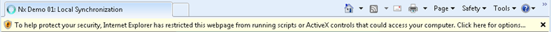

---
authors:
- max
blog: maxrohde.com
categories:
- java
date: "2011-05-20"
title: GWT Script does not load in Chrome and Internet Explorer
---

### The Problem

GWT ([Google Web Toolkit](http://code.google.com/webtoolkit/)) allows compiling Java into JavaScript source. I like to use it to create **client-only** JavaScript applications (this can be very useful for testing purposes). The GWT compiler will place all the compiled JavaScript sources in your project directory and the applications can be tested by loading the created JavaScript in a web browser.

The path in the browser in this scenario will possibly look like: file://\[path to your app\]/\[your app name\].html

Unfortunately, in some instances such a local test might not work as expected.

In particular, one GWT script of mine worked fine in Firefox but would not work in Internet Explorer and Chrome. Internet Explorer warned "To help protect your security, Internet Explorer has restricted this webpage from running scripts".

Chrome would simply only load the page HTML but none of the associated JavaScript scripts. Chrome's JavaScript error console reported the error:

Unsafe JavaScript attempt to access frame with URL [file:///M:/Eclipse/appGwtDemos/src/main/webapp/Demo01.html](\Eclipse\appGwtDemos\src\main\webapp\Demo01.html 'file:///M:/Eclipse/appGwtDemos/src/main/webapp/Demo01.html') from frame with URL [file:///M:/Eclipse/appGwtDemos/src/main/webapp/demo01/677DB6A2A0F1BFA4279679C7B43BEBEF.cache.html](\Eclipse\appGwtDemos\src\main\webapp\demo01\677DB6A2A0F1BFA4279679C7B43BEBEF.cache.html 'file:///M:/Eclipse/appGwtDemos/src/main/webapp/demo01/677DB6A2A0F1BFA4279679C7B43BEBEF.cache.html'). Domains, protocols and ports must match.

### The Solution

It appears that this error occurs due to special security restrictions imposed on webpages accessed as local files. Possible solutions are:

- Deploy the application to a web server and access the script there.
- [Change the Chrome browsers security settings](http://code.google.com/p/chromium/issues/detail?id=31068) (I don't know if there is a similar setting for Internet Explorer) (The [flag is](http://code.google.com/p/chromium/issues/detail?id=70088) --allow-file-access-from-files)
- Host a webserver on your local machine and dynamically link the contents of the folders, in which GWT compiles the JavaScript

### Resources

"xsl stylesheet wrongly blocked, all on local drive" [http://code.google.com/p/chromium/issues/detail?id=70088](http://code.google.com/p/chromium/issues/detail?id=70088)

"Unsafe JavaScript attempt to access frame with URL" [http://code.google.com/p/chromium/issues/detail?id=31068](http://code.google.com/p/chromium/issues/detail?id=31068)