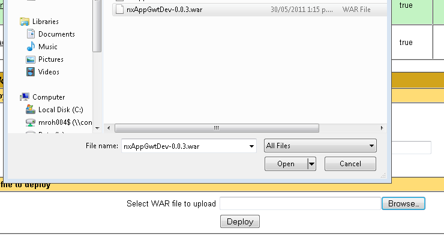
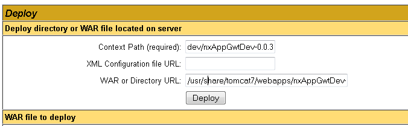

---
categories:
- java
date: "2011-05-30"
blog: maxrohde.com
title: Deploy Tomcat Applications in Custom Directory
---

I have already written about how to [change the directory of applications deployed in tomcat 7](http://maxrohde.com/2011/05/01/change-the-path-of-applications-in-tomcat/) by configuring the server.xml. However, there is an easier way to change the deployment directory using the tomcat manager.

1. Deploy the WAR file using tomcat manager's web upload feature (make sure to [change the manager's web.xml if you are deploying large applications in tomcat 7](http://maxrohde.com/2011/04/27/large-war-file-cannot-be-deployed-in-tomcat-7/)).

1. Use the function "Deploy directory or WAR file located on server" to specify the desired context path for your application.

For this, you need to know the path of the 'webapps' directory, to which tomcat deploys applications by default.

Be sure to start the context path with a slash: eg /path/mydir rather than path/mydir

1. Undeploy the original WAR file you have uploaded.