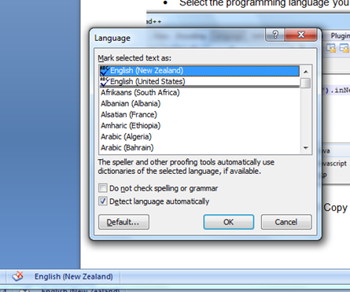
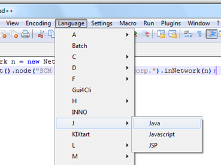
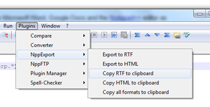

---
authors:
- max
blog: maxrohde.com
date: "2011-08-06"
title: Format Source Code in MS Word
---

## The Problem

You have to write a Word Document, which should contain **snippets of code**. The code should be displayed using **syntax highlighting** following established rules for your programming language of choice.

Furthermore, at a later point in time, you would like to publish parts of your **word document as HTML** or as **blog post** (for instance in WordPress).

## One Solution

One possible solution is to use Microsoft Word, Google Docs and the [Notepad++](http://notepad-plus-plus.org/) editor as follows:

- Create an empty document in Google Docs
- Add an empty table to this document
- Download this document as a Microsoft Word file (.doc)
- Open the Word Document in Word, select the table, and click on the language icon in the Microsoft Word status menu
- Make sure the option 'Do not check spelling or grammar' is ticked.

- Copy your source code into the Notepad++ editor.
- Select the programming language you are using under the 'Language' menu item

- Select the Plugins / NppExport / Copy RTF to clipboard menu item

- Return to word and past the current content of the clipboard into your table

<table style="border-collapse:collapse;" border="0"><colgroup><col style="width:624px;"></colgroup><tbody valign="top"><tr style="height:10px;"><td style="border-top:solid black 1pt;border-left:solid black 1pt;border-bottom:solid black 1pt;border-right:solid black 1pt;padding:7px;">
Network n <strong>=</strong> <strong>new</strong> Network<strong>();</strong>

Nx<strong>.</strong>put<strong>().</strong>node<strong>(</strong>"SCM Implementation at Acorp."<strong>).</strong>inNetwork<strong>(</strong>n<strong>);</strong>
</td></tr></tbody></table>

- You can now save the document, reupload to Google Docs and export as webpage.
- You can further using Words Publish / As Blog function upload the document to a blogging engine. However, here the formatting might get lost.

## Resources

"[Word: Disable spell checker for a paragraph?](http://superuser.com/questions/256247/word-disable-spell-checker-for-a-paragraph)"

"[Best way to show code snippets in word?](http://stackoverflow.com/questions/387453/best-way-to-show-code-snippets-in-word)"

"[Publish Google Docs to WordPress](http://billbennett.co.nz/publish-google-docs-wordpress/)"