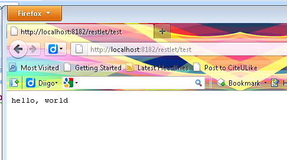

---
categories:
- java
date: "2011-09-02"
primaryBlog: maxrohde.com
title: Restlet Quickstart
---

The Restlet framework is one of the possible options to provide Restful web services in Java. In many framework comparison, Restlet is criticized for being a little bit difficult to understand as well as to perform slightly worse than competing frameworks (e.g. [Apache Wink](http://en.wikipedia.org/wiki/Apache_Wink), [Jersey](http://jersey.java.net/), ...) ([Sangeetha, 2011](http://www.citeulike.org/user/mxro/article/9584259)). However, Restlet is also a very flexible framework and it is very lightweight, in that it has very few dependencies to heavyweight components, for instance servlet containers. This enables Restlet to play nicely with a number of technologies including Google Android, Google App Engine and Google Web Toolkit applications.

The tutorials on the Restlet homepage appear to be a bit confusing and outdated. Therefore, I have assembled a little example to get started with Restlet in a few traceable steps.

### Add Maven Dependency

Restlet offers a wealth of different editions and optional extensions and it is a little bit difficult to determine the right Maven dependencies. For this basic scenario, we want to run a little server deployed as local Java application. For this purpose, the ext.simple extension is required (here I use the latest milestone release 2.1-M7 – the examples should also work with [later releases](http://www.restlet.org/downloads/maven) although this is not guaranteed)

```xml


<dependency>

<groupId>org.restlet.jse</groupId>

<artifactId>org.restlet</artifactId>

<exclusions>

<exclusion>

<groupId>org.osgi</groupId>

<artifactId>org.osgi.core</artifactId>

</exclusion>

</exclusions>

<version>2.1-M7</version>

</dependency>

<dependency>

<groupId>org.restlet.jse</groupId>

<artifactId>org.restlet.ext.simple</artifactId>

<version>2.1-M7</version>

</dependency>

```

In addition, the Restlet repository must be specified

```xml


<repositories>
<repository>
<id>maven-restlet</id>
<name>Public online Restlet repository</name>
<url>http://maven.restlet.org</url>
</repository>
</repositories>

<span style="color: black;">
```

### Create a Small Standalone Server

If these dependencies are established, the following server can be implemented:

```java


import org.restlet.Component;
import org.restlet.data.Protocol;
import org.restlet.resource.Get;
import org.restlet.resource.ServerResource;
import org.restlet.routing.Router;

public class RestletServerTest extends ServerResource {

public static void main(final String[] args) throws Exception {
// Create a new Component.
final Component component = new Component();

// Add a new HTTP server listening on port 8182.
component.getServers().add(Protocol.HTTP, 8182);

final Router router = new Router(component.getContext().createChildContext());

router.attach("/test", RestletServerTest.class);

// Attach the sample application.
component.getDefaultHost().attach("/restlet", router);

// Start the component.
component.start();
}

@Override
@Get
public String toString() {
return "hello, world";
}

}

```

Execute this application and open http://localhost:8182/restlet/test. You should see the message 'hello, world'.



### Provide a Domain Object

In order to provide a domain object, a few more steps need to be undertaken. First, we need to specify the domain object:

```java


import java.io.Serializable;

public class Person implements Serializable {

private static final long serialVersionUID = 1L;

public String name;
public int age;

public Person(final String name, final int age) {
super();
this.name = name;
this.age = age;
}

}

```

Secondly, we need an interface and a ServerResource implementation for the service, which provides the domain object. The interface does not need to extend any other interface but must use the GET, PUT, DELETE annotations provided by Restlet.

```java


import org.restlet.resource.Get;

public interface PersonResource  {

@Get
public Person retrieve();

}
<pre>
```

The ServerResource implementation must extend ServerResource and implement the interface PersonResource:

```java


import org.restlet.resource.ServerResource;

public class PersonServerResource extends ServerResource implements PersonResource {

private static volatile Person person1 = new Person("Peter", 40);

@Override
public Person retrieve() {

return person1;
}

}
<pre>
```

Finally, the main routine starting the server needs to be altered. Also, a little client is added, which reads out the domain object from the server:

```java


import org.restlet.Component;
import org.restlet.data.Protocol;
import org.restlet.resource.ClientResource;
import org.restlet.routing.Router;

public class RestletServerTest  {

public static void main(final String[] args) throws Exception {
// Create a new Component.
final Component component = new Component();

// Add a new HTTP server listening on port 8182.
component.getServers().add(Protocol.HTTP, 8182);

final Router router = new Router(component.getContext().createChildContext());

router.attach("/person", PersonServerResource.class);

// Attach the sample application.
component.getDefaultHost().attach("/restlet", router);

// Start the component.
final Thread t = new Thread() {

@Override
public void run() {
try {
component.start();
} catch (final Exception e) {
e.printStackTrace();
}
super.run();
}

};

t.run();

final ClientResource cr = new ClientResource("http://localhost:8182/restlet/person");

final PersonResource resource = cr.wrap(PersonResource.class);
final Person person = resource.retrieve();

System.out.println(person.name);

}

}
<pre>
```

The domain object is serialized using the Java Serialization mechanism. We can also navigate to http://localhost:8182/restlet/person using a web browser. However, only a binary file will be downloaded by the server. Restlet does provide extensions to provide the domain objects serialized as in RDF, XML and JSON format.

### Emulate a RPC Call Using Domain Objects

Apart from reading domain (and writing using PUT) domain objects, Restlet can easily be used to implement a kind of remote procedure calls (RPC) or functionality similar to Java Remote Method Invocation (RMI). Such calls being made over Restlet do not only have the advantage of running cleanly over HTTP but are also rather performant when compared to remote invocations building on XML serializations (Java Serialization, although slow, is often faster than XML Serialization) such as used by XML-RPC or SOAP/WDSL based web services.

First we change the PersonResource Service description and define a POST service, which makes a copy of a person object.

**import** org.restlet.resource.Post;

**public** **interface** PersonResource { @Post **public** Person copy(Person p);

}

Next we change the implementation of the service:

**import** org.restlet.resource.ServerResource;

**public** **class** PersonServerResource **extends** ServerResource **implements** PersonResource {

@Override

**public** Person copy(**final** Person p) {

**return** p;

}

}

And finally change the main method. Note here too that here we run the server and client as part of a unit test (so add JUnit dependency to your pom). This highlights how easy it is to build (almost) fully blown integration tests based on Restlet, which in addition execute very fast.

```java


import org.junit.Assert;
import org.junit.Test;
import org.restlet.Component;
import org.restlet.data.Protocol;
import org.restlet.resource.ClientResource;
import org.restlet.routing.Router;

public class RestletServerTest  {

@Test
public void test_server() throws Exception {
// Create a new Component.
final Component component = new Component();

// Add a new HTTP server listening on port 8182.
component.getServers().add(Protocol.HTTP, 8182);

final Router router = new Router(component.getContext().createChildContext());

router.attach("/person", PersonServerResource.class);

// Attach the sample application.
component.getDefaultHost().attach("/restlet", router);

// Start the component.
final Thread t = new Thread() {

@Override
public void run() {
try {
component.start();
} catch (final Exception e) {
e.printStackTrace();
}
super.run();
}

};

t.run();

final ClientResource cr = new ClientResource("http://localhost:8182/restlet/person");

final PersonResource resource = cr.wrap(PersonResource.class);
final Person originalPerson = new Person("Peter", 20);
final Person copiedPerson = resource.copy(originalPerson);

Assert.assertFalse(originalPerson == copiedPerson);

Assert.assertTrue(originalPerson.name.equals(copiedPerson.name));

System.out.println(copiedPerson.name);

}

}
<pre>
```

### Resources

[Restlet Documentation Hello World Application in JavaSE](http://wiki.restlet.org/docs_2.1/13-restlet/275-restlet/311-restlet.html)