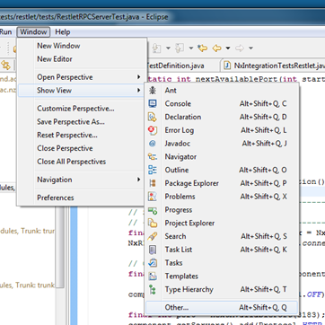
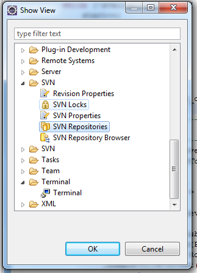
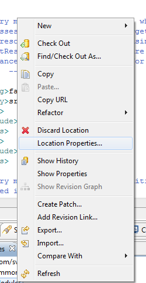
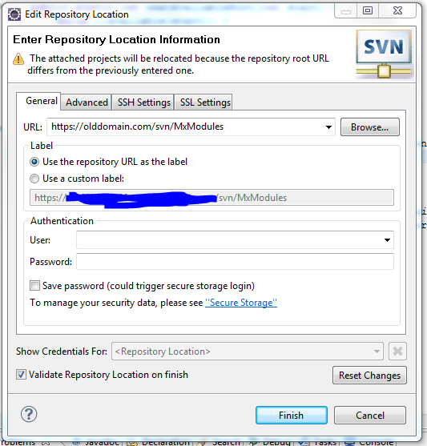

Although an SVN server is possibly a fixed anchor in dynamic and distributed development efforts, even these servers might have to be relocated from time to time. Surprisingly, this can be done quite swiftly, even in complex set ups, for instance an eclipse workspace comprised of dozens of projects stored on a number of different repositories. In the following, a few simple steps are listed to inform eclipse of the relocation of an SVN server or repository.

First, the SVN repositories view must be opened. This can be accomplished through Menu / Show View / Other ...

And then selecting the view "SVN Repositories" under SVN (please note that Subversion must be installed for this view to be present).

The opened view shows all the SVN repositories, which are used by projects in the workspace (or which have been defined in eclipse otherwise). The SVN repositories here should correspond to the SVN labels/server addressed displayed after the project name in the eclipse workspace overview.

Now, right click the SVN repository, you want to relocate. And select "Location Properties" in the pop up menu.

Here, you can specify the new address of your SVN repository. Just rewrite the given URL (in the example, you would rewrite for instance "https://olddomain.com/svn/MxModules" to "https://newserver.com/svn/MxModules" )

Click finish and the repository locations of all projects in the eclipse workspace using the repository will be updated to the new location.

**Hint:**

Make sure that the repository you want to move FROM is available when the relocation operation is performed. Otherwise, eclipse might produce all kind of undesirable errors.