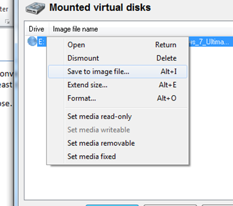
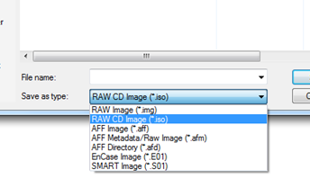

In order to mount an image file on VirtualBox, I needed to convert an IMG image file into an ISO format (VirtualBox does not support mounting IMG files). There seem to be a [myriad of applications available for this purpose](http://en.wikipedia.org/wiki/List_of_ISO_image_software); many of them commercial or at least shareware.

With [OSFMount](http://www.osforensics.com/tools/mount-disk-images.html) I found a free and handy tool for this purpose. Download and install the software, then mount the IMG file you need to convert.

Right click the mounted drive and select "Save to image file…".

Choose "RAW CD Image (\*.iso)" and Voilà! You have an ISO file, which can be mounted by VirtualBox.

