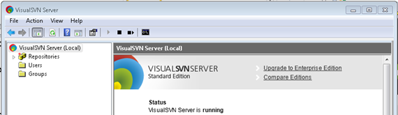
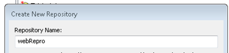
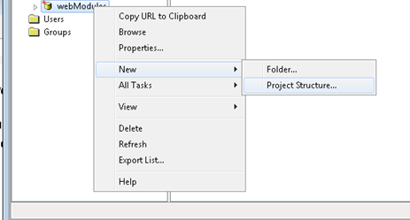
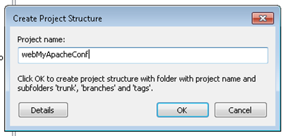
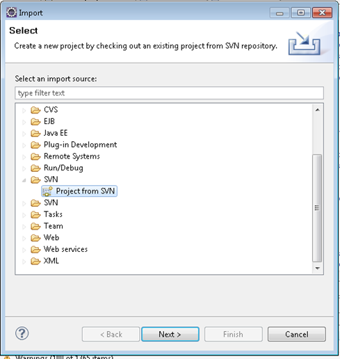
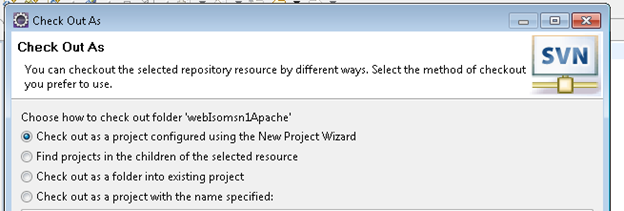
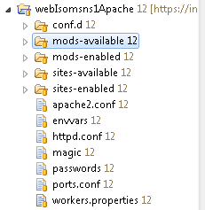
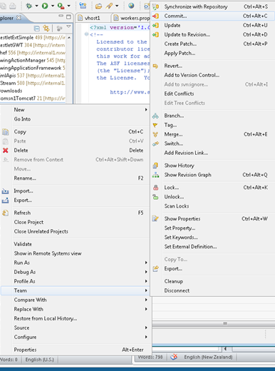

In order to configure a simple Apache Web Server, I found myself many a time connecting to a UNIX system using putty, fiddling around with various configuration files using pico or vim. I don't want to count the times I deleted some configuration I later missed dearly or forgetting to close some xml element. Two of the main problems for me were:

(1) As much as some might be convinced of the productivity of text-based editors like pico and vim, for me it just doesn't fly. Of course one shouldn't use the mouse for everything but windows, the mouse cursor, tabs, and various visualizations such as trees seem just too useful to me to be completely abandoned.

(2) I have become too used to the convenience of a versioning system when developing source code. Although I know there are various ways to backup a UNIX-based system, I would like all the convenience modern source code management systems offer in organizing the versions of text-based files.

I decided to try using two established technologies to address these problems:

- [Eclipse](http://eclipse.org/) is a well-known integrated development environment primarily for the Java programming language, allowing for many conveniences in editing text-based files.
- [Subversion](http://en.wikipedia.org/wiki/Apache_Subversion) (or SVN) is a centralized versioning system for just about anything. Although Subversion can be very cumbersome at times (talk about deleting folders …), it is supported by many platforms and can become almost usable when one knows of its limitations.

The following is a description of the necessary steps to set up a development environment for Apache web server configuration files (and basically any other kind of configuration files one might encounter on a remote server) build on eclipse and subversion.

**Step 1: Install Subversion on your web server**

Installing Subversion on the various flavours of UNIX is very straightforward and Google quickly yields useful instructions. Here, for instance the [instructions for Ubuntu Server](https://help.ubuntu.com/8.04/serverguide/C/subversion.html).

Please note that you need to install subversion on your web server primarily for the SVN command line client, so omit any configuration steps regarding setting up a subversion server.

You can check the success of this step by typing in your remote console 'svn –version'.

**Step 2: Install Subversion Server**

It is sensible to install a subversion server on a different machine than your web server. This will also allow for an easy way to backup various configuration files from your web server.

Again, there are numerous instructions for setting up a subversion server. See for instance, [this post for setting one up on Ubuntu](http://maxrohde.com/2010/05/13/setting-up-a-subversion-server-on-ubuntu-9-10/). One of the easiest ways is using [VisualSVN to install a subversion server as a windows service](http://www.visualsvn.com/server/).

**Step 3: Create a Repository on your Subversion Server**

You can either use one for your already set up repositories (if you use subversion for other project) or create a new repository dedicated for web server configurations.

In VisualSVN, you can right click 'Repositories' and select 'Create New Repository' which opens the dialog given below.

**Step 4: Create a project in your repository**

Since the folders in which the configuration files lie on the web server are already filled with files and folder, we need first to create an empty project on the subversion server.

In VisualSVN, we can right click the newly created repository and create a new Project Structure as shown below.

**Step 5: Add the folders on your web server to version control**

After we have created a 'skeleton' project on the SVN server, we can start to upload the configuration files from the web server.

For this we go to the folder, from which we want to upload the files. For instance, /etc/apache2.

cd /etc/apache2

In this folder, we initialize the SVN checkout operation:

sudo svn checkout https://\[your SVN server\]/svn/webRepro/webMyApacheConf/trunk/ .

Next, we can add the folders we want under version control. For instance, the folder conf:

sudo svn add conf

Finally, we commit and upload the files to the SVN server:

sudo svn commit

**Step 6: Import the files into eclipse**

In order to import the files uploaded to the subversion server, we need to install the Subversive eclipse plugin. After doing so, the following option should be available under File / Import:

In the following dialog, we first specify our SVN repository (../webRepro/) and the project (../webRepro/webMyApacheConf). Note that you should select the 'trunk' folder rather than the project root.

Chose to check out the project as a project configured using the New Project Wizard.

As type for the project, select General / Project.

**Step 7: Edit configuration files in eclipse**

Now, the configuration files from your web server should be available as eclipse project.

Just click and edit these files in the eclipse editors. If you have made changed, right click the project and select Team / Commit, which will commit the changed files to the subversion server.

**Step 8: Import changed files to web server**

Finally, if you have changed files in eclipse, you need to reimport these files onto your web server. For this connect to your web server and navigate to the directory you have placed under version control. For instance:

cd /etc/apache2

To download the changed files, type

sudo svn update

As a result, the changed files should be downloaded to your web server.

Then, don't forget to restart your server to see the effect of the changes.
