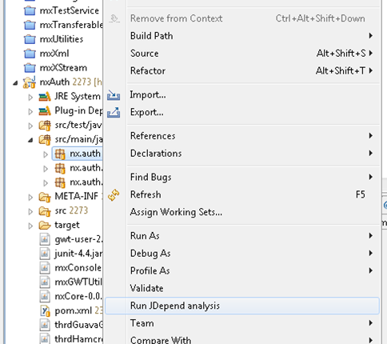
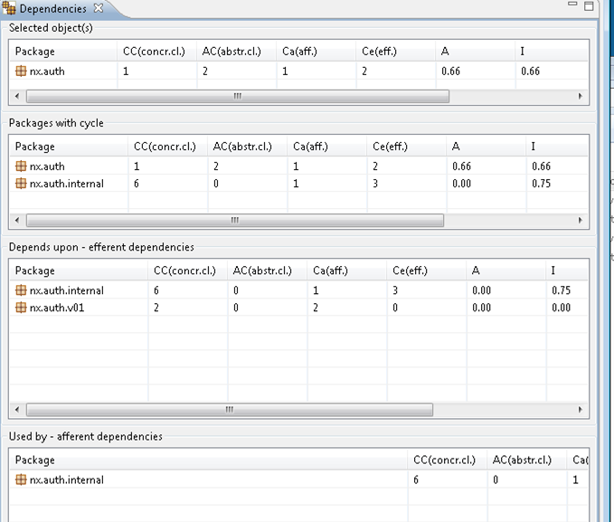

The other day I came across another interesting static source code analysis plugin for eclipse: [JDepend](http://clarkware.com/software/JDepend.html'). JDepend calculates a number of quality metrics for Java packages (therewith it has a slightly different unit of analysis to other tools, which focus on methods, classes or projects).

I found that [Andrey Loskutov](http://andrei.gmxhome.de/privat.html) has created an excellent eclipse plugin based on [JDepend called JDepend4Eclipse](http://andrei.gmxhome.de/jdepend4eclipse/index.html).

After installation of the plugin, context menus for packages (not projects) will feature another item 'Run JDepend analysis'.

Executing this analysis will result in a nicely formatted report being generated. The results can easily be interpreted [with the JDepend documentation](http://clarkware.com/software/JDepend.html).

I tend to build very small modules, in which I place a kind of factory for concrete implementations along with some essential interfaces in the main package of the module. It seems that JDepend is not fond of this practice, since the factory depends on the concrete implementations (in the .internal\* packages) and these in turn depend on the essential interfaces within the main package. However, I am not yet convinced that this practices is very bad, as long as circular reference between modules are avoided.
