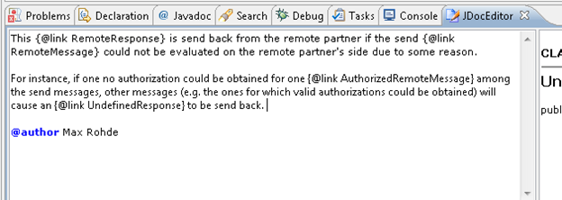
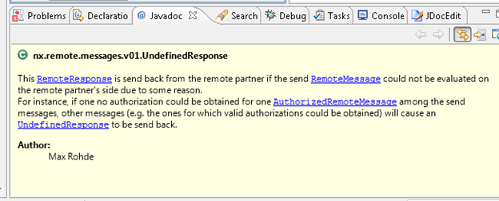
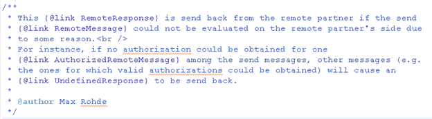
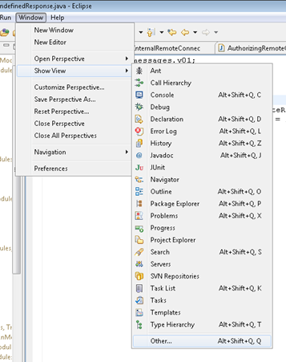
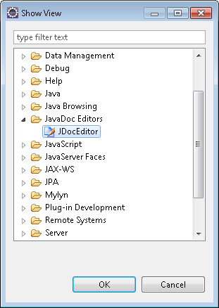

---
categories:
- java
date: "2011-10-03"
blog: maxrohde.com
title: JavaDoc Editor for eclipse
---

Formatting JavaDoc using plain HTML can be a troublesome and time-intensive experience. Today I installed the [JDocEditor](http://www.certiv.net/projects/jdoceditor.html) plugin for eclipse, which allows editing JavaDoc in eclipse using a small rich text editor.

Here, a quick evaluation, a few screenshots and a little getting started guide.

### Evaluation

Good:

- Free
- Helps to reduce the hassle of dealing with line breaks and paragraphs in JavaDoc
- Allows to compose lists and do simple formatting like using bold and italics

Not so good:

- The editor has no native support for JavaDoc annotations such as @link, …
- The editors handling of line breaks, paragraphs and basically any more sophisticated formatting can be unpredictable at times

Conclusion:

- Good tool to enhance productivity in editing JavaDoc documentation with simple formatting.

### Screenshots

The Editor:

Generated JavaDoc (rendered):

Generated JavaDoc (html):

### Getting Started

- Install using the update site [http://www.certiv.net/updates](http://www.certiv.net/updates)
- After the plug in has been installed, add the view of the plugin to your workspace as shown below

- The view can be found under the category JavaDoc Editors/ JDocEditor

### Resources

[StackOverflow Discussion "JavaDoc editor for Eclipse to create formatted text"](http://stackoverflow.com/questions/3599111/javadoc-editor-for-eclipse-to-create-formatted-text)

[Blog post on JDocEditor from 2005](http://www.vasanth.in/2005/01/11/eclipse-plugin-jdoceditor/)