The world is rife for a new dominant programming language! Actually, has been rife for a couple of years, which, however, does not stop Java and C++ from dominating the screens of many unfortunate developers. Apart from the inarguably impressive features offered by 'new' languages, such as Scala, Goovy, Ruby, Haskell, Clojure, Dart? and Go, I am highly suspicious of these languages: What happens to the **billions of lines of code written in legacy programming languages**? Will my Groovy app work with the next update of Groovy, or will it work in 10 years, when I have to update my app? I don't want something big, not the total reinvention of computing but would already be happy with more concise syntax to create inline objects, type inference and simple closures.

Xtend defines itself as a **language for Java developers**. In specific, it allows to write code, which is similar to Java but [improved in many ways](http://www.eclipse.org/Xtext/xtend/). Compiling code written in the Xtend language **generates Java source files**. These files can easily be used with any 'legacy' Java application or library. I have assembled a little tutorial and introduction to get started with the Xtend language. Find below:

- How to install the Xtend Eclipse Plug-in
- How to materialize Xtend Example Project in your Workspace
- How to create Your Own Xtend Project
- A discussion of Xtend Advantages and Disadvantages
- Conclusions

### Install the Xtend Eclipse Plug In

**UPDATE**: As Daniel pointed out below, Xtend is now [available on the Eclipse Marketplace](http://marketplace.eclipse.org/node/148396). Installing it from there rather following the instructions in this section, might be much easier!

- Open the install new software dialog in eclipse
- Connect to the XText release repository: [http://download.eclipse.org/modeling/tmf/xtext/updates/composite/releases/](http://download.eclipse.org/modeling/tmf/xtext/updates/composite/releases/ 'Copy To Clipboard')
- Select all packages "TMF Xtext-2.1.0" (or of a newer version if available)
- This includes the "Xtend2 SDK" mentioned in the [Xtend tutorial](http://www.eclipse.org/Xtext/xtend/). The other packages need to be selected since otherwise the Xtend editors will not work.

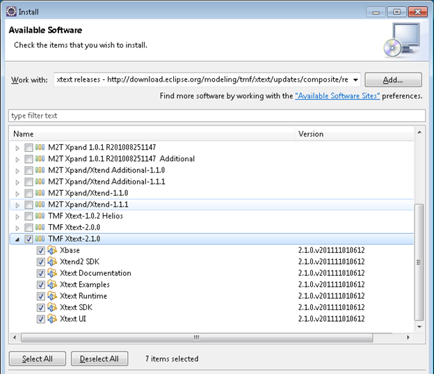

- Click Next again
- Accept EPL licence agreement
- Restart eclipse

### Materialize Xtend Example Project in your Workspace

After the installation of Xtend is complete, the best way to get started is to install the Xtend example

- Create a new Example Project as shown below

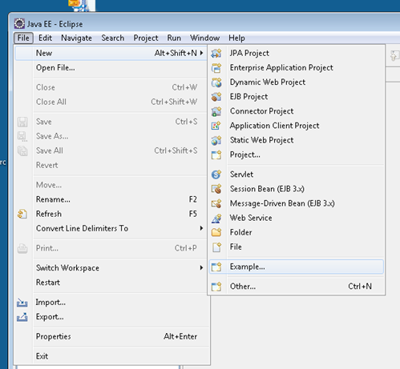

- Or under the new project wizard select "Examples / Xtend Examples / Xtend Tutorial"

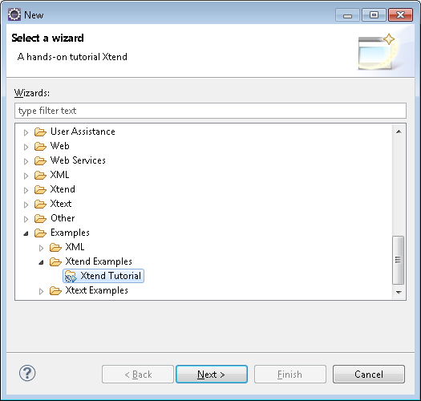

- Initially the project was not built correctly in my eclipse.

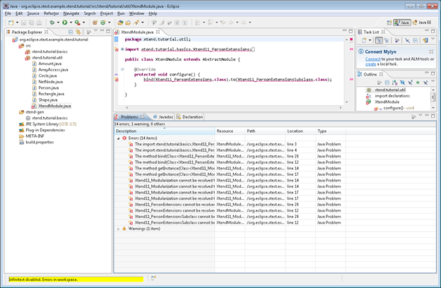

- However, after closing and reopening the project everything appeared to be (maybe the Infinitest plugin in my installation has caused the problem, so I have deactivated it).
- Below a screenshot of the examples provided by Xtend:

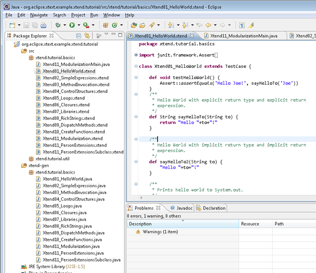

- You can right click the project and select "Run as JUnit test" to execute some of the examples

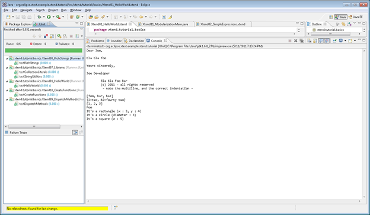

### Create Your Own Xtend Project

After browsing and testing the provided examples, it's time to create a new project with Xtend support.

Xtend seems to be nicely integrated with the eclipse PDE. Therefore, its easiest to create an Xtend project as eclipse Plug In Project. Using the PDE tooling such projects can be easily deployed as executable applications on numerous platforms. However, since Xtend generates plain Java files, we can always compile the generated files as independent Java application. Below the steps to create a simple **Hello World** application.

- Use Eclipse's New Project Wizard to create a new 'Plug-in Project'
- Adjust the source folder and output folder to sensible values ([Maven](http://maven.apache.org/) anyone?) and create the project

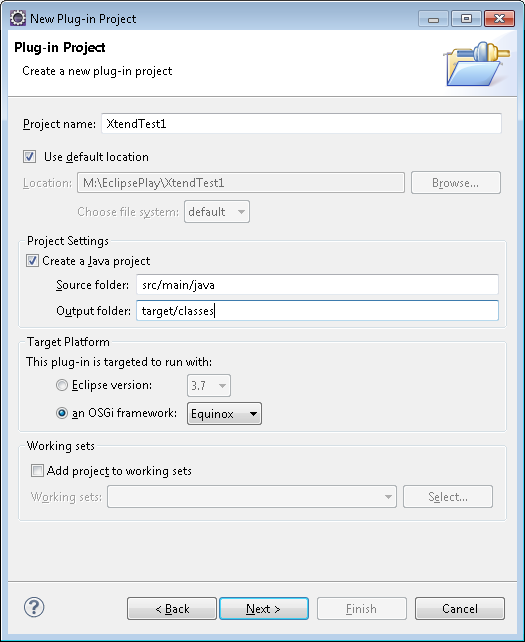

- Open the MANIFEST.MF file in the folder META-INF
- Add the package org.eclipse.xtext.xtend2.lib to the \[Imported Packages\] on the \[Dependencies\] tab

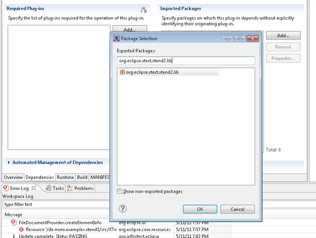

- Also add the following packages:

com.google.inject

org.aopalliance.aop

org.eclipse.xtext.base.lib

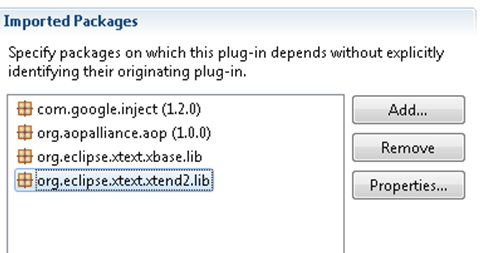

- Create a new source folder for your project: src/main/xtext (Right click the project and select Build Path / New Source Folder)
- Now create a new package in the source folder src/main/xtext
- For instance, de.mxro.examples.xtend1
- Right click this package and select New / Xtend Class

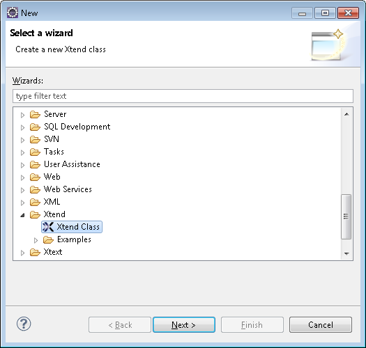

- Select the name "HelloWorld"
- When prompted to add the Xtext nature to the project, click \[Yes\]

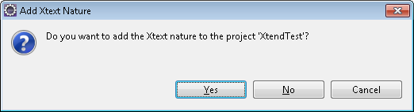

- Right click your project and select "Properties"
- Open the properties for Xtend / Compiler
- Change the output folder to src/main/java and deselect "Override existing files"
- Click \[Apply\] to apply the changes

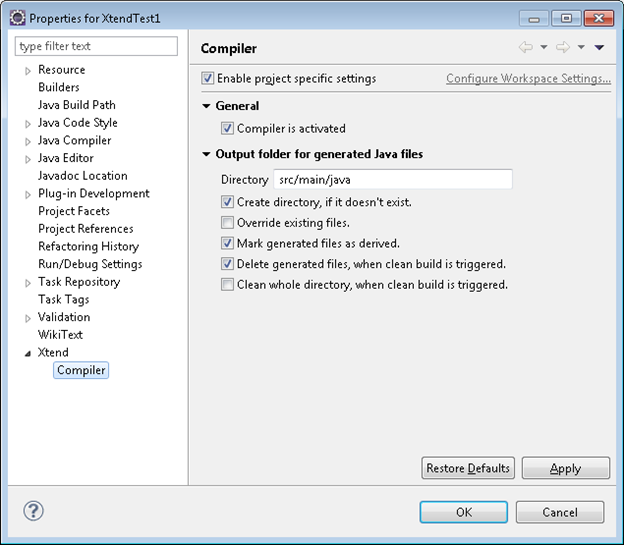

- Go back to your file HelloWorld.xtend and define the following class:

**class** HelloWorld {

**def** **public** **void** helloWorld() {

**val** message = "Hello, World!";

System::_out_.println('''«message»''');

}

}

Tip: writing the symbol "«" can be achieved by pressing CTRL + SHIFT + < (or ,)

- Now check the folder src/main/java. Here, a file HelloWorld.java should have been generated as follows

**import** org.eclipse.xtext.xtend2.lib.StringConcatenation;

@SuppressWarnings("all")

**public** **class** HelloWorld { **public** **void** helloWorld() { **final** String message = "Hello, World!";

StringConcatenation \_builder = **new** StringConcatenation();

\_builder.append(message, "");

System._out_.println(\_builder);

}

}

Does not look 100% efficient but that's the tradeoff for source code generation. I did not find out how to define static methods using Xtend, so we need a standard Java class to run this code:

- In the source folder src/main/java add a Java class "Application", while checking create main(String\[\] args).
- Implement the following class

**public** **class** Application {

/\*\*

\* **@param** args

\*/

**public** **static** **void** main(String\[\] args) {

**new** HelloWorld().helloWorld();

}

}

- Right click the file Application.java and select "Run as Java Application"

Volia! You should be friendly greeted with the output "Hello, World!"

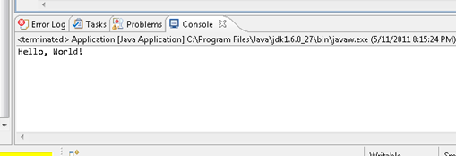

### Xtend Advantages and Disadvantages

After following this little exercise and browsing the Xtend documentation, these are a number of advantages and disadvantages I see in this languages:

#### Advantages

- Allows writing more concise code for the Java platform.

It is no secret that Java syntax is unnecessarily verbose. This sets the bar relatively low for better languages for the Java platform. Xtend has a number of very nice features to allow writing more concise Java code, my favourite example being **type inference**.

- Is fully compatible with most Java technologies.

Although the JVM has received considerable attention with alternative Java byte code generating languages such as [Scala](http://www.scala-lang.org/), not everything Java is Java byte code. Most notably, the Android platform draws on the Java language but is not compatible with generated Java byte code. The [Google Web Tookit](http://code.google.com/webtoolkit/) (GWT) is another technology working with the Java language but not with the JVM. Xtend enables to write code, which interoperates both the **platforms build on top of the JVM** (since its Java source files can be compiled into byte code) as well as **platforms build on top of the Java language syntax**.

- Performance

Since the Xtend language is close to the Java language and generates relatively optimal Java source files, its performance **can be expected to be far superior to other improved Java dialects**, especially [Groovy](http://groovy.codehaus.org/). Moreover, since it does not generate byte code but Java source files, more compiler optimization can be applied to the applications.

#### Disadvantages

- Tight coupling with eclipse tooling

Xtend and Xtext are doubtlessly eclipse technologies through and through. This is a definite advantage for starting to use these technologies since they offer nice integration with the eclipse IDE. As a downside, however, code written in the Xtend language might be **difficult to use with other tools apart from eclipse**. On the other hand, the Java code generated by Xtend is vanilla Java code (apart from the lightweight Xtend library used in the generated code). This code, of course, can be used by most other tools. Therefore, I have chosen above to place the xtend source files not in the main Java source code folder of the project (src/main/java) but into a separate folder (src/main/xtext). This enabled to let Java code be generated into the src/main/java folder. From there, it can be picked up and used by other tools such as Maven.

- In places, insufficient documentation

The documentation available for Xtend is far from extensive. In comparison, the documentation available for [Groovy](http://groovy.codehaus.org/) is extensive including books and various web sites.

### Conclusion

I believe that Java and C++ are the very best programming languages around. Not in terms of developer productivity, measured in implemented features/hours of course, but in terms of creating **sustainable code**. Most Java or C++ applications written a decade ago will still run today. Java programs even without the need to be recompiled. This makes one rather confident that a decade from now, still people will be able to compile and run written in Java and C++ today. Adopting terms from the finance industry, they are simply **too big to fail**.

Give that, I am very suspicious of any new programming language. That is it more elegant and allows me to be more productive are simply insufficient arguments. Code is too difficult to write that I would want to run into the risk of having to dump it ever. **Xtend offers a neat compromise**. It allows to write code in a more modern, more productive language but yet defining the application in plain old Java code. Therefore, I see Xtend primarily as a useful tool to generate Java tool. Even if Xtend becomes deprecated at some point in time, one always has the Java code to fall back to.

### Mistakes to Avoid

As mentioned above, installing the plugin following the documentation provided on the Xtend tutorial page has not been a smooth process. Below a number of mistakes in installing the plugin, which are better avoided.

#### Do not install only the Xtend2 SDK

Installing only the Xtend 2 SDK package as shown below …

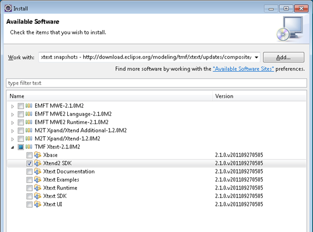

.. and creating a new class …

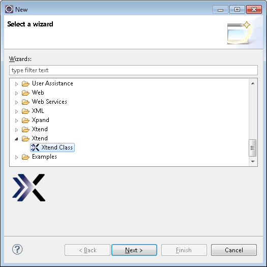

… will result in a problem being reported by Xtend.

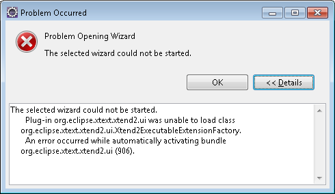

#### Do not Install the Xpend/Xtend All-in-One Package

Selecting "Xpand/Xtend All-in-One" …

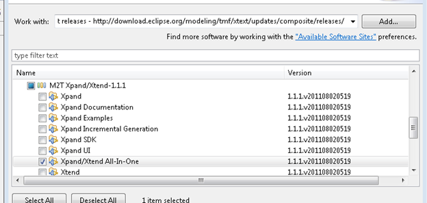

… with all these packages …

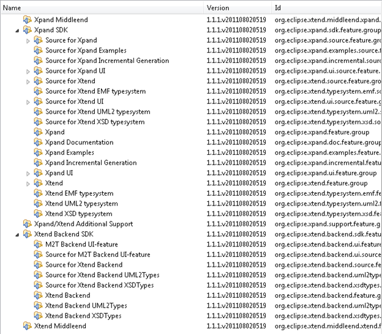

… will not allow you to create the Xtend example project.

#### Do Not Create an Xtext Project to Start an Xtend Project

Xconfused? An Xtext project does not automatically allows to get started with Xtext. It is better to create an eclipse Plug-in project as shown above.

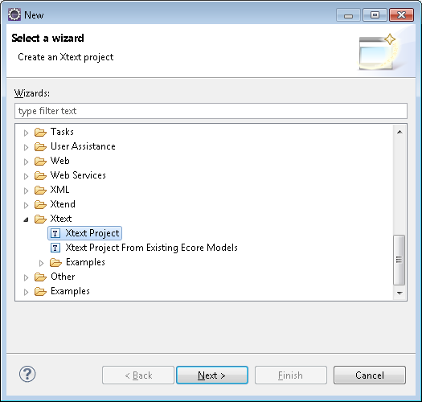

### References

[Xtend Official Overview](http://www.eclipse.org/Xtext/xtend/)

[Xtend 2 - the Successor to Xpand](http://blog.efftinge.de/2010/12/xtend-2-successor-to-xpand.html) post by creator Sven Efftinge
