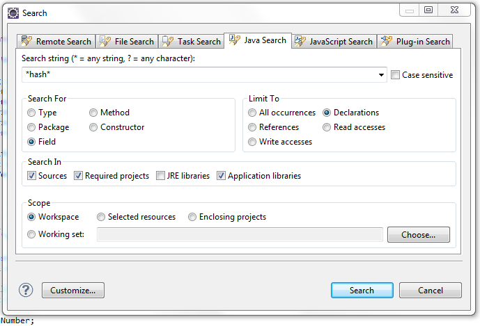

---
categories:
- java
date: "2012-03-16"
blog: maxrohde.com
title: 'GWT Serialization: ‘Expected type ''int'' but received an out-of-range value’'
---

## Problem

While the GWT application works fine in development mode, it reports a mysterious NumberFormatException exception in production mode upon deserialization of an RPC on the server side.

java.lang.NumberFormatException: Expected type 'int' but received an out-of-range value: -43400113595222000

at \[..\]ServerSerializationStreamReader.getNumberFormatException(ServerSerializationStreamReader.java:839)

## Analysis

Apparently Java and JavaScript have a different definition of the capacity of the type int. JavaScript integers can hold larger values than allowed by Java integers. While usually testing the application in an Java environment can easily spot integer overflows occurring for Java integers, generated integer values can cause problems in some special cases. In specific the algorithm employed by GWT to calculate the hash codes of objects (Object.hashCode()) is prone to produce integer values, which exceed the maximum value for integers in Java. If this occurs, abovementioned exception might be cast during deserialization of incoming Objects with int fields.

## Solution

First it boils down to finding the 'int' field of the serializable object, which is sent over the RPC wire, causing the exception. Unfortunately the exception provided by the GWT deserialization logic is not very helpful in this cause. A good starting point is to search for integer fields containing hash codes. For instance using the eclipse search as shown below:

After the integer field causing the overflow has been located, all assignments to this field must be checked whether they might cause a too large 'int' value to be assigned. For instance, the following assignment might lead to such a faulty assignment:

this.versionHash = this.generateHashCode();

Adding a binary mask to this assignment makes it 'safe' in preventing integer overflows:

this.versionHash = this.generateHashCode() **& 0xffffffff**;

## Resources

[Issue 4263: GWT Serialization issue](http://code.google.com/p/google-web-toolkit/issues/detail?id=4263)