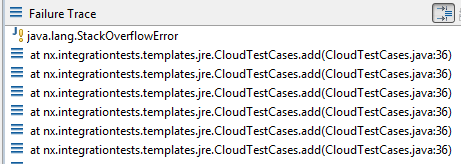

---
authors:
- max
blog: maxrohde.com
categories:
- java
date: "2012-03-27"
title: Debugging StackOverflowExceptions in Java
---

# Problem

StackOverflowExceptions in Java and in other programming languages can be notoriously difficult to debug. The most troublesome attribute of these exceptions is that they occur in no specific place in the application. In specific, the location (class+line number) in which the exception is thrown does only point indirectly to the erroneous part of the application.

For instance, the StackOverflowException reported in the following stack trace …

Exception in thread "pool-1117-thread-1" java.lang.StackOverflowError

at java.util.concurrent.locks.AbstractQueuedSynchronizer.release(Unknown Source)

at java.util.concurrent.locks.ReentrantLock.unlock(Unknown Source)

at one.utils.jre.concurrent.JreConcurrency$4.unlock(JreConcurrency.java:146)

… has the same cause as this stack trace:

Exception in thread "pool-1115-thread-1" java.lang.StackOverflowError

at java.lang.String.endsWith(Unknown Source)

at mx.gwtutils.MxroGWTUtils.assertNoSlash(MxroGWTUtils.java:311)

at nx.core.nodes.v01.ReferenceData.<init>(ReferenceData.java:34)

at nx.core.Nx.reference(Nx.java:156)

## Solution

The first sensible action is to run the application multiple times and identify common patterns in the reported stack traces. In particular, the overflow exception is most likely caused by an undesired recursive loop involving one or multiple method calls. The first case can usually easily be identified from the stack trace. For instance, in the following example there is probably something wrong with line 36 in the tested class.

The latter case, that of multiple involved method calls, is often the more interesting (to use a daring euphemisms). For instance, a recursive loop might occur in the following constellation:

method 1 -> method 2 -> … -> method 40 -> method 41 -> method 1

In this case, it is significantly more difficult to find the original cause of the problem, since, theoretically, the cause might be in any of the involved methods.

The useful construct 'assert' in combination with the capabilities of Java Exceptions can be of great help to pinpoint the error leading to undesired recursion. The following guard will check that the total depth of the stack trace is below a sensible threshold (in the example 799 nested method calls). If this threshold is violated, the application will terminate with a message hopefully of greater aid than Java's StackOverflowException.

**assert** **new** Exception().getStackTrace().length < 800 : "Stack overflow for message: "\+ message;

Adding a number of such asserts in the methods involved in the stack overflow can greatly speed up the process of identifying the cause of the error.

## Notes

- Asserts will only be evaluated when the JVM is started using the argument '-ea'
- While asserts should be disabled by default in production deployments and therewith the additional guards inserted in the code should not affect application performance, the performance penalty of getting a stack trace in Java (new Exception().getStackTrace()) is very high. Therefore, one might consider adding an additional Boolean flag to these asserts to assure they are only invoked when one is actively searching for the cause of StackOverflowExceptions.