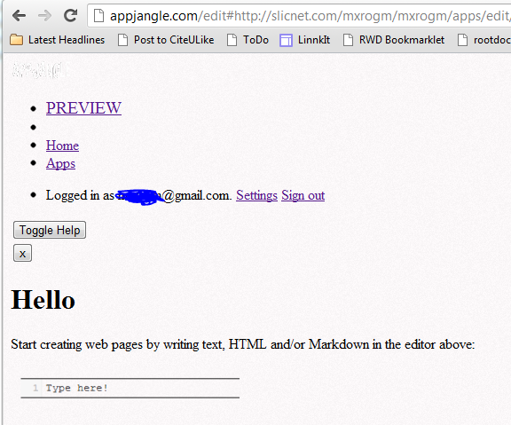

---
categories:
- javascript
date: "2012-08-23"
primaryBlog: maxrohde.com
title: Beware of BootstrapCDN :(
---

A few days ago, I discovered the [service BootstapCDN](https://twitter.com/mxro/status/235940607695130624). I really like the idea to serve standard libraries such as JQuery or Twitter Bootstrap through central Content Delivery Networks. Especially since serving libraries through a standard location enables clients to not have to download these libraries at all (if the CDN server is configured for caching correctly).

However, already after a few days of using BootstrapCDN to provide the Twitter bootstrap files for a few web applications, the service was/is down for a few hours. In consequence, otherwise slightly better looking webpages are served such as in the example below:

I think the idea of services like BootstrapCDN is really great, and, the service explicitly warns that 'This free service comes with no warranty.' So, if it is not work as expected, that is fair enough.

However, most of the time all dependencies of a web application need to be available in order for it to function as intended. Therefore, even if the CDN just fails **sometimes (my sample is really small -just a few days and one outtime)**, it would be better to serve the libraries from your own server. Since, when your server would be down, well, the availability of third party libraries is anyway of limited help.