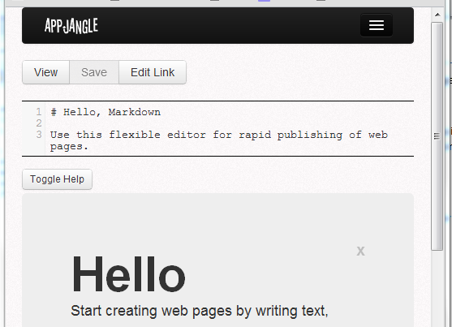
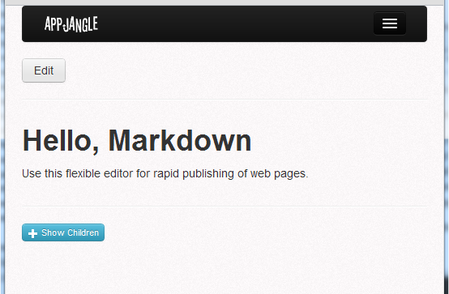

---
categories:
- javascript
date: "2012-08-23"
primaryBlog: maxrohde.com
tags:
- markdown
title: New Online Markdown Editor
---

[nodejump](http://nodejump.com) is a small web application to create and publish web pages using the Markdown markup language.

It's really easy to get started creating a new document (and therewith a new webpage). Just open the following link:

> [http://nodejump.com](http://nodejump.com)

The main features of this editor are the following:

- Publish simple web pages from various devices (desktop, mobile) quickly and easily.
- Allow to share documents for viewing and collaborative editing via simple hyperlinks.
- Allow users to use the tool with and without registering.
- Switch between editing and viewing in real-time.
- Synchronize documents opened on multiple locations in real-time.

## Screenshots

The editor is built to load quickly and scale for various screen resolutions.

Switching between 'edit' and 'view' mode is done in real-time both in desktop and mobile environments.

## Further Resources

[Source code on github](https://github.com/mxro/aj-edit)

[Application documentation](http://slicnet.com/mxrogm/mxrogm/apps/edit/docs/3/2/doc)