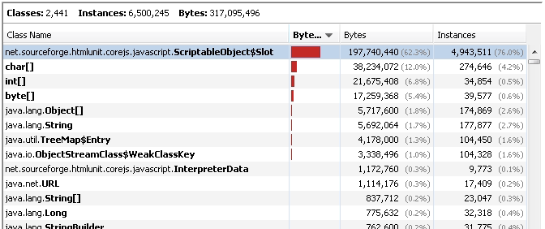

---
categories:
- java
date: "2013-01-05"
primaryBlog: maxrohde.com
title: Fix HtmlUnit Memory Leak
---

## The Problem

While testing pages with heavy JavaScript usage in [HtmlUnit](http://htmlunit.sourceforge.net/), great amounts of heap memory are allocated but never released.

## Solutions

There are numerous solutions, which can be applied to fix an OutOfMemory error related to HtmlUnit:

### Call webClient.closeAllWindows();

The first [often suggested](http://stackoverflow.com/questions/4869576/htmlunit-memory-leaks) remedy to fix a HtmlUnit memory leak is to call webClient.closeAllWindows() after a page has been processed completely.

### Increase the JVM Heap Size

One should consider that HtmlUnit is very memory hungry and therefore an [increase of the heap size might be in order](http://stackoverflow.com/questions/7535243/htmlunit-is-throwing-out-of-memory-and-maybe-leaking-memory). Just add a VM argument such as:

\-Xmx1024m

### Explicitly Stop All JavaScript Jobs

It might also be helpful to [explicitly stop all JavaScript background jobs](http://htmlunit.10904.n7.nabble.com/ScriptableObjects-piling-up-on-the-heap-td28361.html) (Note: **this is not be required in newer versions of HtmlUnit**). For this, add the following code before calling .closeAllWindows:

final List<WebWindow> windows = webClient.getWebWindows();

for (final WebWindow wd : windows) {

wd.getJobManager().removeAllJobs();

}

webClient.closeAllWindows();

### Don't Forget to Trigger GC

In some configurations the JVM might delay clearing up objects after a test case has been completed. If you monitor the memory usage, make sure to request an explicit garbage collection run (e.g. by clicking \[Perform GC\] on the 'Monitor' page of VisualVM). Trigger it multiple times, too.

## Analysis

Processing pages with complex JavaScript procedures appears to result in a large number of heavily memory consuming objects of the class 'net.sourceforge.htmlunit.corejs.javascript.ScriptableObject$Slot'.

A possible strategy to avoid creation of many of these objects is to limit the usage of JavaScript within an application.

## Background

As reported here earlier, a complex test suite for the Appjangle platform is constantly executed using the opsunit framework.

To test the implementation of the [Nextweb](http://nextweb.io) JavaScript API a number of these test cases use the [qunit-htmlunit-java](https://github.com/mxro/qunit-htmlunit-java) wrapper to run quite extensive QUnit test suites with HtmlUnit. This has been proven to be quite troublesome on a memory-restricted server. The main reason for this appeared to be the complexity of the JavaScript exercised during the test.