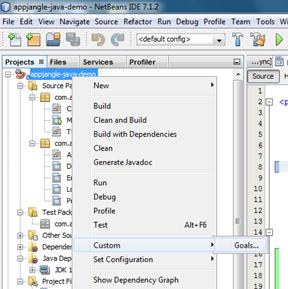
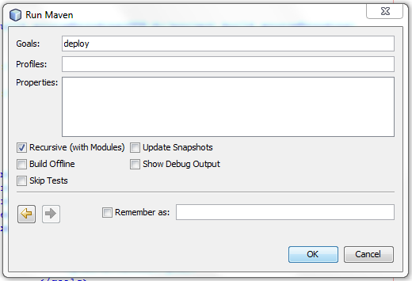

## Problem

You would like to deploy a Java [Maven](http://maven.apache.org/) project you are developing using the [Netbeans](http://netbeans.org/) IDE to your Maven repository.

## Solution

Right click on your project in the Netbeans 'Projects' view and select the Custom / Goals … in the drop down menu as shown below.

Type 'deploy' in the field 'Goals' in the following dialog. Then, click Ok and your project should be deployed!

