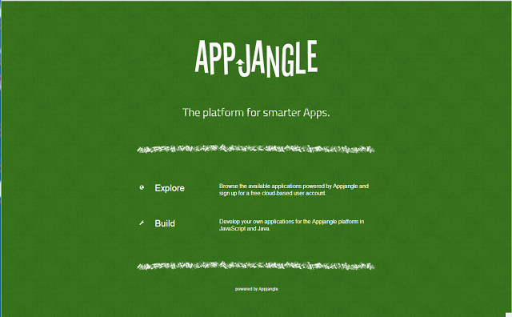
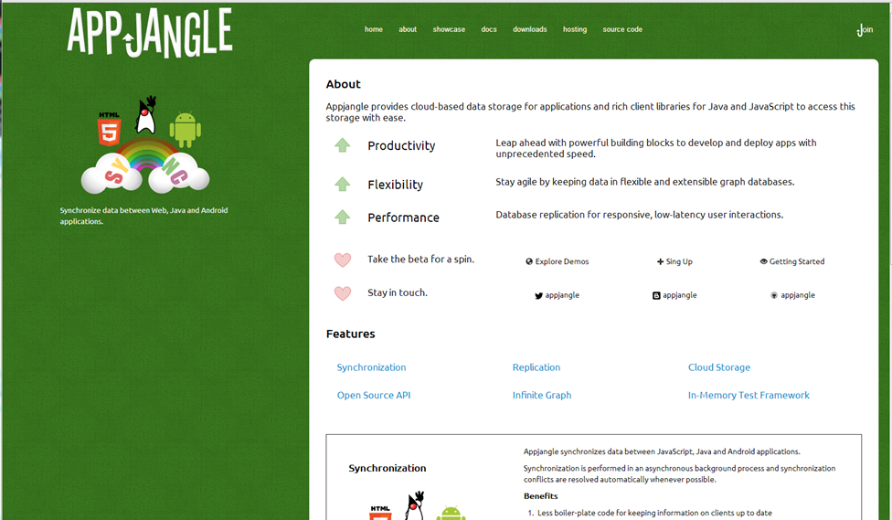

---
authors:
- max
blog: maxrohde.com
date: "2013-03-12"
title: 'Appjangle: New Homepage (Again)'
---

After I had recently completed a first version of [interactive showcases](http://appjangle.blogspot.com/2013/02/appjangle-showcase-released.html) for the Appjangle platform, it was now about time to give a little rework to the homepage. Arguably, it was a bit dull and, more importantly, not very informative – in particular in regards to giving an overview of what Appjangle is good for and what it does.

This is how the [last version of the homepage](http://appjangle.blogspot.com/2012/10/appjanglecom-redesign-coming.html) looked like:

The redesign, accomplished in 350 min (yes, I am slow and I also love to measure time), focused on the following objectives:

- Allow to understand what the Appjangle platform does.
- Provide an overview of the benefits of the platform.
- Give a clear indication of what a visitor can do next.

Well, this is how the [new page](http://appjangle.com) looks like:

I believe that this new design meets the described objectives much better than the old version. However, there are still plenty of steps which stand between this version and 'perfect'.

Now, I am certainly not what I would call a naturally gifted graphics artist. However, I think it's often a diversion from my usual occupations of writing code and [writing academically](http://www.mxro.de/short-cv) to move around some pixels. Also, it's nice to see a design develop over time. Actually I started working on this 'entry page' in November 2011 – at that time Appjangle was still called 'Nx Framework', and the Introduction was somewhat wordy: [Nx Framework Introduction](https://sites.google.com/site/thecloudnexus/).

Anyway, next on my list are the [sign up screen](http://appjangle.com/signup) and the [hosting options](http://appjangle.com/hosting)\- when my thesis will grant me some time.

_This post is also published [on the Appjangle Blog](http://appjangle.blogspot.co.nz/2013/03/after-i-had-recently-completed-first.html)._