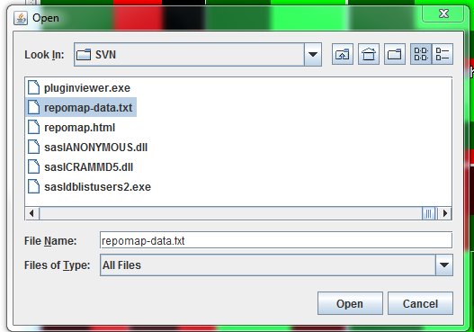
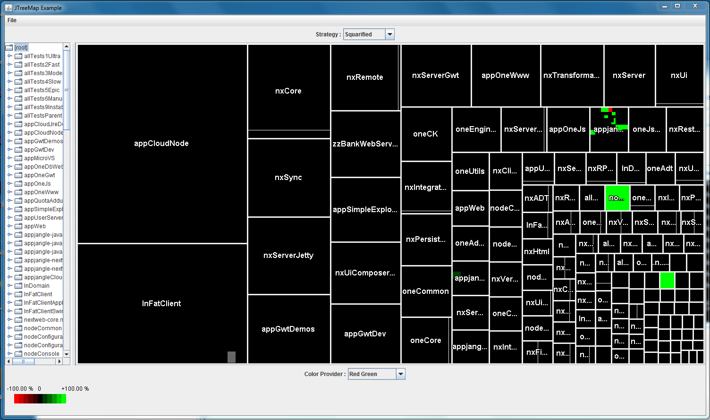

In the course of writing up my thesis, I wanted to perform a simple source code analysis on the Appjangle code base. Since most of the code is as of now stored in a SVN repository, I used [StatSVN](http://www.statsvn.org/) for this purpose. StatSVN is really easy to use and generate some very nice statistics and diagrams.

However, one of the visualization, the **Repo Heatmap**, requires a Java Applet based on [JTreeMap](http://jtreemap.sourceforge.net/) to be run on the page. Most current browsers are a bit picky about running Java Applets, and also I have quite a number of Java versions floating about in my machine – in consequence, it would be quite a hassle to configure my browsers to start the Java applet.

Thus, I wanted to load the Repo Heatmap using the JTreeMap standalone Swing Application. Now, most of the documentation on the JTreeMap homepage focusses on its use as an Applet, but it's really quite easy to launch it as standalone application as well.

JTreeMap is bundled in a single JAR file. However, plugging this file into a call to 'java –jar' does not yield much good; since there is no MANIFEST.MF file is not configured appropriately for this. Luckily, the application can [easily be started using the '-cp' parameter](http://samindaw.wordpress.com/2008/11/04/specifying-the-main-class-to-run-in-a-jar-file-from-command-line/):

**java –cp jtreemap-1.1.0.jar net.sf.jtreemap.swing.example.JTreeMapExample**

Once the application is launched, you can open a data file. For instance, the data file generated by StatSVN: **repomap-data.txt**.

Then, you can view the heat map, even without having to install the Java plugin:

