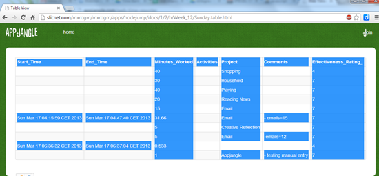
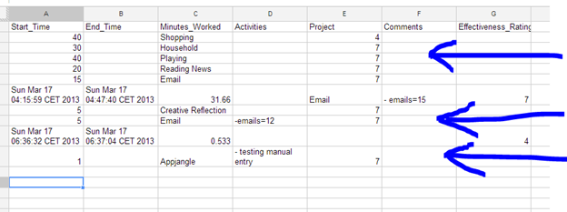

## Problem

You would like to copy a HTML table into a spreadsheet processing application like Google Spreadsheets.

However, the table you would like to copy contains empty cells. Just as in the 'Start_Time' column in the image shown below:

If you paste this table, the rows which contain empty cells are not copied correctly. The empty cells are simply omitted and thus the later column headings do not match the cell values correctly.

## Solution

You can solve this problem easily when you have some influence on the rendering of the HTML table in question.

Just place in any empty cell the character &nbsp;

For instance, instead of creating cells such as

<td></td> or

<td> </td>

Represent empty cells as:

<td>&nbsp;</td>

## Background

As can be seen in the first screenshot, I've been working on a tabular data view for [hyperdata](http://nextweb.io/docs/nextweb-data-model.value.html) on [Appjangle](http://appjangle.com). This view should make it easier to analyse structured and semi-structured data. In the example above, data created using the [web time reporter](http://appjangle.blogspot.com/2012/09/new-app-web-time-reporter.html) is to be analyzed using Google Spreadsheets.
